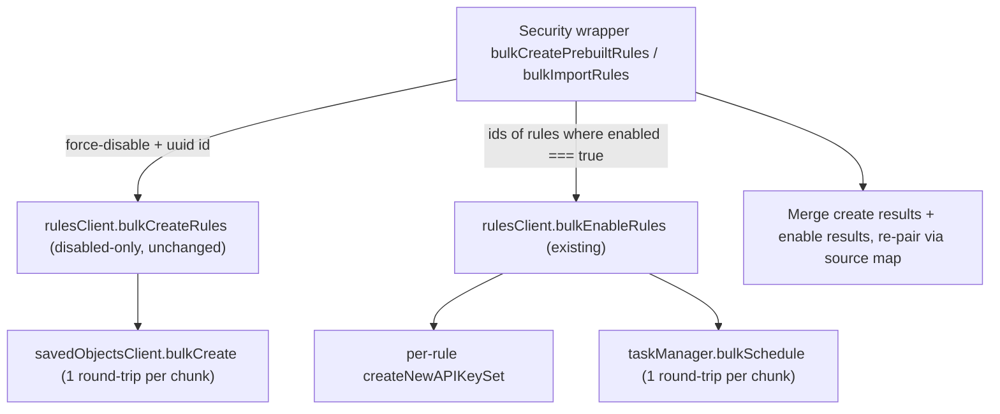

## Goal

Allow `_perform` (prebuilt rules install) and `_import` (rules import) to use the new bulk SO write path when an `enableExperimental` flag is on. Keep the alerting `bulkCreateRules` "disabled-only" contract; orchestrate enabled-rule support from the security-side wrappers via a follow-up `bulkEnableRules` call.

## Branch

- Stay on the current branch — this work extends the existing `bulkCreateRules` PR rather than splitting into a new branch.

## Design summary



No changes to alerting plugin's `bulkCreateRules` are required.

## 1. Bulk conflict detection (import path only)

The import flow needs to know which `rule_id`s already exist before deciding "create" vs "conflict error" vs "would be overwritten." Today this is one `findRules` per rule via [get_rule_by_rule_id.ts](x-pack/solutions/security/plugins/security_solution/server/lib/detection_engine/rule_management/logic/detection_rules_client/methods/get_rule_by_rule_id.ts).

Reuse the existing [findRules helper](x-pack/solutions/security/plugins/security_solution/server/lib/detection_engine/rule_management/logic/search/find_rules.ts) directly — no new wrapper file, no new helper function. `findRules` already runs `enrichFilterWithRuleTypeMapping` which scopes the query to security-solution rule types (avoids matching alerts from other plugins that happen to use the same field name).

Inline the filter construction in `bulk_import_rules.ts` using KQL's parenthesized OR-list-of-values for a single field (one field-name token in the query, not N):

```ts
// rule_id is free-form (RuleSignatureId), not guaranteed UUID; escape backslashes and quotes
const escape = (id: string) => id.replace(/\\/g, '\\\\').replace(/"/g, '\\"');
const filter = `alert.attributes.params.ruleId: (${ruleIds.map((id) => `"${escape(id)}"`).join(' OR ')})`;

const result = await findRules({
  rulesClient,
  filter,
  page: 1,
  perPage: ruleIds.length,
  fields: undefined,
  sortField: undefined,
  sortOrder: undefined,
});
```

Build a `Map<string, RuleResponse>` keyed by `params.ruleId` from `result.data` (mapped through `convertAlertingRuleToRuleResponse`, same as `getRuleByRuleId`).

### KQL / ES margin analysis

- **ES `indices.query.bool.max_clause_count`**: defaults to 1024 in 7.x, 4096 in 8.x. Each value in the parenthesized OR list counts as a clause. With chunk size 50 → 50 clauses. Margin: ~80x in 8.x, ~20x in 7.x. Comfortable even if chunk size grows to 200+.
- **KQL string size**: ~`"<36-char-uuid>"` ≈ 40 bytes per value, plus the single field-name prefix. 50 values → ~2 KB filter. HTTP body limits not at issue.

## 2. Experimental flag

Add a single new flag `bulkCreateRulesEnabled` (default `false`) to [x-pack/solutions/security/plugins/security_solution/common/experimental_features.ts](x-pack/solutions/security/plugins/security_solution/common/experimental_features.ts) inside `allowedExperimentalValues`:

```ts
/**
 * When enabled, prebuilt rule installation (POST .../prebuilt_rules/installation/_perform)
 * and rule import (POST .../rules/_import) use the new alerting bulkCreateRules path
 * (one savedObjectsClient.bulkCreate per chunk) instead of the per-rule create loop.
 * Composes with rulesClient.bulkEnableRules to support enabled rules.
 *
 * Release: TBD
 */
bulkCreateRulesEnabled: false,
```

Update [config/kibana.dev.yml](config/kibana.dev.yml) to opt local dev in. The line at the bottom already has examples — append:

```yaml
xpack.securitySolution.enableExperimental:
  - 'bulkCreateRulesEnabled'
```

(Replace any prior `enableExperimental` block with a merged list if one exists.)

## 3. Wire `_perform` (prebuilt installation) behind the flag

Currently [perform_rule_installation_handler.ts](x-pack/solutions/security/plugins/security_solution/server/lib/detection_engine/prebuilt_rules/api/perform_rule_installation/perform_rule_installation_handler.ts) unconditionally calls `detectionRulesClient.bulkCreatePrebuiltRules(...)` (introduced by this PR).

Changes:

- Resolve `experimentalFeatures` from the security solution context (already on the request context; check existing usage in nearby handlers).
- Branch:
  - **Flag on**: keep current `detectionRulesClient.bulkCreatePrebuiltRules` path (this PR's behavior). Prebuilt rules are always created disabled, so no follow-up `bulkEnableRules` is needed here.
  - **Flag off**: restore the previous loop calling `createPrebuiltRules` (the promise-pool helper at [create_prebuilt_rules.ts](x-pack/solutions/security/plugins/security_solution/server/lib/detection_engine/prebuilt_rules/logic/rule_objects/create_prebuilt_rules.ts)) so we keep behavior exactly as it was on `main` for the default path.
- Keep `BATCH_SIZE = 50` for the bulk path; the legacy path keeps its original chunking.

## 4. Wire `_import` behind the flag

### New wrapper method `bulkImportRules`

Add `x-pack/solutions/security/plugins/security_solution/server/lib/detection_engine/rule_management/logic/detection_rules_client/methods/bulk_import_rules.ts` modelled on [bulk_create_rules.ts](x-pack/solutions/security/plugins/security_solution/server/lib/detection_engine/rule_management/logic/detection_rules_client/methods/bulk_create_rules.ts) (this PR).

Pipeline per chunk:

1. **Per-rule pre-checks** (in-process, isolated try/catch, collect partial errors):
   - Version validation: `ruleToImportHasVersion`
   - Exception list refs: `checkRuleExceptionReferences` (using the per-chunk `getReferencedExceptionLists` result, same as today's [import_rules.ts (security wrapper)](x-pack/solutions/security/plugins/security_solution/server/lib/detection_engine/rule_management/logic/detection_rules_client/methods/import_rules.ts))
   - `ruleSourceImporter.calculateRuleSource(rule)` → `{ immutable, ruleSource }`
   - `validateMlAuth`
2. **Bulk lookup**: inline `findRules` call (see Section 1) → `existingByRuleId: Map<string, RuleResponse>`.
3. **Classify**:
   - `existingByRuleId.has(rule_id) && !overwriteRules` → push conflict error (no SO write).
   - `existingByRuleId.has(rule_id) && overwriteRules` → fall back to per-rule update path. **Out of scope per user direction**: do this via the existing `detectionRulesClient.importRule` call (single-rule update via `rulesClient.update` + `toggleRuleEnabledOnUpdate`). Run via `pMap` with a small concurrency cap.
   - `!existingByRuleId.has(rule_id)` → bulk-create candidate.
4. **Bulk create (force-disabled)** for all "new" rules in one `rulesClient.bulkCreateRules<RuleParams>` call. Use the `BulkCreateRuleItem.source` envelope to carry `{ ruleToImport, immutable, ruleSource, requestedEnabled }`. Re-pair by SO id (`uuidv4`-pre-assigned, same pattern as `bulk_create_rules.ts:83-95`).
5. **Bulk enable** any successfully-created rules whose `requestedEnabled === true` via a single `rulesClient.bulkEnableRules({ ids: [...] })` call. Merge per-rule errors from the enable result into the wrapper's error array (without unwinding the create — the rule exists, it's just disabled if enable failed).
6. **Reshape** combined results + errors back into `Array<RuleResponse | RuleImportErrorObject>` so the route ([api/rules/import_rules/route.ts](x-pack/solutions/security/plugins/security_solution/server/lib/detection_engine/rule_management/api/rules/import_rules/route.ts)) is unchanged.

### Wire it in

- Expose `bulkImportRules(args: ImportRulesArgs)` on `IDetectionRulesClient` ([detection_rules_client_interface.ts](x-pack/solutions/security/plugins/security_solution/server/lib/detection_engine/rule_management/logic/detection_rules_client/detection_rules_client_interface.ts)) and [detection_rules_client.ts](x-pack/solutions/security/plugins/security_solution/server/lib/detection_engine/rule_management/logic/detection_rules_client/detection_rules_client.ts), plus the [__mocks__](x-pack/solutions/security/plugins/security_solution/server/lib/detection_engine/rule_management/logic/detection_rules_client/__mocks__/detection_rules_client.ts).
- Modify the security wrapper [logic/import/import_rules.ts](x-pack/solutions/security/plugins/security_solution/server/lib/detection_engine/rule_management/logic/import/import_rules.ts) (the per-chunk loop) to branch on `experimentalFeatures.bulkCreateRulesEnabled`:
  - **Flag on**: call `detectionRulesClient.bulkImportRules({ rules, overwriteRules, ruleSourceImporter, allowMissingConnectorSecrets })` once per chunk.
  - **Flag off**: call existing `detectionRulesClient.importRules(...)` (today's per-rule `Promise.all` path).
- Pass `experimentalFeatures` from the route into `importRules` (or get it from `ctx.securitySolution.getConfig().experimentalFeatures` inside the wrapper — match the pattern used elsewhere in the file).

## 5. Tests

- New unit tests for `bulk_import_rules.ts` mirroring the structure of [bulk_create_rules.test.ts (security side)] and the existing [detection_rules_client.import_rules.test.ts](x-pack/solutions/security/plugins/security_solution/server/lib/detection_engine/rule_management/logic/detection_rules_client/detection_rules_client.import_rules.test.ts). Include a test asserting the bulk-lookup filter is built correctly and escapes special characters in rule_ids:
  - all-new disabled rules → one bulkCreate, no bulkEnable
  - all-new enabled rules → one bulkCreate (force-disabled) + one bulkEnable
  - mix of existing + new with `overwriteRules: false` → conflicts surfaced, news created
  - mix of existing + new with `overwriteRules: true` → existing go through single-update fallback, news bulk-created
  - bulkCreate per-row error → propagated correctly via `source` re-pairing
  - bulkEnable partial failure → rule remains created/disabled, error reported
  - ML auth failure pre-check → error per-rule, doesn't block other rules
- Modify `perform_rule_installation_handler` tests if any assert the post-PR bulk path is always taken; gate on the flag. Tests for the legacy path that exist on `main` should still pass when flag is `false`.
- Keep [bulk_create_rules.test.ts (alerting)](x-pack/platform/plugins/shared/alerting/server/application/rule/methods/bulk_create/bulk_create_rules.test.ts) unchanged — alerting plugin is not modified.

## 6. Out of scope (explicit, for follow-up branches)

- **Bulk overwrite path** (`existing && overwriteRules: true`): stays per-rule via `rulesClient.update`. Handled in a separate branch when `bulkUpdateRules` is added.
- **UIAM tag divergence in serverless**: both `bulkCreateRules` (this PR) and the existing `bulkEnableRules` skip `addMissingUiamKeyTagIfNeeded`. With this branch, prebuilt rules and imported rules in serverless with `PROVISION_UIAM_API_KEYS_FEATURE_FLAG` on will be missing `MISSING_UIAM_API_KEY_TAG`. Fix is mechanical (add the call in both bulk methods on the alerting side) but is a separate concern that touches the alerting public API and `bulkEnableRules`. Track as a follow-up issue.
- **Rollback policy for `taskManager.bulkSchedule` partial failure**: `bulkEnableRules` already tolerates inconsistency (no rollback); this branch inherits that. Revisit in a future branch if needed.
- **Alerting `bulkCreateRules` API surface change** (e.g. accept `enabled: true` and internally compose with `bulkEnableRules`): not done — kept disabled-only. Composition lives in the security wrapper.

## 7. Validation checklist (before opening PR)

- `node scripts/type_check --project x-pack/platform/plugins/shared/alerting/tsconfig.json`
- `node scripts/type_check --project x-pack/solutions/security/plugins/security_solution/tsconfig.json`
- `node scripts/jest x-pack/solutions/security/plugins/security_solution/server/lib/detection_engine/rule_management/logic/detection_rules_client/methods/bulk_import_rules.test.ts`
- `node scripts/jest x-pack/solutions/security/plugins/security_solution/server/lib/detection_engine/prebuilt_rules/api/perform_rule_installation`
- `node scripts/eslint --fix $(git diff --name-only main)`
- Manual smoke: with flag off, `_import` and `_perform` behave exactly as on `main`. With flag on, both go through bulk paths.