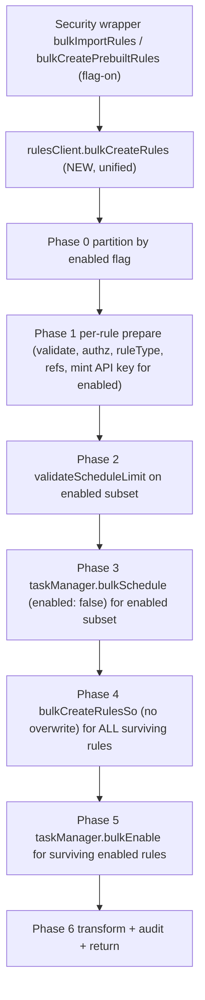

# Bulk create + enable rules (alerting + security wiring)

## Goal

Implement Section 3 ("`bulkCreateAndEnableRules`") of [.claude/reports/bulk-create-with-enable.md](.claude/reports/bulk-create-with-enable.md) as the new public method `rulesClient.bulkCreateRules`, and wire it into the security `_import` and `_perform` endpoints behind a `bulkCreateRulesEnabled` experimental flag (mirroring how PR #264371 gates the disabled-only POC).

Differences from PR #264371:
- One unified `bulkCreateRules` (not disabled-only). It handles enabled rules natively: API-key minting, `validateScheduleLimit`, `taskManager.bulkSchedule` + `bulkEnable`, audit `CREATE` + `ENABLE`.
- Failure semantics are **partition-aware best-effort** (per Section 3 of the report and the answers above): TM `bulkSchedule` whole-throw fails only the enabled subset; SO `bulkCreate` whole-throw aborts the whole batch with strict cleanup; per-row failures are isolated.
- Out of scope (explicit): #264892 fix, UIAM-tag fix, single-rule create-rollback API-key leak, bulk-overwrite for `_import`. We must just **not replicate** the #264892 buggy whole-throw invalidation pattern in our new code.

## Branch

Stay on the current branch `bulk-create-enable-alerting-rules`. PR #264371 is reference only — none of its code is on disk and we do not cherry-pick it.

## Architecture



Failure handling (per phase):
- Phase 1 per-rule throw -> push error, drop from set.
- Phase 2 fail -> bulk-invalidate enabled-subset keys, push per-rule error for enabled subset, **continue** with disabled subset.
- Phase 3 whole throw -> same as Phase 2 plus drop enabled subset; do not rethrow. Per-task silent drops -> diff returned ids vs requested, push per-rule error, drop from `preparedRules` before Phase 4. Track `scheduledTaskIdsThisCall`.
- Phase 4 per-row error -> push error, invalidate that rule's new key, `taskManager.removeIfExists(rule.id)` **only if** id ∈ `scheduledTaskIdsThisCall`. Whole throw -> bulk-invalidate every newly-minted key in `apiKeysMap`, best-effort `taskManager.bulkRemove(scheduledTaskIdsThisCall)`, rethrow.
- Phase 5 per-task error -> append to `taskIdsFailedToBeEnabled`, no rollback (rule exists, just disabled).

## 1. Alerting plugin — new `bulkCreateRules`

New files under `x-pack/platform/plugins/shared/alerting/server/application/rule/methods/bulk_create/`:

- `types.ts` — public `BulkCreateRulesItem<Params>`, `BulkCreateRulesParams<Params>`, `BulkCreateRulesResult<Params>`. Same envelope as `BulkEnableRulesResult` (`{ rules, errors, total, taskIdsFailedToBeEnabled }`) so wrappers can merge uniformly.
- `schemas.ts` — `bulkCreateRulesParamsSchema`.
- `bulk_create_rules.ts` — the orchestration (Phases 0–6 above). Reuses existing helpers verbatim:
  - Per-rule prepare reuses the same building blocks as [create_rule.ts](x-pack/platform/plugins/shared/alerting/server/application/rule/methods/create/create_rule.ts): `addGeneratedActionValues`, `createRuleDataSchema.validate`, `ruleTypeRegistry.get`/`ensureRuleTypeEnabled`, `authorization.ensureAuthorized`, `validateRuleTypeParams`, `validateActions`, `validateAndAuthorizeSystemActions`, `extractReferences`, `transformRuleDomainToRuleAttributes`, `apiKeyAsRuleDomainProperties`. For `enabled` inputs additionally `createNewAPIKeySet({ shouldUpdateApiKey: true })` (same helper used by [bulk_enable_rules.ts](x-pack/platform/plugins/shared/alerting/server/application/rule/methods/bulk_enable/bulk_enable_rules.ts) at lines ~242-249) and pre-set `scheduledTaskId: id` and `lastEnabledAt`.
  - `bulkCreateRulesSo` from `data/rule` for the SO write (no `overwrite`).
  - `bulkMarkApiKeysForInvalidation` for compensation.
  - `tryToEnableTasks` exported from `bulk_enable_rules.ts:433-477` for Phase 5.
  - Audit events: per-rule `RuleAuditAction.CREATE` (mirrors single path) and `RuleAuditAction.ENABLE` for the enabled subset.
  - **No OCC retry** (Section 3.4 of report — ids are caller-controlled, no concurrent-writer scenario).
- `index.ts` — re-exports.

Wire-in:

- `x-pack/platform/plugins/shared/alerting/server/rules_client/rules_client.ts` — add `public bulkCreateRules = <Params extends RuleTypeParams = never>(params) => bulkCreateRules<Params>(this.context, params);`.
- `x-pack/platform/plugins/shared/alerting/server/rules_client.mock.ts` — add `bulkCreateRules: jest.fn().mockResolvedValue({ rules: [], errors: [], total: 0, taskIdsFailedToBeEnabled: [] })`.
- `x-pack/platform/plugins/shared/alerting/server/index.ts` — re-export the new types from `application/rule/methods/bulk_create`.
- `x-pack/platform/plugins/shared/alerting/server/authorization/types.ts` (if needed) — confirm `WriteOperations.Create` is sufficient (it is — we authorize per (ruleTypeId, consumer) pair, same as single create). Per-pair dedupe authorization in Phase 1 (one `ensureAuthorized` per distinct pair) per #264893.

Unit test: `bulk_create/bulk_create_rules.test.ts`. Cover the matrix from Section 2 of the report:
- empty input
- all-disabled happy path (no TM, no API keys)
- all-enabled happy path (Phase 1 keys, Phase 3 schedule, Phase 4 SO write, Phase 5 enable)
- mixed enabled+disabled happy path
- Phase 1 per-rule throw isolated; remaining rules persist
- Phase 2 trip → enabled keys invalidated, disabled subset still created, per-rule errors only for enabled subset
- Phase 3 whole throw → enabled subset failed (keys invalidated, errors), disabled subset still created
- Phase 3 silent per-task drop → per-rule error pushed, drop before Phase 4
- Phase 4 per-row 409 on Phase-3-scheduled id → key invalidated, `removeIfExists(id)` called
- Phase 4 per-row 409 on caller-supplied id NOT in `scheduledTaskIdsThisCall` → no `removeIfExists` (the guard test)
- Phase 4 whole throw → all newly-minted keys invalidated, `bulkRemove(scheduledTaskIdsThisCall)` attempted, rethrow
- Phase 5 per-task error → `taskIdsFailedToBeEnabled` populated, no SO rollback

Note: explicitly assert the per-row Phase-4 invalidation is **per-rule** (only the failed rule's key), not whole-batch — this is the #264892 anti-pattern we must not repeat.

## 2. Security solution — experimental flag

Add to [x-pack/solutions/security/plugins/security_solution/common/experimental_features.ts](x-pack/solutions/security/plugins/security_solution/common/experimental_features.ts) inside `allowedExperimentalValues`:

```ts
/**
 * When enabled, prebuilt rule installation (POST .../prebuilt_rules/installation/_perform)
 * and rule import (POST .../rules/_import) use the new alerting `rulesClient.bulkCreateRules`
 * path, which handles both disabled and enabled rules (API key minting + task scheduling)
 * in a single call instead of the per-rule create loop.
 *
 * Release: TBD
 */
bulkCreateRulesEnabled: false,
```

Local opt-in in `config/kibana.dev.yml` (do not commit).

## 3. Security wrappers

### 3a. Disabled-only path: `bulkCreatePrebuiltRules`

New: `x-pack/solutions/security/plugins/security_solution/server/lib/detection_engine/rule_management/logic/detection_rules_client/methods/bulk_create_prebuilt_rules.ts`. Mirrors single-rule [create_rule.ts](x-pack/solutions/security/plugins/security_solution/server/lib/detection_engine/rule_management/logic/detection_rules_client/methods/create_rule.ts) but bulk: per-rule transform `PrebuiltRuleAsset → CreateRuleData` with `enabled: false`, then one `rulesClient.bulkCreateRules({ rules })`. Map results back to `RuleResponse[]` and per-rule errors to the existing `aggregatePrebuiltRuleErrors` shape.

Expose on `IDetectionRulesClient` ([detection_rules_client_interface.ts](x-pack/solutions/security/plugins/security_solution/server/lib/detection_engine/rule_management/logic/detection_rules_client/detection_rules_client_interface.ts), [detection_rules_client.ts](x-pack/solutions/security/plugins/security_solution/server/lib/detection_engine/rule_management/logic/detection_rules_client/detection_rules_client.ts), and [`__mocks__`](x-pack/solutions/security/plugins/security_solution/server/lib/detection_engine/rule_management/logic/detection_rules_client/__mocks__/detection_rules_client.ts)).

### 3b. Mixed enabled/disabled path: `bulkImportRules`

New: `x-pack/solutions/security/plugins/security_solution/server/lib/detection_engine/rule_management/logic/detection_rules_client/methods/bulk_import_rules.ts`. Per chunk:

1. Per-rule pre-checks (isolated try/catch, push to errors, drop from set):
   - `ruleToImportHasVersion`, `checkRuleExceptionReferences`, `ruleSourceImporter.calculateRuleSource`, `validateMlAuth`.
2. Bulk conflict lookup: inline `findRules` call with KQL `alert.attributes.params.ruleId: ("..." OR "..." OR ...)` (escape `\` and `"`). Build `Map<ruleId, RuleResponse>`. KQL/ES margin already analyzed in the prior plan (well within `max_clause_count` at chunk size 50).
3. Classify per rule:
   - `existing && !overwriteRules` → conflict error.
   - `existing && overwriteRules` → fallback to existing per-rule [`importRule`](x-pack/solutions/security/plugins/security_solution/server/lib/detection_engine/rule_management/logic/detection_rules_client/methods/import_rule.ts) under a small `pMap` cap. Out of scope: bulk overwrite.
   - `!existing` → bulk-create candidate; preserve user-requested `enabled` flag (do **not** force-disable, since alerting `bulkCreateRules` now handles enabled rules natively).
4. Build `BulkCreateRulesItem[]` with caller-assigned `options.id = uuidv4()` so we can re-pair results to inputs by id.
5. One `rulesClient.bulkCreateRules({ rules })` call. Merge per-rule errors and `taskIdsFailedToBeEnabled` into the wrapper's response. A rule whose `taskIdsFailedToBeEnabled` contains its id is reported as a warning-style error (rule exists but task didn't enable) per the existing `bulkEnableRules` precedent.
6. Reshape combined results back into `Array<RuleResponse | RuleImportErrorObject>` so the route ([api/rules/import_rules/route.ts](x-pack/solutions/security/plugins/security_solution/server/lib/detection_engine/rule_management/api/rules/import_rules/route.ts)) is unchanged.

Expose `bulkImportRules` on `IDetectionRulesClient` and the mock.

### 3c. Branch the orchestrators on the flag

- [logic/import/import_rules.ts](x-pack/solutions/security/plugins/security_solution/server/lib/detection_engine/rule_management/logic/import/import_rules.ts): per-chunk loop branches on `experimentalFeatures.bulkCreateRulesEnabled` — flag on calls `detectionRulesClient.bulkImportRules(...)`, flag off keeps today's `detectionRulesClient.importRules(...)`. Pass `experimentalFeatures` from the route handler.
- [perform_rule_installation_handler.ts](x-pack/solutions/security/plugins/security_solution/server/lib/detection_engine/prebuilt_rules/api/perform_rule_installation/perform_rule_installation_handler.ts): per-chunk branches — flag on calls `detectionRulesClient.bulkCreatePrebuiltRules(...)`, flag off keeps today's `createPrebuiltRules(detectionRulesClient, ruleAssets, logger)` (the promise-pool path) untouched. `BATCH_SIZE` stays 100 for the bulk path; legacy path keeps its original chunking.

## 4. Tests

- Alerting unit tests for the new `bulkCreateRules` (matrix above).
- Security unit tests:
  - `bulk_create_prebuilt_rules.test.ts` — disabled path, partial errors propagate, audit/result shape unchanged.
  - `bulk_import_rules.test.ts` — all-new disabled, all-new enabled (single bulk call delivers both, no follow-up `bulkEnable` call from wrapper), mixed new/existing with `overwriteRules: false` (conflicts), with `overwriteRules: true` (existing fall through to per-rule `importRule`), bulk per-row error re-pairing via uuid, `taskIdsFailedToBeEnabled` surfaces in response, ML auth pre-check failure isolated.
  - Bulk-conflict KQL filter unit test asserting escaping of `\` and `"`.
- Adjust `perform_rule_installation_handler` and `import_rules` tests if they assert the specific code path; gate on the flag where needed. Existing main-branch behavior must still pass with flag off.

## 5. Validation

- `node scripts/type_check --project x-pack/platform/plugins/shared/alerting/tsconfig.json`
- `node scripts/type_check --project x-pack/solutions/security/plugins/security_solution/tsconfig.json`
- `node scripts/jest x-pack/platform/plugins/shared/alerting/server/application/rule/methods/bulk_create`
- `node scripts/jest x-pack/solutions/security/plugins/security_solution/server/lib/detection_engine/rule_management/logic/detection_rules_client/methods/bulk_import_rules.test.ts`
- `node scripts/jest x-pack/solutions/security/plugins/security_solution/server/lib/detection_engine/prebuilt_rules/api/perform_rule_installation`
- `node scripts/eslint --fix $(git diff --name-only main)`
- `node scripts/check_changes.ts`
- Manual smoke (both flag states): `_import` of `3rules.ndjson` (mixed enabled/disabled) and `_perform` for prebuilt installation. With flag on, verify in logs/Kibana that one `bulkCreate` SO call and at most one `bulkSchedule`/`bulkEnable` round-trip per chunk happen.

## 6. Out of scope (deferred follow-ups)

- Issue **#264892** — fix the API-key invalidation bug in `saveBulkUpdatedRules` whole-throw. We will not replicate the buggy pattern in our new code, but the existing fix lives in a separate PR.
- UIAM tag gap (`addMissingUiamKeyTagIfNeeded`) in bulk methods — separate cross-cutting fix touching `bulkEnableRules` too.
- Single-rule `createRuleSavedObject` API-key leak on schedule-failure rollback.
- Bulk overwrite path for `_import` — stays per-rule via existing `importRule`.
- Compatibility with #264907 (`bulkCreatePrebuiltRules` performance issue): satisfied as a side-effect (this branch implements its required underlying primitive plus the wiring).