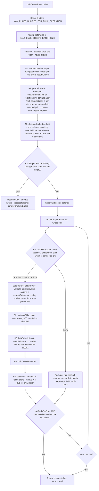

# bulk_create_rules: lean call-wide pre-flight refactor

## Motivation

Framework custodian feedback (verbatim):

- "Let's be cautious about which operations we perform before writes to ES. For example, let's not do validation between ES calls (even API key creation)."
- "Keeping track of the results is a memory footgun. keep the minimum info in memory."
- Q&A: "Before doing any API calls to ES (like API generation, rule creation, etc), let's do first the operations that can fail fast like schema validation. Then, when all checks have passed, we can go and start doing the ES calls. This will help us with doing as few reverts as possible."

Today, [bulk_create_rules.ts](x-pack/platform/plugins/shared/alerting/server/application/rule/methods/bulk_create/bulk_create_rules.ts) calls `prepareRule` **per batch**, and `prepareRule` interleaves validation with API-key minting. So a schema-invalid rule in batch 5 of 10 happens *after* batches 1–4 already wrote SOs, scheduled tasks, and minted keys — the exact case the feedback wants to prevent.

A previous design carried transformed `PreflightValidatedRule` payloads (references, params, actionsWithRefs, artifactsWithRefs, ruleType) across batches. At the 10k hard cap that's hundreds of MB held in memory — the "memory footgun" the custodians explicitly warned about. This plan stores **only `{ id, error? }`** call-wide and rebuilds transforms per-batch.

A previous iteration also (a) auto-aborted on any preflight error and (b) auto-threw on authz failure regardless of `exitEarlyOnError`. (a) was rejected as a silent breaking change to the per-rule isolation contract; (b) was considered as an opt-in under `exitEarlyOnError=true` but ultimately rejected as well because:

1. It bundles two distinct concepts (operational halt vs. failure-shape change) onto a single flag whose original purpose was "stop digging once we know we're in trouble" — not "rewrite the audit/return contract."
2. It produces an asymmetric audit shape across modes for the same call-site (per-rule with `savedObject` under default, one call-wide with no `savedObject` under `exitEarlyOnError=true`), which is harder to consume downstream.
3. The custodian-blessed precedent (`checkAuthorizationAndGetTotal`) exists for methods that don't batch and have no `exitEarlyOnError` flag; `bulkCreate` already has a better-suited primitive (the A→B boundary short-circuit) that satisfies "as few reverts as possible" without inventing a parallel throw path.

**Resolution: authz failures are always per-rule, in both modes.** The existing `exitEarlyOnError` flag is extended only to use its established "operational halt" meaning at the Phase A→B boundary — when set, any preflight error (including authz) triggers an early return with zero ES writes. Phase A never throws mid-step. This preserves today's `bulkCreate` contract verbatim under the default flag value, and gives strict-mode callers a clean "stop digging" signal without changing return/audit shape.

## Design

### Phase A — lean call-wide pre-flight (no ES action lookups)

A single new function `preflightChecks` runs **before any batching**.

Step 1: sequential `for` loop over **all inputs**. Each iteration is wrapped in its own `try/catch` so a synchronous throw from any check (e.g. `createRuleDataSchema.validate`, `ruleTypeRegistry.get`, `validateRuleTypeParams`, the minimum-interval guard, or `addGeneratedActionValues` if it ever throws on `kql → dsl`) is captured as that rule's error and the loop continues. **One bad rule produces one error entry; other rules are not affected.**

Per rule, in order (cheapest first):

1. `addGeneratedActionValues(rule.data.actions, rule.data.systemActions, context)` — returns new arrays with UUIDs and `alertsFilter.query.dsl` filled in. Pure (verified at [add_generated_action_values.ts](x-pack/platform/plugins/shared/alerting/server/rules_client/lib/add_generated_action_values.ts) — `.map` + spread, no input mutation). The only throw path is invalid KQL ([add_generated_action_values.ts L38-40](x-pack/platform/plugins/shared/alerting/server/rules_client/lib/add_generated_action_values.ts)) — caught per-rule. Pass the returned `data = { ...rule.data, actions, systemActions }` into the schema check below.
2. `createRuleDataSchema.validate(data)` — `@kbn/config-schema` throws synchronously on failure; caught per-rule and surfaced as `Boom.badRequest('Error validating create data - ...')` matching single-rule `createRule` behaviour ([create_rule.ts L84-88](x-pack/platform/plugins/shared/alerting/server/application/rule/methods/create/create_rule.ts)).
3. `ruleTypeRegistry.get(data.alertTypeId)` — throws 400 if unregistered; caught per-rule.
4. `ruleTypeRegistry.ensureRuleTypeEnabled(data.alertTypeId)` — throws if disabled; caught per-rule.
5. `validateRuleTypeParams(data.params, ruleType.validate.params)` — params shape; caught per-rule.
6. `parseDuration(schedule.interval)` + minimum-interval check (when `enforce=true`) — caught per-rule.

State held: `Map<index, { id: string; ok: boolean; error?: BulkCreateOperationError; consumerKey?: string; enabled?: boolean; interval?: string }>`. **No generated arrays are stored** — the locally-built `data` is discarded at end of iteration.

> **Note on `addGeneratedActionValues` running in both phases.** The function also runs in Phase B step 1 (inside `prepareRule`). This means `v4()` is called twice per auto-generated action UUID and `buildEsQuery` runs twice per `alertsFilter`. This is intentional: Phase A's generated UUIDs are never exposed (Phase A's outcome state stores only `id` / `error` / consumer key / enabled / interval — no action UUIDs ever reach error messages, audit logs, or return values), so the Phase-A UUIDs are throwaway. The SO that lands carries Phase B's UUIDs, consistent within a single rule's lifecycle. Worst-case waste at the 10k hard cap is ~250 ms total CPU — negligible compared to the alternatives (storing generated arrays across batches violates C4 memory; threading a UUID-override map adds helper surface). Document in code comment.

Step 2: per-pair authorization (the only ES read in Phase A) — **always per-rule on rejection; never throws**.

Today's `bulkCreate` contract is per-rule authz isolation: a user with partial permissions creates the subset they're authorized for and gets per-rule errors for the rest. The sibling-bulk methods (`bulkDelete`/`bulkEnable`/etc.) instead emit one call-wide audit and re-throw — that precedent intentionally **does not apply here**, because (a) those methods don't batch and have no `exitEarlyOnError` flag, (b) `bulkCreate` already has a better-suited primitive (the A→B boundary short-circuit) for the "stop digging" use case, and (c) the security-solution callers ([bulk_import_rules.ts](x-pack/solutions/security/plugins/security_solution/server/lib/detection_engine/rule_management/logic/detection_rules_client/methods/bulk_import_rules.ts), [bulk_create_prebuilt_rules.ts](x-pack/solutions/security/plugins/security_solution/server/lib/detection_engine/rule_management/logic/detection_rules_client/methods/bulk_create_prebuilt_rules.ts)) depend on the per-rule contract.

Implementation (matches today's per-pair dedup, lifted out of `prepareRule`):

- Build `pairsToCheck: Map<authzKey, { alertTypeId, consumer, ruleIndices: number[] }>` where `authzKey = \`${alertTypeId}::${consumer}\`` and `ruleIndices` are the Phase A1 input indices that share the pair.
- For each unique pair, call `context.authorization.ensureAuthorized({ ruleTypeId, consumer, operation: WriteOperations.Create, entity: AlertingAuthorizationEntity.Rule })`. Run as a deduped sequential `for` loop (typical bulk has 1-10 unique pairs; latency is negligible and the resulting code is simpler than `pMap` here). Wrap each call in its own `try/catch` so one pair's rejection does not affect others.
- **On a pair-level rejection** (same behavior regardless of `exitEarlyOnError`):
  - For every `ruleIndex` in the rejected pair: emit a per-rule `RuleAuditAction.CREATE` failure audit event with `savedObject: { type: RULE_SAVED_OBJECT_TYPE, id, name }` (matches today's `prepareRule` audit shape verbatim).
  - Mark each of those rules as errored in the preflight outcome map (`{ ok: false, error: { message: authzError.message, status: authzError.output?.statusCode, rule: { id, name } } }`).
  - Other pairs continue to be checked.
- Per-`ruleTypeId` registry checks already happen in Phase A step 1.4 (per rule). No need to repeat here.
- The `exitEarlyOnError` short-circuit at the A→B boundary (see below) is the single mechanism that turns "any preflight error" into "zero ES writes". Step 2 never participates in that decision directly — it just records errors.

> **Note**: today's per-pair dedup in `utils.ts` L119-130 is preserved verbatim; only the failure-handling moves out of `prepareRule` (so it no longer interleaves with API-key minting). The audit-event shape is unchanged — single source of truth for "bulkCreate authz failed for this rule".

Step 3: deduped schedule-limit:

- Collect intervals for surviving **enabled** rules.
- One `validateScheduleLimit` call across all of them.
- On overflow: mark the enabled subset as demoted (`disabledReason: 'schedule_limit_exceeded'`). Demoted rules **still proceed to ES write** as disabled, mirroring today's `demotePreparedRules` semantics.

> **Note**: action/connector validation does **not** happen in Phase A. It moves into Phase B step 0 as a per-batch pre-fetch (see below), following the pattern established in [commit d0483a2 "Add performance improvements"](https://github.com/elastic/kibana/commit/d0483a20df2fa7e96cb7ecff036656185b69147f). That keeps Phase A's ES touches limited to authz only, and bounds the connector-map memory to one batch at a time.

### Post-Phase A decision

After Phase A completes (it never throws):

- `validIds: string[]` (rules that will proceed to ES, possibly with demoted enabled→disabled flags from schedule-limit overflow)
- `preflightErrors: BulkCreateOperationError[]` (per-rule, full granularity preserved at API level — schema/registry/params/interval/`addGeneratedActionValues`/per-rule authz/schedule-limit demotion failures each report against their own rule index)

Behaviour:

- **`exitEarlyOnError === true` AND `preflightErrors.length > 0`** → return `{ successfulIds: [], errors: preflightErrors, total }`. **Zero ES writes.** This is the "stop digging" branch; it covers preflight authz failures, schema failures, registry failures, and schedule-limit demotions equally — strict-mode callers don't need to discriminate by error type.
- **`validIds.length === 0`** (no survivors, regardless of flag) → return `{ successfulIds: [], errors: preflightErrors, total }`. **Zero ES writes.** No point entering Phase B with an empty input.
- Else → continue to Phase B with `validIds`. Per-rule errors are aggregated into the final response.

**The current `bulkCreate` per-rule-isolation contract is preserved verbatim.** No caller (today's default-flag callers OR future `exitEarlyOnError=true` callers) sees a change in error shape, audit shape, or return-vs-throw semantics for authz failures. The only difference under `exitEarlyOnError=true` is that Phase B is skipped when any preflight error is present — the same "operational halt" semantics the flag already provides between batches in Phase B.

### Phase B — per-batch ES writes only

Slice `validIds` into batches of `batchSize` (clamped to `MAX_BULK_CREATE_BATCH_SIZE`). For each batch:

0. **Pre-fetch actions** via new `prefetchActions(...)` helper (pattern from [commit d0483a2](https://github.com/elastic/kibana/commit/d0483a20df2fa7e96cb7ecff036656185b69147f)):
   - Skip entirely when the batch has no actions or systemActions across any rule (avoid an empty `getBulk` call).
   - Otherwise, union every action ID + systemAction ID across this batch's rules.
   - One `actionsClient.getBulk({ ids: [...union], throwIfSystemAction: false })` call.
   - Returns `Map<id, ActionResult | InMemoryConnector>` — pass through to step 1.
   - **On throw (batch-wide error, no fallback):** `actionsClient.getBulk` throws synchronously on the first missing connector ID. Catch the throw and treat it as a **batch-wide error**: for every rule in the batch push `{ message: prefetchError.message, status: prefetchError.output?.statusCode, rule: { id, name } }` into `errors[]`, set `batchPrefetchFailed = true`, and **skip steps 1–6 for this batch**. No API keys are minted, no `bulkSchedule`, no `bulkCreate`. Continue to the next batch unless `exitEarlyOnError` (see step 7). This deliberately avoids any per-rule `getBulk` fallback that would mean ES reads sit between failed prefetch and writes — see C5 rationale in §"Risks / open items".
1. **`prepareRule`** (per rule, in-memory now that actions are pre-fetched):
   - `addGeneratedActionValues(rule.data.actions, rule.data.systemActions, context)` — returns new arrays with UUIDs (does NOT mutate input). Use the returned `data = { ...rule.data, actions, systemActions }` for all downstream steps. **Re-runs Phase A's call** — Phase A's UUIDs are discarded; Phase B's land in the SO. See §"Risks / open items" for the trade-off rationale.
   - `validateActions(context, ruleType, data, allowMissingConnectorSecrets, preFetchedActions)` — uses the map; no ES call.
   - `validateAndAuthorizeSystemActions({ ..., preFetchedActions })` — uses the map; no ES call.
   - `extractReferences(context, ruleType, allActions, validatedRuleTypeParams, artifacts, preFetchedActions)` — uses the map.
   - `transformRuleDomainToRuleAttributes(...)` to build `rawRule`.
   - All payloads released at end of batch.
2. **Mint API keys** for the enabled subset:
   - Per-rule via `createNewAPIKeySet(context, ...)`, run through `pMap` at concurrency `API_KEY_GENERATE_CONCURRENCY` (= 50, defined in [constants.ts](x-pack/platform/plugins/shared/alerting/server/rules_client/common/constants.ts)). This matches today's behavior and is preserved verbatim from the existing `prepareRule`.
   - **Soft-fail per rule:** on `createNewAPIKeySet` throw, flip that rule's `effectiveEnabled` to `false`, set `apiKeyProps` to a null key, and push a `BulkCreateOperationError` with `disabledReason: 'api_key_creation_failed'`. The rule still proceeds to the SO write as disabled. This is N concurrent ES writes per batch (capped at 50), all of which complete before step 3. **No bulk API-key mint endpoint exists today** — pMap concurrency is the established pattern across the alerting plugin (`prepareRule`, `bulk_enable_rules`, `bulk_edit_rules_occ`).
   - Note: although step 2 is N writes, **no validation happens between any of them and step 3** — all validation already completed in step 1.
3. `context.taskManager.bulkSchedule(tasks)` with `enabled: true` and **no `runAt` / `scheduledAt`** on the task instances. TM ([PR #269991](https://github.com/elastic/kibana/pull/269991)) applies `addJitter` server-side: first task runs immediately, the rest are spread up to `min(interval, 5m)`.
4. `bulkCreateRulesSo(...)` — writes SOs with each rule's effective `enabled` flag.
5. Per-row outcomes from `bulkResponse.saved_objects`:
   - Success → push to `successfulIds`; emit `ENABLE` audit if enabled.
   - Error → push to `errors`, queue task ID for cleanup, queue API key for invalidation.
6. **Best-effort cleanup** (custodian-approved): `taskManager.bulkRemove(failedTaskIds)` and `bulkMarkApiKeysForInvalidation(...)`. Swallow errors with `logger.error`.
7. If `exitEarlyOnError && (batchPrefetchFailed || perRowFailureOccurred)` → break the outer loop. Return what we have.

Order of ES touches per batch is therefore: **prefetch actions (read) → API key mint (N writes, soft-fail per rule) → bulkSchedule (write) → bulkCreate SOs (write)**. All validation lives in step 1, which is pure CPU once step 0 finishes. **No validation between any ES calls** — step 0's read is followed by pure-CPU validation in step 1, then four consecutive write steps with no validation interleaved.

## Control flow

## Memory characteristics

| Phase | State held | Approx size at 10k hard cap |
|---|---|---|
| A — per-rule outcome map | `Map<idx, { id, ok, error?, consumerKey?, enabled?, interval? }>` | ~150 bytes/rule = ~1.5 MB |
| A — error array | `BulkCreateOperationError[]` for invalid rules | bounded by failure rate |
| A — authz pair map | `Map<authzKey, { alertTypeId, consumer, ruleIndices: number[] }>` | bounded by unique pairs (typically 1-10) |
| B — current batch only | `Map<id, PreparedRule>` with rawRule, references, schedule, etc. | bounded by `batchSize` (max 500 → ~50 MB worst case at full ruleAttributes) |
| B — prefetched actions (current batch) | `Map<connectorId, ActionResult | InMemoryConnector>` | bounded by `batchSize × max-actions-per-rule` (~2500 entries at 500 × 5) |
| Cross-call accumulators | `successfulIds: string[]`, `errors: BulkCreateOperationError[]` | strings + small objects, linear in successes |

No call-wide accumulation of transformed payloads. Phase A's generated action arrays from `addGeneratedActionValues` are **not** retained (rerun in Phase B by design — see §"Risks / open items"). **C4 (memory footgun) satisfied.**

## Files to change

- [bulk_create_rules.ts](x-pack/platform/plugins/shared/alerting/server/application/rule/methods/bulk_create/bulk_create_rules.ts) — add `preflightChecks` (Phase A) before the batch loop; the new Phase A2 lives here too (or in a small private helper inside `utils.ts`); rewrite `runBatch` to consume `validIds[]`, call `prefetchActions` once per batch, then `prepareRule` per rule with the resulting map; remove per-batch `authzCache` (authz moved to Phase A2).
- [utils.ts](x-pack/platform/plugins/shared/alerting/server/application/rule/methods/bulk_create/utils.ts) — split today's `prepareRule` into:
  - `preflightChecks` — in-memory only, returns `{ ok: true; consumerKey; enabled; interval } | { ok: false; error }`. **No transforms, no action lookups.**
  - `prepareRule` — runs in Phase B per batch. Accepts `preFetchedActions?: Map<id, ActionResult | InMemoryConnector>` (Map shape — per-batch caller's view). Does `validateActions` / `validateAndAuthorizeSystemActions` / `extractReferences` (all pure CPU when the map is present), API key minting (per-rule via `pMap` concurrency=`API_KEY_GENERATE_CONCURRENCY`, soft-fail), and `transformRuleDomainToRuleAttributes`. Output shape matches today's `PreparedRule`.
  - Add `prefetchActions(actionsClient, batch, logger)` helper: unions connector IDs, calls `actionsClient.getBulk({ ids, throwIfSystemAction: false })`, returns `Map<id, ActionResult | InMemoryConnector>` on success. **On throw, re-throws to the caller (no fallback)** — caller (`runBatch`) catches and marks the entire batch as errored. Returns an empty map (or short-circuits in the caller) when the batch has zero connector IDs.
  - Add `sliceActionsById(map, actions)` helper: returns ordered `Array<ActionResult | InMemoryConnector>` subset of pre-fetched actions for a given rule's `data.actions` / `data.systemActions`. **This is the Map → Array conversion bridge: per-batch caller holds a `Map`; downstream shared helpers consume an `Array`.** (See [commit d0483a2](https://github.com/elastic/kibana/commit/d0483a20df2fa7e96cb7ecff036656185b69147f) for the canonical shape.)
  - Add Phase A2 authz helper (`runPerPairAuthorization` or inline in `bulk_create_rules.ts`): builds `Map<authzKey, { alertTypeId, consumer, ruleIndices }>`, runs deduped `ensureAuthorized` per pair, and on rejection emits per-rule audit + per-rule error for every rule in the rejected pair. **Never throws** — failures are recorded in the preflight outcome and the `exitEarlyOnError` boundary check decides whether to short-circuit.
  - In `buildTaskInstance`: **delete** `runAt: new Date()` and `scheduledAt: new Date()`. Delete the commented `// import { BULK_TM_SCHEDULE_DELAY ...` line at the top of the file.
- **Shared `rules_client/lib` helpers** — additive, backward-compatible (mirrors [commit d0483a2](https://github.com/elastic/kibana/commit/d0483a20df2fa7e96cb7ecff036656185b69147f)). **Each helper accepts an `Array<ActionResult | InMemoryConnector>`**, not a Map — `sliceActionsById` does the conversion at the call site. Layering: `runBatch` holds `Map<id, ...>`; for each rule, `sliceActionsById(map, rule.data.actions ++ rule.data.systemActions)` produces the `Array` passed into shared helpers.
  - [validate_actions.ts](x-pack/platform/plugins/shared/alerting/server/rules_client/lib/validate_actions.ts) — add optional `preFetchedActions?: Array<ActionResult | InMemoryConnector>`. If present, use it instead of `actionsClient.getBulk`.
  - [validate_authorize_system_actions.ts](x-pack/platform/plugins/shared/alerting/server/lib/validate_authorize_system_actions.ts) — same.
  - [extract_references.ts](x-pack/platform/plugins/shared/alerting/server/rules_client/lib/extract_references.ts) — same; threads through to `denormalizeActions`.
  - [denormalize_actions.ts](x-pack/platform/plugins/shared/alerting/server/rules_client/lib/denormalize_actions.ts) — same.
  - Single-rule callers (`createRule`, `updateRule`, etc.) keep working unchanged because the new parameter is optional and the helpers fall back to `actionsClient.getBulk` when it's absent.
- [types.ts](x-pack/platform/plugins/shared/alerting/server/application/rule/methods/bulk_create/types.ts) — add `PreflightOutcome` union type (`{ ok: true; id; consumerKey; enabled; interval } | { ok: false; id; error }`). Update `PrepareRuleArgs` to the per-batch ES-only shape (no `authzCache`, with optional `preFetchedActions: Map<id, ActionResult | InMemoryConnector>`).
- [constants.ts](x-pack/platform/plugins/shared/alerting/server/rules_client/common/constants.ts) — **delete** the `BULK_TM_SCHEDULE_DELAY = 30_000` export at L30. TM's [PR #269991](https://github.com/elastic/kibana/pull/269991) `addJitter` makes it unnecessary, and leaving it in place is misleading. Grep the alerting plugin for any other importer before removal — there should be none after the commented-out import in `utils.ts` is also removed.
- [bulk_create_rules.test.ts](x-pack/platform/plugins/shared/alerting/server/application/rule/methods/bulk_create/bulk_create_rules.test.ts) — test updates listed below.

## Test changes

### Phase A — preflight

- **Schema-invalid rule among valid rules (`exitEarlyOnError=false`, default)**: 1 invalid + N valid → invalid reported in `errors`, all N valid land in `successfulIds`. `bulkCreate` called with only the valid subset.
- **All rules fail schema validation**: `validIds.length === 0` → `{ successfulIds: [], errors: <all>, total }`. Assert **no** `taskManager.bulkSchedule`, **no** `bulkCreate`, **no** API keys minted. Regardless of `exitEarlyOnError`.
- **`exitEarlyOnError=true` + one schema-invalid rule** → `{ successfulIds: [], errors: [<that one>], total }`. Assert `taskManager.bulkSchedule` and `unsecuredSavedObjectsClient.bulkCreate` are **never called**, no API keys minted.
- **Schedule-limit overflow**: demoted rules still reach `bulkCreate` as disabled; appropriate `disabledReason` recorded in `errors`.

### Phase A — per-pair authz behavior (consistent across modes)

- **Partial-authz user + `exitEarlyOnError=false` (default)**: pair `(siem.signals, siem)` authorized; pair `(logs.alert.foo, logs)` rejected. Assert:
  - Authorized rules land in `successfulIds`.
  - Unauthorized rules: each emits one per-rule `RuleAuditAction.CREATE` audit event **with** `savedObject: { type, id, name }`; each appears in `errors[]` with the authz error message.
  - `ensureAuthorized` called **once per unique pair**, not once per rule.
  - `bulkCreate` / `bulkSchedule` / `apiKey.create` are called only for the authorized subset.
  - **Preserves today's bulkCreate contract exactly.**
- **Partial-authz user + `exitEarlyOnError=true`**: same input. Assert:
  - Per-rule audit events emitted with `savedObject` for unauthorized rules (same as default — audit shape is mode-invariant).
  - `errors[]` contains per-rule entries for every unauthorized rule.
  - **Zero ES writes**: `apiKey.create`, `taskManager.bulkSchedule`, `unsecuredSavedObjectsClient.bulkCreate` are **never called**, including for the authorized subset (A→B boundary short-circuits).
  - The call **returns normally** (does NOT throw); caller inspects `errors[]` and `successfulIds`.
- **All pairs authorized**: no audit events emitted in Phase A2; behavior is identical to today.
- **Multiple rejected pairs**: assert that the second pair is **also** checked and its rules also recorded — Phase A2 does not short-circuit on first rejection.

### Phase B — prefetch (no fallback)

- **Action prefetch — happy path**: a batch with N rules referencing M unique connectors → exactly **one** `actionsClient.getBulk` call (with `ids = M unique`), and `validateActions`/`validateAndAuthorizeSystemActions`/`extractReferences` are called per rule **without** triggering further `getBulk` calls (assert via mock call counts).
- **Action prefetch — batch with zero actions**: a batch where every rule has empty `actions` and `systemActions` → `actionsClient.getBulk` is **not called** at all for this batch.
- **Action prefetch — throw (batch-wide error, no fallback)**: `actionsClient.getBulk` throws on the first missing connector ID. Assert:
  - Every rule in the batch appears in `errors[]` with the prefetch error message.
  - **Zero** `apiKey.create` calls for this batch.
  - **Zero** `taskManager.bulkSchedule` calls for this batch.
  - **Zero** `unsecuredSavedObjectsClient.bulkCreate` calls for this batch.
  - Subsequent batches proceed normally (call counts on `getBulk` show one call per subsequent batch).
- **Action prefetch — throw + `exitEarlyOnError=true`**: same setup, but the outer loop breaks; remaining batches are not invoked.
- **Mixed-batch actions**: a batch where some rules have actions and others don't → `actionsClient.getBulk` is called once with the union of connector IDs from the actioned rules only; the no-actions rules' `validateActions` makes no `getBulk` call.

### Phase B — task instances + API key mint

- **`bulkSchedule` task instances** have `enabled: true` and **do not** include `runAt` or `scheduledAt` (TM-side jitter is asserted in TM's own tests; we assert delegation).
- **Per-rule API key mint soft-fail**: one rule's `createNewAPIKeySet` throws → that rule is created disabled with `disabledReason: 'api_key_creation_failed'` in `errors[]`; others succeed. Assert `pMap` concurrency is bounded at `API_KEY_GENERATE_CONCURRENCY`.

### Existing tests to keep

- **Hard-cap clamping** (`MAX_RULES_NUMBER_FOR_BULK_OPERATION`).
- **`batchSize` clamping** to `MAX_BULK_CREATE_BATCH_SIZE` with warn log.
- **`exitEarlyOnError=true` on SO per-row failure**: pre-flight passed, SO step had failures → remaining batches not invoked.

### `utils.test.ts` additions

- Cover `preflightChecks` and `prepareRule` separately.
- Assert `prepareRule` with `preFetchedActions` Map provided makes **no** `actionsClient.getBulk` calls.
- Assert `sliceActionsById` returns the correct ordered subset for a rule.

### Shared `rules_client/lib` helper tests

- `validate_actions.ts`, `validate_authorize_system_actions.ts`, `extract_references.ts`, `denormalize_actions.ts`: each gains a "with `preFetchedActions` array" case asserting **no** internal `actionsClient.getBulk` call, and an existing "without `preFetchedActions`" case continues to work unchanged (single-rule fallback).

## Non-changes

- No security-solution-side changes. [bulk_import_rules.ts](x-pack/solutions/security/plugins/security_solution/server/lib/detection_engine/rule_management/logic/detection_rules_client/methods/bulk_import_rules.ts) and [bulk_create_prebuilt_rules.ts](x-pack/solutions/security/plugins/security_solution/server/lib/detection_engine/rule_management/logic/detection_rules_client/methods/bulk_create_prebuilt_rules.ts) already do domain-level pre-flight (ML auth, exception lists, ruleSource calc, version) before calling `rulesClient.bulkCreateRules`. They benefit automatically.
- **No alerting-side `runAt` staggering** — handled by TM via [PR #269991](https://github.com/elastic/kibana/pull/269991).
- Per-rule error isolation contract preserved. `exitEarlyOnError` is the explicit opt-in for "stop early".

## Risks / open items

- **`addGeneratedActionValues` runs in both phases (by design).** Pure ([add_generated_action_values.ts](x-pack/platform/plugins/shared/alerting/server/rules_client/lib/add_generated_action_values.ts)): `.map` + spread, no input mutation; `async` only wraps a cached UI-settings read. Phase A's generated UUIDs/dsl are discarded; Phase B's are what land in the SO. Phase A UUIDs never leak (outcome state doesn't include action UUIDs). Worst-case duplicate CPU at 10k cap is ~250 ms — accepted to keep memory lean (the alternative — carrying the generated arrays call-wide — adds ~1.8 MB at the cap which is still lean, but the simpler "rerun and discard" design wins on code clarity and parity with single-rule path semantics).
- **No prefetch fallback (C5 strict alignment).** `actionsClient.getBulk` throws synchronously on the first missing connector ID. Earlier iterations of this plan included a "fall back to per-rule `getBulk` inside `validateActions`" path; that has been **removed** because per-rule `getBulk` would sit between the failed prefetch and the first ES write (API key mint), which is exactly the "validation between ES calls" pattern C5 prohibits. The current design treats a prefetch throw as a **batch-wide error**: every rule in the batch is marked errored, no writes happen for that batch, and (unless `exitEarlyOnError` is set) the next batch proceeds with its own independent prefetch. The user-visible cost is that a single missing connector in one rule fails its entire batch, but C5 is honored without exception.
- **Connector cardinality**: prefetch is per-batch, so the connector map is bounded by `batchSize × max-actions-per-rule`. At 500 rules × ~5 actions, the map holds ~2500 entries — comfortably small.
- **Authz contract preserved verbatim (deliberate divergence from sibling-bulk methods).** Today's `bulkCreate` contract is per-rule authz isolation (a user authorized for some rule types but not others gets a 200 with per-rule errors for the unauthorized ones). Sibling-bulk methods (`bulkDelete`/`bulkEnable`/`bulkDisable`/`bulkEdit`/`bulkEditParams`/`bulkGet`) throw 403 with one call-wide audit event on authz failure. **We keep today's `bulkCreate` contract in both modes.** Justification:
  - Those sibling methods don't batch and don't have `exitEarlyOnError`; their throw-pattern is the only "circuit breaker" they have. `bulkCreate` already has the A→B boundary short-circuit, which gives strict-mode callers the same "zero ES writes" guarantee without changing the return/audit shape.
  - Bundling "throw on authz" onto `exitEarlyOnError` would conflate two distinct concepts (operational halt vs. failure-shape change) on a single flag whose documented purpose is the former.
  - Audit shape is mode-invariant — downstream audit consumers don't have to special-case two shapes for the same call-site.
  - Security-solution callers ([bulk_import_rules.ts](x-pack/solutions/security/plugins/security_solution/server/lib/detection_engine/rule_management/logic/detection_rules_client/methods/bulk_import_rules.ts), [bulk_create_prebuilt_rules.ts](x-pack/solutions/security/plugins/security_solution/server/lib/detection_engine/rule_management/logic/detection_rules_client/methods/bulk_create_prebuilt_rules.ts)) keep working unchanged.
  - PR description should explicitly note the divergence from sibling-bulk precedent and the rationale.
- **Demotion semantics in Phase A** (schedule-limit overflow): we still demote in-memory and let the rule write as disabled. This matches today's behaviour but happens earlier in the call. Call-wide check (vs today's per-batch) means a 10-batch call that breaches the limit demotes the whole enabled subset upfront, rather than batches 1-N succeeding and batch N+1 demoting. Stricter and more predictable; PR description should make this explicit.
- **API-key mint is N concurrent ES writes per batch.** `pMap` at concurrency `API_KEY_GENERATE_CONCURRENCY` (=50). No bulk-mint endpoint exists. The N writes are all bracketed inside Phase B step 2 with no validation between them and step 3 (`bulkSchedule`) — so C5 is preserved. Per-rule failures soft-fail the affected rule to disabled (`disabledReason: 'api_key_creation_failed'`); other rules in the batch continue.
- **Return-shape contract on `exitEarlyOnError`-with-preflight-errors**: callers see `total > 0` but `successfulIds.length === 0` and a populated `errors[]`. Security-solution callers iterate the result without throwing, so this is fine — confirm in review.
- **`BULK_TM_SCHEDULE_DELAY` constant removal**: `rules_client/common/constants.ts` L30 exports `BULK_TM_SCHEDULE_DELAY = 30_000` which is only referenced from a commented-out import in `utils.ts` L34. Remove both. TM's [PR #269991](https://github.com/elastic/kibana/pull/269991) `addJitter` makes any alerting-side stagger constant unnecessary.
