# bulk_create_rules: two-phase refactor with RuleEntry map

## Motivation

Framework custodian feedback (verbatim):

- "Let's be cautious about which operations we perform before writes to ES. For example, let's not do validation between ES calls (even API key creation)."
- "Keeping track of the results is a memory footgun. keep the minimum info in memory."
- Q&A: "Before doing any API calls to ES (like API generation, rule creation, etc), let's do first the operations that can fail fast like schema validation. Then, when all checks have passed, we can go and start doing the ES calls. This will help us with doing as few reverts as possible."

Today, [bulk_create_rules.ts](x-pack/platform/plugins/shared/alerting/server/application/rule/methods/bulk_create/bulk_create_rules.ts) calls `prepareRule` **per batch**, and `prepareRule` interleaves validation with API-key minting. So a schema-invalid rule in batch 5 of 10 happens *after* batches 1–4 already wrote SOs, scheduled tasks, and minted keys — the exact case the Q&A asks us to prevent.

A previous design carried transformed `PreflightValidatedRule` payloads (references, params, actionsWithRefs, artifactsWithRefs, ruleType) across batches. At the 10k hard cap that's hundreds of MB held in memory — the "memory footgun" the custodians explicitly warned about. This plan stores **only a `Map<id, RuleEntry>`** call-wide (one entry per rule with its outcome + optional demotion record) and rebuilds transforms per-batch.

### Lessons from a previous attempt (relevant context)

A prior implementation pass on this plan was reverted before merge. Two design corrections fell out of that work and are baked into this revised plan:

1. **`validateScheduleLimit` stays in Phase B per-batch, not Phase A.** The previous plan moved it into Phase A under the "centralise validation up front" reading of the custodian feedback. The Q&A interprets more strictly: *in-memory* fail-fast checks come first, *then* ES calls. `validateScheduleLimit` is an ES read; it does not belong in the in-memory phase. Keeping it per-batch also (a) reflects intra-call growth correctly — batch N's check sees batches 1..N-1 in its baseline, (b) demotes the minimum number of rules necessary instead of the entire enabled set up front, and (c) keeps the established `demotePreparedRules` authoring path as the single place demotion errors are emitted.
2. **Phase A's central data structure is a `Map<id, RuleEntry>`, not parallel arrays.** The previous pass used a parallel `outcomes: PreflightOutcome[]` array alongside `inputsWithIds`, then built a `byId` map after Phase A2 to support downstream lookups. Routine O(n²) shapes (`.find(...)` + `.some(...)`) snuck back in. The corrected design has one map from the start: each rule's verdict is mutated in place on the entry, helpers (`runPerPairAuthorization`) operate on the map directly, and the caller's "derive errors / survivors" pass is a single `for-of` over `map.values()`.

### Three rules the design enforces

These come out of the constraints above and the custodian review. The whole structure exists to honour them.

- **C5 strict — in-memory first, ES later.** Phase A1 (per-rule in-memory checks) runs over every input. If zero rules survive A1, Phase A2 (the only ES read in Phase A, authz) is skipped entirely. We never make ES calls if every input is going to fail fast.
- **C4 — minimum information in memory.** Call-wide we hold one `RuleEntry` per input ≈ a few hundred bytes/rule (id, original rule reference, small outcome record, optional demotion record). No transformed `rawRule`/`references`/`actionsWithRefs` cross batch boundaries.
- **One demotion error per rule, one author.** Every `disabledReason` (`api_key_creation_failed`, `schedule_limit_exceeded`, `task_schedule_failed`, `task_validation_failed`) is authored in exactly one place: `demotePreparedRules` inside `runBatch`. Demotion is a Phase B concept against `PreparedRule`s — there is no Phase A demotion path, and the A→B short-circuit branch never has to reconstruct demotion errors. No fan-out, no parallel arrays of "demotion errors" alongside "preflight errors."

## Design

### Phase A — in-memory fail-fast over a `RuleEntry` map

A private `preflightChecks` orchestrator inside `bulk_create_rules.ts` builds a `Map<id, RuleEntry<Params>>` and returns it. Each entry is mutated in place by A1/A2; the map *is* Phase A's output. The caller derives `preflightErrors` and `survivingInputs` from the map in a single pass.

`RuleEntry` shape (lives in `types.ts`):

```ts
interface RuleEntry<Params> {
  id: string;
  rule: BulkCreateRulesItem<Params>;
  outcome: PreflightOutcome;
}
type RuleEntryMap<Params> = Map<string, RuleEntry<Params>>;
```

`PreflightOutcome` is the discriminated `{ ok: true, consumerKey, enabled, interval } | { ok: false, error }`. There is no `demoted?` field — demotion happens against `PreparedRule`s in Phase B only.

#### A1 — per-rule in-memory checks (`validateRule` in `utils.ts`)

Sequential `for` loop over **all inputs**. Each iteration is wrapped in its own `try/catch` so a synchronous throw from any check is captured as that rule's `ok: false` outcome and the loop continues. **One bad rule produces one entry with `outcome.ok: false`; other rules are not affected.**

Per rule, in order (cheapest first):

1. `addGeneratedActionValues(rule.data.actions, rule.data.systemActions, context)` — returns new arrays with UUIDs and `alertsFilter.query.dsl` filled in. Pure (verified at [add_generated_action_values.ts](x-pack/platform/plugins/shared/alerting/server/rules_client/lib/add_generated_action_values.ts) — `.map` + spread, no input mutation). The only throw path is invalid KQL ([add_generated_action_values.ts L38-40](x-pack/platform/plugins/shared/alerting/server/rules_client/lib/add_generated_action_values.ts)) — caught per-rule. Pass the returned `data = { ...rule.data, actions, systemActions }` into the schema check below.
2. `createRuleDataSchema.validate(data)` — `@kbn/config-schema` throws synchronously on failure; caught per-rule and surfaced as `Boom.badRequest('Error validating create data - ...')` matching single-rule `createRule` behaviour ([create_rule.ts L84-88](x-pack/platform/plugins/shared/alerting/server/application/rule/methods/create/create_rule.ts)).
3. `ruleTypeRegistry.get(data.alertTypeId)` — throws 400 if unregistered; caught per-rule.
4. `ruleTypeRegistry.ensureRuleTypeEnabled(data.alertTypeId)` — throws if disabled; caught per-rule.
5. `validateRuleTypeParams(data.params, ruleType.validate.params)` — params shape; caught per-rule.
6. `parseDuration(schedule.interval)` + minimum-interval check (when `enforce=true`) — caught per-rule.

`validateRule` returns a `PreflightOutcome`; `preflightChecks` stores it on the new `RuleEntry`. **No generated arrays are stored on the entry** — the locally-built `data` is discarded at end of iteration. The entry holds the original `rule` reference (already retained via `inputsWithIds`).

> **Note on `addGeneratedActionValues` running in both phases.** It also runs in Phase B step 1 (inside `prepareRule`). Phase A's generated UUIDs are throwaway (the entry's `outcome` records only `id` / `error` / `consumerKey` / `enabled` / `interval` — no UUIDs leak). Phase B's UUIDs are what land in the SO. Worst-case duplicate CPU at the 10k hard cap is ~250 ms — accepted to keep memory lean (C4) and helper signatures unchanged.

#### A1 short-circuit — skip A2 if zero survivors

After A1, scan `entries.values()` for at least one `outcome.ok === true`. If there are none, return the map immediately and let the caller handle the "no survivors" branch. **This is the C5 strict check**: we never make an ES read (authz) if every input failed fast.

#### A2 — deduped per-pair authorization (`runPerPairAuthorization` in `utils.ts`)

The only ES read in Phase A, and only reached if at least one A1 survivor exists.

Operates on `RuleEntryMap` directly (no parallel arrays). Builds `Map<\`${alertTypeId}::${consumer}\`, { alertTypeId, consumer, ids: string[] }>` from `entries.values()` where `outcome.ok === true`. For each unique pair, calls `context.authorization.ensureAuthorized({ ruleTypeId, consumer, operation: Create, entity: Rule })` inside its own `try/catch` (deduped sequential loop; typical bulk has 1–10 unique pairs). On pair rejection:

- For each id in the rejected pair, emit a `RuleAuditAction.CREATE` failure audit **with** `savedObject` populated (`{ type: RULE_SAVED_OBJECT_TYPE, id, name }`).
- Overwrite `entry.outcome` from `{ ok: true, ... }` to `{ ok: false, id, error: { message, status, rule: { id, name } } }`. **In-place mutation on the map value** — no parallel array to keep in sync.
- Continue checking other pairs.

**Audit shape and return-vs-throw semantics are mode-invariant** — neither `exitEarlyOnError` value changes them. This deliberately diverges from the sibling-bulk-method pattern (`checkAuthorizationAndGetTotal` re-throws); see the custodian-review report for the four-point rationale.

#### What Phase A does NOT do

- **No `validateScheduleLimit`.** It's an ES read; C5 strict says ES reads come *after* every cheap in-memory check has had a chance to fail-fast. Schedule-limit moves to Phase B per-batch (see below) — the previous "Phase A3 single-call" placement is dropped.
- **No connector/action validation.** That moves into Phase B step 0 as a per-batch prefetch, following [commit d0483a2 "Add performance improvements"](https://github.com/elastic/kibana/commit/d0483a20df2fa7e96cb7ecff036656185b69147f). Bounds connector-map memory to one batch at a time.

### A→B boundary — caller derives state in one pass

`preflightChecks` returns the map. `bulkCreateRules` walks `map.values()` once and accumulates:

- `preflightErrors: BulkCreateOperationError[]` — every entry where `outcome.ok === false` (schema/registry/params/interval/`addGeneratedActionValues`/authz failures).
- `survivingInputs: Array<{ id, rule }>` — every entry where `outcome.ok === true`.

Halt policy (the caller's job; `preflightChecks` doesn't see `exitEarlyOnError`):

- **`survivingInputs.length === 0`** → return `{ successfulIds: [], errors: preflightErrors, total }`. **Zero ES writes.** No point entering Phase B with an empty input.
- **`exitEarlyOnError === true && preflightErrors.length > 0`** → same return shape. **Zero ES writes.**
- Else → continue to Phase B with `survivingInputs`. Per-rule errors are aggregated into the final response. **The current per-rule-isolation contract is preserved.**

### Phase B — per-batch ES writes

Slice `survivingInputs` into batches of `batchSize` (clamped to `MAX_BULK_CREATE_BATCH_SIZE`). For each batch (`runBatch`):

0. **Prefetch actions** via `prefetchActions(actionsClient, batch)`:
   - Skip entirely if the batch has no actions across any rule (avoid an empty `getBulk` call).
   - Otherwise, union every action ID + systemAction ID across this batch's rules.
   - One `actionsClient.getBulk({ ids: [...union], throwIfSystemAction: false })` call.
   - Returns `PreFetchedActionsMap = Map<id, ActionResult | InMemoryConnector>` on success.
   - **On throw (batch-wide error, no fallback):** push a per-rule error for every rule in the batch with the prefetch error message, set `batchPrefetchFailed = true`, and skip steps 0.5–6 for this batch. No API keys minted, no `bulkSchedule`, no `bulkCreate`. The next batch proceeds with its own independent prefetch (unless `exitEarlyOnError` is set, in which case the outer loop breaks). **No per-rule `getBulk` fallback** — that would re-introduce validation between ES calls (C5 violation).
0.5. **Per-batch schedule-limit check** — between prefetch (a read) and any write:
   - Collect intervals for this batch's enabled subset (rules where `data.enabled === true`).
   - Skip entirely if the enabled subset is empty.
   - Call `validateScheduleLimit({ context, updatedInterval })` once. On overflow, call `demotePreparedRules(...)` to flip those rules to disabled with `disabledReason: 'schedule_limit_exceeded'`. The error message is authored here via `getBulkCreateAsDisabledMessage` and pushed onto the batch's `errors[]` by `demotePreparedRules` itself — same path used by `api_key_creation_failed` / `task_schedule_failed` / `task_validation_failed`. One error per demoted rule, authored in one place.
   - Schedule-limit demotion is **not** halt-worthy. The batch continues to step 1+ (writes the demoted rules as disabled). `exitEarlyOnError` does **not** halt the outer loop on schedule-limit demotion.
1. **`prepareRule`** (per rule, all in-memory once step 0 succeeds):
   - `addGeneratedActionValues(rule.data.actions, rule.data.systemActions, context)` — rerun (Phase A's UUIDs are discarded). Use the returned `data` for all downstream steps.
   - `validateActions(..., sliceActionsById(preFetchedActions, data.actions ++ data.systemActions))` — uses the slice; no ES call.
   - `validateAndAuthorizeSystemActions({ ..., preFetchedActions: slice })` — same.
   - `extractReferences(..., slice)` — same; threads through to `denormalizeActions`.
   - `transformRuleDomainToRuleAttributes(...)` builds `rawRule`. Discard after the batch.
2. **Mint API keys for the enabled subset** — per-rule via `createNewAPIKeySet`, run through `pMap` at concurrency `API_KEY_GENERATE_CONCURRENCY` (= 50). Soft-fail per rule (flip `effectiveEnabled` to `false`, push `disabledReason: 'api_key_creation_failed'` to `errors[]`).
3. `taskManager.bulkSchedule(tasks)` — `enabled: true`, **no `runAt` / `scheduledAt`** (deleted from `buildTaskInstance`). TM's [PR #269991](https://github.com/elastic/kibana/pull/269991) `addJitter` handles activation spread.
4. `bulkCreateRulesSo(...)` — writes SOs with each rule's effective `enabled` flag.
5. Per-row outcomes from `bulkResponse.saved_objects`:
   - Success → push to `successfulIds`; emit `ENABLE` audit if enabled.
   - Error → push to `errors`, queue task ID for cleanup, queue API key for invalidation.
6. **Best-effort cleanup**: `taskManager.bulkRemove(failedTaskIds)` and `bulkMarkApiKeysForInvalidation(...)`. Swallow errors with `logger.error`.
7. If `exitEarlyOnError && (batchPrefetchFailed || soFailureOccurred)` → break the outer loop. Schedule-limit demotion never triggers this.

ES touches per batch: **prefetchActions (read) → validateScheduleLimit (read, conditional) → API key mint (N writes, soft-fail per rule) → bulkSchedule (write) → bulkCreate SOs (write).** All per-rule validation lives in step 1, which is pure CPU once step 0 finishes. The two reads (0, 0.5) cluster at the start of the batch with no writes between them; from step 2 onward it's writes only. **No validation between ES writes.**

## Control flow

```mermaid
flowchart TD
    Start[bulkCreateRules called] --> CapCheck[Reject if total > MAX_RULES_NUMBER_FOR_BULK_OPERATION]
    CapCheck --> Clamp[Clamp batchSize to MAX_BULK_CREATE_BATCH_SIZE]
    Clamp --> Ids[Assign ids up front - SavedObjectsUtils.generateId per rule]
    Ids --> PhaseA[preflightChecks builds RuleEntryMap]
    PhaseA --> A1["A1: per-rule validateRule - in-memory only; entry.outcome set"]
    A1 --> A1Halt{Any ok=true entry?}
    A1Halt -->|no| Derive
    A1Halt -->|yes| A2["A2: runPerPairAuthorization on the map - ES read; mutates entry.outcome on rejection"]
    A2 --> Derive[Caller: one for-of over map.values to build preflightErrors + survivingInputs]
    Derive --> Halt{No survivors OR exitEarlyOnError AND any preflight error?}
    Halt -->|yes| AbortNoES["Return early - zero ES writes"]
    Halt -->|no| Loop[Slice survivingInputs into batches]
    Loop --> PhaseB[runBatch - per-batch ES writes]
    PhaseB --> B0{"B0: prefetchActions - one getBulk over union of connector IDs"}
    B0 -->|throw| BatchAbort["Per-rule prefetch error for every rule in batch; batchPrefetchFailed=true; skip B0.5-B6"]
    B0 -->|ok or no actions| B05["B0.5: validateScheduleLimit over batch enabled subset; on overflow demotePreparedRules with disabledReason=schedule_limit_exceeded"]
    B05 --> B1["B1: prepareRule per rule - validateActions/system-actions/extractReferences using sliced preFetchedActions (pure CPU)"]
    B1 --> B2["B2: pMap API key mint at concurrency=50 - soft-fail to disabled"]
    B2 --> B3[B3: bulkSchedule with enabled=true, no runAt - TM applies jitter via PR 269991]
    B3 --> B4[B4: bulkCreate SOs]
    B4 --> CleanupNode[Cleanup: bulkRemove failed tasks, invalidate failed keys]
    BatchAbort --> Next
    CleanupNode --> Next{exitEarlyOnError AND batchPrefetchFailed OR SO failure?}
    Next -->|yes| Done
    Next -->|no| MoreBatches{More batches?}
    MoreBatches -->|yes| PhaseB
    MoreBatches -->|no| Done[Return successfulIds, errors, total]
```



Note: schedule-limit demotion at B0.5 does **not** trigger the outer-loop halt — only `batchPrefetchFailed` and SO-write failures do. Schedule-limit overflow demotes the affected rules to disabled and the batch continues writing them; the next batch sees the updated baseline (rules from batches 1..N-1 that were *successfully written enabled* now count in its schedule-frequency lookup).

## Memory characteristics

| Phase | State held | Approx size at 10k hard cap |
|---|---|---|
| A — `RuleEntryMap` | `Map<id, { id, rule, outcome }>`; `rule` is a reference (not a copy), `outcome` is a small discriminated record | ~250 bytes/entry × 10k = ~2.5 MB. `rule` references are shared with `inputsWithIds`, not duplicated. |
| A — error array | derived once at the A→B boundary | bounded by failure rate |
| B — current batch only | `Map<id, PreparedRule>` with rawRule, references, schedule, etc. | bounded by `batchSize` (max 500 → ~50 MB worst case at full ruleAttributes) |
| Cross-call accumulators | `successfulIds: string[]`, `errors: BulkCreateOperationError[]` | strings + small objects, linear in successes |

No call-wide accumulation of transformed payloads. **C4 (memory footgun) satisfied.**

## Code style: minimise comments

When implementing this refactor, **keep comments to a minimum, preferably one line each**.

- Do not narrate what the code does. Names (`validateRule`, `runPerPairAuthorization`, `prefetchActions`, `sliceActionsById`, `RuleEntry`, `PreflightOutcome`, `survivingInputs`) carry the meaning.
- Reserve comments for non-obvious *intent* or *constraint* the code itself cannot convey — e.g. a one-line note at the Phase A2 audit site that the shape is mode-invariant and must not be collapsed (see custodian review §9.8), or a one-line note that `addGeneratedActionValues` is intentionally rerun in Phase B.
- Do NOT echo the plan text into code comments. Cross-reference the report file for any longer rationale instead of pasting paragraphs.
- No `// Phase A1: do thing` / `// Step 0.5: do other thing` chapter-marker comments. The function structure does the marking.

If a piece of logic genuinely needs a paragraph of explanation, that's a smell — either the structure is wrong, or the explanation belongs in the report, not the source file.

## Files to change

- [bulk_create_rules.ts](x-pack/platform/plugins/shared/alerting/server/application/rule/methods/bulk_create/bulk_create_rules.ts):
  - Add a private `preflightChecks` orchestrator that builds and returns `RuleEntryMap<Params>`. A1 calls `validateRule` per rule (sequential). After A1, scan for at least one `ok=true` entry; if none, return early without calling A2. A2 calls `runPerPairAuthorization({ context, entries })` which mutates entries in place.
  - **`preflightChecks` does NOT take `exitEarlyOnError`** — caller owns halt policy. Function is a pure "report what I found."
  - In `bulkCreateRules`: assign ids up front (`SavedObjectsUtils.generateId()` when no caller-supplied id), call `preflightChecks`, derive `preflightErrors` / `survivingInputs` in a single `for-of` over the map, apply halt policy (`!survivors || (exitEarlyOnError && hasHalt)`). Short-circuit branch returns `{ successfulIds: [], errors: preflightErrors, total }` — no demotion-error reconstruction needed (schedule-limit lives in Phase B now).
  - Rewrite `runBatch` to consume one batch from `survivingInputs`. Call `prefetchActions` once at the start. **Add per-batch `validateScheduleLimit` step (B0.5)** between prefetch and `prepareRule`. Call `prepareRule` per rule with the resulting prefetched map. Remove per-batch `authzCache` (authz centralised in Phase A2).
- [utils.ts](x-pack/platform/plugins/shared/alerting/server/application/rule/methods/bulk_create/utils.ts):
  - Add `validateRule` — per-rule in-memory checks (schema, registry, params, interval, `addGeneratedActionValues`). Returns `PreflightOutcome`. No transforms, no action lookups.
  - Add `runPerPairAuthorization({ context, entries: RuleEntryMap<Params> })` — operates on the map directly. On rejection: emits per-rule `RuleAuditAction.CREATE` audit (with `savedObject`) and mutates `entry.outcome` from `{ ok: true, ... }` to `{ ok: false, error }`. Never throws.
  - Add `prefetchActions(actionsClient, batch)` helper: unions connector IDs across the batch (skipping when zero), calls `actionsClient.getBulk({ ids, throwIfSystemAction: false })`, returns `PreFetchedActionsMap` on success. **Re-throws on failure** — caller (`runBatch`) treats the throw as a batch-wide error. No per-rule fallback.
  - Add `sliceActionsById(map, actions)` helper: returns ordered `Array<ActionResult | InMemoryConnector>` subset for a given rule's `data.actions` / `data.systemActions`. **Map → Array bridge** — `runBatch` holds a `Map`, shared helpers consume an `Array`.
  - Keep `prepareRule` (now Phase B only): accepts `preFetchedActions?: PreFetchedActionsMap`. Does `validateActions` / `validateAndAuthorizeSystemActions` / `extractReferences` (pure CPU when the map is present) + API key minting via `pMap` (concurrency `API_KEY_GENERATE_CONCURRENCY`, soft-fail per rule) + `transformRuleDomainToRuleAttributes`.
  - Keep `demotePreparedRules` as the single demotion-error authoring path — called by `runBatch` from B0.5 (schedule-limit overflow), B3 (`task_schedule_failed` / `task_validation_failed`), and from the `pMap` inside `prepareRule` step 2 (`api_key_creation_failed`, which already uses it today). The A→B short-circuit branch does NOT need it (no Phase A demotions exist).
  - `getBulkCreateAsDisabledMessage` stays where it is (already exported). No new export needed.
  - In `buildTaskInstance`: **delete** `runAt: new Date()` and `scheduledAt: new Date()`. Delete the commented `// import { BULK_TM_SCHEDULE_DELAY ...` line.
- **Shared `rules_client/lib` helpers** — additive, backward-compatible (mirrors [commit d0483a2](https://github.com/elastic/kibana/commit/d0483a20df2fa7e96cb7ecff036656185b69147f)):
  - [validate_actions.ts](x-pack/platform/plugins/shared/alerting/server/rules_client/lib/validate_actions.ts) — add optional `preFetchedActions?: Array<ActionResult | InMemoryConnector>`. If present, use it instead of `actionsClient.getBulk`.
  - [validate_authorize_system_actions.ts](x-pack/platform/plugins/shared/alerting/server/lib/validate_authorize_system_actions.ts) — same.
  - [extract_references.ts](x-pack/platform/plugins/shared/alerting/server/rules_client/lib/extract_references.ts) — same; threads through to `denormalizeActions`.
  - [denormalize_actions.ts](x-pack/platform/plugins/shared/alerting/server/rules_client/lib/denormalize_actions.ts) — same.
  - Single-rule callers (`createRule`, `updateRule`, etc.) keep working unchanged because the new parameter is optional.
- [types.ts](x-pack/platform/plugins/shared/alerting/server/application/rule/methods/bulk_create/types.ts):
  - Add `PreflightOutcome` (discriminated union: `{ ok: true; id; consumerKey; enabled; interval } | { ok: false; id; error: BulkCreateOperationError }`).
  - Add `RuleEntry<Params>` (`{ id; rule; outcome }`) and `RuleEntryMap<Params>`.
  - Update `PrepareRuleArgs` to per-batch ES-only shape: remove `authzCache`, add optional `preFetchedActions: PreFetchedActionsMap`.
- [constants.ts](x-pack/platform/plugins/shared/alerting/server/rules_client/common/constants.ts) — remove `BULK_TM_SCHEDULE_DELAY` (TM PR #269991 makes it unnecessary).
- [bulk_create_rules.test.ts](x-pack/platform/plugins/shared/alerting/server/application/rule/methods/bulk_create/bulk_create_rules.test.ts) — test updates listed below.

## Test changes

**Phase A — `validateRule` failures (per-rule isolation, default flag):**
- Schema-invalid rule among valid rules: invalid reported per-rule, valid rules still created. `bulkCreate` called with only the valid subset.
- All rules fail preflight: zero ES writes regardless of `exitEarlyOnError`. No `taskManager.bulkSchedule`, no `bulkCreate`, no `createAPIKey`. Importantly: **also no `validateScheduleLimit` and no authz call** (zero A1 survivors → A2 skipped).
- `exitEarlyOnError=true` + one preflight error → returns immediately, zero ES writes.

**Phase A — per-pair authz:**
- Partial-authz user, default flag → authorized subset created; per-rule `RuleAuditAction.CREATE` audit (with `savedObject`) emitted for unauthorized; both audits and `errors[]` shape are mode-invariant.
- Partial-authz user + `exitEarlyOnError=true` → per-rule audit emitted, per-rule errors recorded, **zero ES writes for the authorized subset too**, call returns normally (no throw).
- All pairs authorized → no Phase-A audit events emitted.
- Multiple rejected pairs → both pairs are checked; both rules in `errors[]`.

**Phase B — prefetch (no fallback):**
- Happy path: exactly one `actionsClient.getBulk` per batch with union of connector ids.
- Batch with zero actions: `actionsClient.getBulk` not called.
- Prefetch throw → batch-wide error; no API keys, no `bulkSchedule`, no `bulkCreate` for that batch.
- Prefetch throw + `exitEarlyOnError=true` → outer loop breaks.
- Prefetch throw, default flag → subsequent batches proceed independently.

**Phase B — per-batch schedule-limit (new placement at B0.5):**
- Single batch overflow: enabled subset is demoted to disabled with `disabledReason: 'schedule_limit_exceeded'`; the demoted rules **still reach `bulkCreate` as disabled**; `errors[]` contains one entry per demoted rule.
- Batch 1 overflow + batch 2 fits: assert that batch 2's `validateScheduleLimit` is called with the right intervals and **does** proceed without demotion (per-batch baseline grows as prior batches' enabled writes complete).
- Schedule-limit demotion does **NOT** halt the outer loop, even with `exitEarlyOnError=true`. (Demotion is *not* an error — the SO is still written.)
- Mixed batch where only some rules are enabled: only enabled intervals are passed to `validateScheduleLimit`; disabled rules are unaffected.

**Phase B — existing tests preserved:**
- Per-rule `createNewAPIKeySet` throw → rule becomes disabled with `disabledReason: 'api_key_creation_failed'`.
- `bulkSchedule` per-task silent drop → demoted with `disabledReason: 'task_validation_failed'`, SO still written.
- `bulkCreate` per-row error → `errors[]` push, task cleanup queued.
- `exitEarlyOnError=true` on SO per-row failure → remaining batches not invoked.
- `bulkSchedule` task instances: `enabled: true`, **no** `runAt` / `scheduledAt`.
- Hard-cap clamping (`MAX_RULES_NUMBER_FOR_BULK_OPERATION`).

## Non-changes

- No security-solution-side changes. [bulk_import_rules.ts](x-pack/solutions/security/plugins/security_solution/server/lib/detection_engine/rule_management/logic/detection_rules_client/methods/bulk_import_rules.ts) and [bulk_create_prebuilt_rules.ts](x-pack/solutions/security/plugins/security_solution/server/lib/detection_engine/rule_management/logic/detection_rules_client/methods/bulk_create_prebuilt_rules.ts) already do domain-level pre-flight (ML auth, exception lists, ruleSource calc, version) before calling `rulesClient.bulkCreateRules`. They benefit automatically.
- **No alerting-side `runAt` staggering** — handled by TM via [PR #269991](https://github.com/elastic/kibana/pull/269991).
- Per-rule error isolation contract preserved. `exitEarlyOnError` is the explicit opt-in for "stop early".

## Risks / open items

- **`addGeneratedActionValues` runs in both phases.** Pure ([add_generated_action_values.ts](x-pack/platform/plugins/shared/alerting/server/rules_client/lib/add_generated_action_values.ts)): `.map` + spread, no input mutation; `async` only wraps a cached UI-settings read. Phase A's generated UUIDs/dsl are discarded; Phase B's are what land in the SO. Phase A UUIDs never leak (entry's `outcome` doesn't include action UUIDs). Worst-case duplicate CPU at 10k cap is ~250 ms — accepted to preserve lean memory (C4) and keep helper signatures unchanged.
- **`actionsClient.getBulk` throw semantics**: today it throws synchronously on the first missing connector ID. The plan deliberately does **no** per-rule fallback (an earlier iteration had one and was removed because it would re-introduce validation between ES calls, violating C5). One missing connector ID in one rule of the batch causes the whole batch to error.
- **Connector cardinality**: prefetch is per-batch, so the connector map is bounded by `batchSize × max-actions-per-rule`. At 500 rules × ~5 actions, the map holds ~2500 entries — comfortably small.
- **Authz handling diverges from sibling-bulk methods deliberately.** Authz failures are always per-rule (with `savedObject` populated), in both `exitEarlyOnError` modes. The call never throws on authz failure; the route layer returns 200 with `errors[]` populated. This intentionally **does not** adopt the [`checkAuthorizationAndGetTotal`](x-pack/platform/plugins/shared/alerting/server/rules_client/lib/check_authorization_and_get_total.ts) audit-and-throw pattern. See the custodian-review report for the four-point rationale.
- **Per-batch schedule-limit placement shifts earlier in `runBatch`.** Today, `validateScheduleLimit` already runs per-batch inside `runBatch`, but **after `prepareRule` has finished** — which means every batch mints API keys for its enabled subset *before* learning whether the schedule-limit will demote them. The refactor moves the call to B0.5 (between prefetch and `prepareRule`), so demoted rules never get an enabled-rule API key minted. Same batching cadence as today; cleaner ordering, fewer wasted ES writes. PR description should call this out.
- **Return-shape contract on `exitEarlyOnError`-with-preflight-errors**: callers see `total > 0` but `successfulIds.length === 0` and a populated `errors[]`. Security-solution callers ([bulk_import_rules.ts](x-pack/solutions/security/plugins/security_solution/server/lib/detection_engine/rule_management/logic/detection_rules_client/methods/bulk_import_rules.ts)) iterate the result without throwing, so this is fine — confirm in review.
