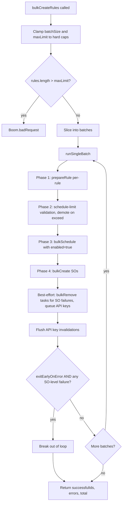

## Goals

1. Batching lives **inside** `bulkCreateRules`. Caller passes `batchSize` and `maxLimit`; framework enforces hard caps.
2. New `exitEarlyOnError` flag (default `false`), scoped to **SO-level failures only** (whole-call SO throw or any per-row SO error).
3. Drop the post-batch `bulkEnableTasks` phase. Within each batch: schedule tasks **enabled**, then create rule SOs.
4. Return only successful rule IDs, not transformed `SanitizedRule` objects.
5. Preserve best-effort cleanup: bulk-remove tasks on SO failure; invalidate API keys for failed/demoted rules.

## Files to change

- [x-pack/platform/plugins/shared/alerting/server/application/rule/methods/bulk_create/bulk_create_rules.ts](x-pack/platform/plugins/shared/alerting/server/application/rule/methods/bulk_create/bulk_create_rules.ts) — split into an outer loop + per-batch function; remove sanitize step; flip task-enabled inline.
- [x-pack/platform/plugins/shared/alerting/server/application/rule/methods/bulk_create/types.ts](x-pack/platform/plugins/shared/alerting/server/application/rule/methods/bulk_create/types.ts) — new params/result shape; drop `skipTaskEnabling`; drop `<Params>` generic from the result.
- [x-pack/platform/plugins/shared/alerting/server/application/rule/methods/bulk_create/utils.ts](x-pack/platform/plugins/shared/alerting/server/application/rule/methods/bulk_create/utils.ts) — `buildTaskInstance(context, prepared, batchIndex)` returns `enabled: true` with a future `runAt` (see below); remove `toSanitizedRule`.
- [x-pack/platform/plugins/shared/alerting/server/rules_client/common/constants.ts](x-pack/platform/plugins/shared/alerting/server/rules_client/common/constants.ts) — add `BULK_TM_SCHEDULE_RUNAT_BUFFER = 30_000`.
- [x-pack/platform/plugins/shared/alerting/server/application/rule/methods/bulk_enable_tasks/](x-pack/platform/plugins/shared/alerting/server/application/rule/methods/bulk_enable_tasks/) — delete the whole folder; no internal callers will remain.
- [x-pack/platform/plugins/shared/alerting/server/rules_client/rules_client.ts](x-pack/platform/plugins/shared/alerting/server/rules_client/rules_client.ts) — remove the `bulkEnableTasks` public method and its imports.
- [x-pack/platform/plugins/shared/alerting/server/rules_client.mock.ts](x-pack/platform/plugins/shared/alerting/server/rules_client.mock.ts) — remove `bulkEnableTasks` mock entry; update `bulkCreateRules` default mock to `{ successfulIds: [], errors: [], total: 0 }`.
- [x-pack/platform/plugins/shared/alerting/server/index.ts](x-pack/platform/plugins/shared/alerting/server/index.ts) — keep `BulkCreateRules*` exports; ensure no stale `BulkEnableTasks*` export is added.
- [x-pack/platform/plugins/shared/alerting/server/application/rule/methods/bulk_create/bulk_create_rules.test.ts](x-pack/platform/plugins/shared/alerting/server/application/rule/methods/bulk_create/bulk_create_rules.test.ts) — update assertions for new return shape; remove `bulkEnable` expectations; add batching + exit-early + cap tests.

## New types

```ts
export interface BulkCreateRulesParams<Params extends RuleParams = never> {
  rules: Array<BulkCreateRulesItem<Params>>;
  batchSize?: number;
  maxLimit?: number;
  exitEarlyOnError?: boolean;
}

export interface BulkCreateRulesResult {
  successfulIds: string[];
  errors: BulkCreateOperationError[];
  total: number;
}
```

Hard caps live next to the method:

```ts
export const DEFAULT_BULK_CREATE_BATCH_SIZE = 100;
export const DEFAULT_BULK_CREATE_MAX_LIMIT = 1000;
export const HARD_MAX_BULK_CREATE_BATCH_SIZE = 500;
export const HARD_MAX_BULK_CREATE_MAX_LIMIT = 10_000;
```

Caller-supplied values are clamped to `[1, HARD_MAX_*]` with a `logger.warn` when clamped. `rules.length > effectiveMaxLimit` rejects via `Boom.badRequest`.

## New control flow



Within each batch:

- `buildTaskInstance` returns `enabled: true` with a future `runAt` (see "Future `runAt` to close the SO-landing race" below).
- `taskManager.bulkSchedule` schedules already-enabled tasks; per-row drops (silent skips by `taskInstanceToAttributes`) still demote via `demotePreparedRules` exactly as today.
- Then SOs are bulk-created. If the whole `bulkCreate` throws or any row errors, the corresponding scheduled task IDs are `bulkRemove`'d (best-effort, swallowed errors with `logger.error`) and the API keys are queued for invalidation.
- "SO-level failure" for exit-early means **either** the whole-call SO `bulkCreate` throws **or** `bulkResponse.saved_objects` contains at least one `so.error`. Phase-1/2/3 errors do **not** trigger exit-early.
- Audit `CREATE` (outcome `unknown`) is logged per rule before SO persistence as today. Audit `ENABLE` is logged per successful enabled rule after SO success (still mirrors single-rule semantics, just no longer gated by a later `bulkEnable` step).
- The batch returns `{ successfulIds, errors, soFailureOccurred }`. The outer function appends per-batch results.

## Future `runAt` to close the SO-landing race

Tasks are scheduled `enabled: true` **with a future `runAt`** so Task Manager won't claim them before the SO `bulkCreate` for the same batch has landed, and so activations are spread across the schedule interval (mirroring the prior `bulkEnable` jitter behaviour from `randomlyOffsetRunTimestamp`).

New constant in [rules_client/common/constants.ts](x-pack/platform/plugins/shared/alerting/server/rules_client/common/constants.ts):

```ts
export const BULK_TM_SCHEDULE_RUNAT_BUFFER = 30_000; // 30s baseline
```

`buildTaskInstance(context, prepared, batchIndex)` gains a `batchIndex` parameter and computes per-task `runAt`:

```ts
const intervalMs = parseDuration(prepared.schedule.interval);
const jitterCeilingMs = Math.min(intervalMs, 5 * 60 * 1000); // cap at 5m
const jitterMs = Math.floor(Math.random() * jitterCeilingMs);
const runAt = new Date(
  Date.now() + BULK_TM_SCHEDULE_RUNAT_BUFFER + batchIndex * 1_000 + jitterMs
);
return { ...task, enabled: true, runAt, scheduledAt: runAt };
```

Semantics:
- 30s base buffer: comfortably exceeds the SO `bulkCreate` roundtrip for any realistic batch size and gives ES write a chance to be visible.
- `+ batchIndex * 1_000` (1s per batch): staggers batches so batch N's tasks never fire before batch N-1's, even under fast SO writes.
- `+ jitter(0, min(interval, 5m))`: preserves the activation spread the prior `bulkEnable` step provided so rules of similar intervals don't all fire simultaneously.

`scheduledAt` is set to the same value to keep TM diagnostics consistent (matches what `randomlyOffsetRunTimestamp` does in [task_scheduling.ts](x-pack/platform/plugins/shared/task_manager/server/task_scheduling.ts) lines 367-380).

### Residual trade-off

Even with the 30s buffer, this is a soft guarantee, not a hard one — TM could in principle claim a task slightly early if the buffer were misconfigured or under heavy clock skew. The rule-runner already handles "rule SO not found" by failing gracefully, so the worst case is a single retry. Worth documenting both in code comments next to the constant and in the PR body.

## Caller surface (`RulesClient`)

- `RulesClient.bulkCreateRules` remains; signature updated by the new params type.
- `RulesClient.bulkEnableTasks` is removed (per decision); the import + method on [rules_client.ts](x-pack/platform/plugins/shared/alerting/server/rules_client/rules_client.ts) and the mock entry are deleted along with the `bulk_enable_tasks/` directory.
- No public `BulkEnableTasks*` type is exported from [server/index.ts](x-pack/platform/plugins/shared/alerting/server/index.ts).

## Test updates

In [bulk_create_rules.test.ts](x-pack/platform/plugins/shared/alerting/server/application/rule/methods/bulk_create/bulk_create_rules.test.ts):

- Replace assertions that read `result.rules[i]` / `taskIdsFailedToBeEnabled` with `result.successfulIds`.
- Drop expectations on `taskManager.bulkEnable`; instead assert that `bulkSchedule` was called with task instances whose `enabled: true` and a `runAt` >= now + 30s (use fake timers; verify per-batch `runAt` increases by ~1s).
- Add new cases:
  - Batching: `rules.length=250, batchSize=100` → three `bulkSchedule` calls, three `bulkCreate` calls, results concatenated.
  - Hard-cap clamp: `batchSize=10_000` clamps to 500 and logs a warn.
  - `maxLimit` exceeded: `rules.length=2000, maxLimit=1000` throws `Boom.badRequest`.
  - `exitEarlyOnError=true`: when batch 2 SO `bulkCreate` returns a per-row error, batches 3+ are not invoked; successful IDs from batches 1 and 2 are returned; tasks for failed rows are cleaned up; API keys queued for invalidation.
  - `exitEarlyOnError=true` does **not** trigger on Phase-1/Phase-3 demotion errors.

## Out of scope

- No changes to single-rule `create_rule`.
- No changes to security solution callers (none exist yet for `bulkCreateRules`).
