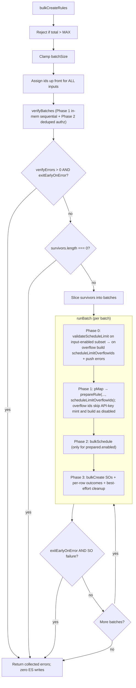

# bulk_create_rules: verifyBatches() extraction

## Goals

1. Pull cheap, fail-fast per-rule validation **out of per-batch `runBatch()`** and **up into a whole-call `verifyBatches()`** that runs exactly once over every input before any batch loop iteration.
2. Treat `verifyBatches` failures as **removals** (push to `errors[]`, exclude from `runBatch` entirely). The existing 4 in-batch demotion paths (`api_key_creation_failed`, `schedule_limit_exceeded`, `task_schedule_failed`, `task_validation_failed`) stay in `runBatch` unchanged.
3. Honor `exitEarlyOnError`: if any rule fails verifyBatches **and** the flag is set, return immediately with the collected errors and **zero ES writes**.
4. Drop alerting-side `runAt` / `scheduledAt` / `BULK_TM_SCHEDULE_DELAY` so TM's `addJitter` (commit `6669b2a`) applies on `bulkSchedule` and avoids the thundering-herd problem when a large bulk lands.

Confirmed scope decisions (from clarifying questions):

- All verifyBatches failures are **REMOVE**, never demote.
- `parseDuration` + the **full** minimum-interval gate (`enforce=true` reject branch AND `enforce=false` warn branch) move into verifyBatches. `prepareRule` no longer touches the schedule interval. Mirrors the established two-branch write-time pattern (`create_rule.ts` reject; `bulk_edit_rules.ts` both branches). No demotion option preserved.
- Phase 1 is a **sequential** `for` loop (tightest memory; no I/O so still fast at the 10k cap).
- `addGeneratedActionValues` is **re-run** inside `prepareRule` on survivors; the Phase 1 output is discarded (memory-lean; ~250ms duplicate CPU at 10k cap is acceptable).
- `validateRuleTypeParams` is **also re-run** inside `prepareRule` on survivors. It's not a pure check — it returns coerced/defaulted params that `extractReferences` consumes. Every other write-path call site (`create_rule.ts`, `update_rule.ts`, `update_rule_in_memory.ts`, `rule_loader.ts`, `ad_hoc_task_runner.ts`) uses the return value; verifyBatches doing the same on survivors keeps that invariant intact.
- Phase 2 emits **per-rule** `RuleAuditAction.CREATE` failure audit events on pair rejection (preserves today's per-rule audit cardinality from `prepareRule`).
- `validateScheduleLimit` reorders to run **before** `prepareRule` inside `runBatch`. Brings bulk_create into line with the schedule-then-key ordering used in `create_rule.ts`, `update_rule.ts`, `enable_rule.ts`, `bulk_enable_rules.ts`, and `bulk_edit_rules_occ.ts` — bulk_create is the lone outlier today. Side-effect: avoids minting (and then invalidating) API keys for rules that will be demoted by the schedule cap. Trade-off accepted: in the edge case where API-key mint failures would have freed capacity to fit under the cap, the new order over-demotes (writes the rules as disabled rather than enabling them). API-key mint failures are usually platform-wide, so this edge case is rare; over-demoting beats throwing or skipping rule creation.

## Files to change

- [bulk_create_rules.ts](x-pack/platform/plugins/shared/alerting/server/application/rule/methods/bulk_create/bulk_create_rules.ts)
- [utils.ts](x-pack/platform/plugins/shared/alerting/server/application/rule/methods/bulk_create/utils.ts)
- [types.ts](x-pack/platform/plugins/shared/alerting/server/application/rule/methods/bulk_create/types.ts)
- [constants.ts](x-pack/platform/plugins/shared/alerting/server/rules_client/common/constants.ts)
- [bulk_create_rules.test.ts](x-pack/platform/plugins/shared/alerting/server/application/rule/methods/bulk_create/bulk_create_rules.test.ts)

## `verifyBatches()`

Lives in `utils.ts` next to `prepareRule`. Signature:

```ts
export const verifyBatches = async <Params extends RuleParams>({
  context,
  inputsWithIds,
}: {
  context: RulesClientContext;
  inputsWithIds: Array<{ id: string; rule: BulkCreateRulesItem<Params> }>;
}): Promise<{
  survivors: Array<{ id: string; rule: BulkCreateRulesItem<Params> }>;
  errors: BulkCreateOperationError[];
}>;
```

Internal scratch is created and discarded inside the function — the caller receives only the two lean arrays. No new types exported.

### Phase 1: per-rule, cheapest first (sequential, in-memory)

A single `for ... of inputsWithIds` loop. Each iteration is wrapped in its own `try / catch`; one bad rule does not affect the others. On the **first throw**, push a `BulkCreateOperationError` keyed by `id`, then `continue` to the next rule.

Per rule, in this exact order (stop at first failure):

1. `addGeneratedActionValues(rule.data.actions, rule.data.systemActions, context)` — KQL parse can throw `Boom.badRequest`. Result is held in a local `data` variable for the rest of the iteration.
2. `createRuleDataSchema.validate(data)` — schema. Catch and re-throw as `Boom.badRequest('Error validating create data - ${err.message}')` to match the single-rule `create_rule.ts` semantics.
3. `ruleTypeRegistry.get(data.alertTypeId)` — throws 400 if unregistered. Captured into local `ruleType`.
4. `ruleTypeRegistry.ensureRuleTypeEnabled(data.alertTypeId)` — throws if disabled.
5. `validateRuleTypeParams(data.params, ruleType.validate.params)` — params shape.
6. `parseDuration(data.schedule.interval)` — throws if interval format is invalid. Hold result as `intervalInMs`.
7. Minimum-interval gate (full block moves from `prepareRule`):
   - if `intervalInMs < context.minimumScheduleIntervalInMs && context.minimumScheduleInterval.enforce` → throw `Boom.badRequest('Error creating rule: the interval is less than the allowed minimum interval of ${context.minimumScheduleInterval.value}')`. Rule is REMOVED.
   - if `intervalInMs < context.minimumScheduleIntervalInMs && !context.minimumScheduleInterval.enforce` → `context.logger.warn(...)` with the exact existing message (substitute `ruleType.id` and `id`) and continue. Rule is RETAINED.

At end of iteration, the entry pushed to the `survivors` array is just `{ id, rule }` — the locally generated `data` (with action UUIDs), `ruleType`, and `intervalInMs` are all discarded. `addGeneratedActionValues` will be re-run inside `prepareRule` for survivors only; this is an explicit memory-vs-CPU trade.

Also collect, for each survivor, the unique `${alertTypeId}::${consumer}` pair into a `Map<authzKey, { ruleTypeId, consumer, ids: string[], names: Map<id, name> }>` so Phase 2 can iterate pairs once.

If **zero rules** survive Phase 1, return `{ survivors: [], errors }` immediately. Phase 2 is skipped — the contract is "in-memory checks first, ES later", so a totally-invalid call performs zero ES reads.

### Phase 2: deduped per-pair `ensureAuthorized`

Iterate the pair-map. For each unique pair, wrap a single `context.authorization.ensureAuthorized({ ruleTypeId, consumer, operation: WriteOperations.Create, entity: AlertingAuthorizationEntity.Rule })` in a `try / catch`.

On rejection:

- For **each rule id** in the rejected pair: emit one `RuleAuditAction.CREATE` audit event with `savedObject: { type: RULE_SAVED_OBJECT_TYPE, id, name }` and the caught error (mirrors today's per-rule audit emitted by `prepareRule`).
- Push a per-rule `BulkCreateOperationError` for each id in the pair to `errors[]`.
- Remove every id in the pair from the survivors list.
- Continue checking other pairs — one rejected pair must not skip the others.

Phase 2 **never throws**. All failures are converted to per-rule errors regardless of `exitEarlyOnError` (the caller decides what to do).

## Caller wiring in `bulkCreateRules`

```ts
const username = await context.getUserName();
const actionsClient = await context.getActionsClient();
const successfulIds: string[] = [];
const errors: BulkCreateOperationError[] = [];

const inputsWithIds = rules.map((rule) => ({
  id: rule.options?.id ?? SavedObjectsUtils.generateId(),
  rule,
}));

const { survivors, errors: verifyErrors } = await verifyBatches({ context, inputsWithIds });
errors.push(...verifyErrors);

if (verifyErrors.length > 0 && exitEarlyOnError) {
  logger.warn(
    `bulkCreateRules: exiting early on verifyBatches; ${verifyErrors.length} rule(s) failed pre-flight, zero ES writes.`
  );
  return { successfulIds, errors, total };
}
if (survivors.length === 0) {
  return { successfulIds, errors, total };
}

const totalBatches = Math.ceil(survivors.length / batchSize);
logger.debug(
  `bulkCreateRules: ${total} input(s), ${survivors.length} survivor(s) after verifyBatches, ${totalBatches}x batches of ${batchSize}.`
);

for (let batchIndex = 0; batchIndex < totalBatches; batchIndex++) {
  const start = batchIndex * batchSize;
  const batch = survivors.slice(start, start + batchSize);
  const result = await runBatch<Params>({ context, username, actionsClient, batch });
  successfulIds.push(...result.successfulIds);
  errors.push(...result.errors);
  if (exitEarlyOnError && result.soFailureOccurred) { /* existing early-exit log + break */ }
}

return { successfulIds, errors, total };
```

ID generation moves from `runBatch` up to `bulkCreateRules` so `verifyBatches` operates against final ids (needed for Phase 2 audit / error reporting).

## `runBatch` changes

Shape changes:

- `RunBatchArgs.batch` becomes `Array<{ id: string; rule: BulkCreateRulesItem<Params> }>` instead of `Array<BulkCreateRulesItem<Params>>`.
- Drop the inline `inputsWithIds = batch.map(...)` step — ids are already attached.
- Drop the `authzCache = new Map<string, Promise<void>>()` — Phase 2 of verifyBatches owns deduped authz now.

Phase reorder — schedule-limit moves first (was Phase 2, becomes Phase 0):

- **Phase 0 (new position)**: compute `enabledInputs = batch.filter(({ rule }) => rule.data.enabled === true)`. If non-empty, call `validateScheduleLimit({ context, updatedInterval: enabledInputs.map(({ rule }) => rule.data.schedule.interval) })`. On overflow, build `scheduleLimitOverflowIds = new Set(enabledInputs.map(({ id }) => id))` and push one error per id into the batch's `errors[]` with `message: getBulkCreateAsDisabledMessage(<circuit-breaker reason>)` and `disabledReason: 'schedule_limit_exceeded'`. No mutation of `preparedRules` (it doesn't exist yet). All-or-nothing demotion semantics preserved.
- **Phase 1 (was today's Phase 1, slightly tweaked)**: `pMap` over `batch` (concurrency `API_KEY_GENERATE_CONCURRENCY`) calls `prepareRule({ ..., scheduleLimitOverflowIds })`. For any id in the set, `prepareRule` treats `data.enabled` as false: skip the API-key mint block entirely, build `rawRule` in the disabled shape (no `scheduledTaskId`, no `lastEnabledAt`, null api-key attrs), set `prepared.enabled = false`. Existing `api_key_creation_failed` soft-fail path inside `prepareRule` is unchanged for rules NOT in the overflow set.
- **Phase 2 (was Phase 3)**: `bulkSchedule` for the surviving enabled subset. Unchanged in logic.
- **Phase 3 (was Phase 4)**: `bulkCreate` SOs. Unchanged.

The post-`prepareRule` `validateScheduleLimit` + `demotePreparedRules({ reason: 'schedule_limit_exceeded' })` block is removed entirely. `demotePreparedRules` is still called for the two remaining in-batch demotion reasons (`task_schedule_failed`, `task_validation_failed`) which can only be detected after `bulkSchedule` runs.

### Why this matches existing convention

Today's bulk_create is the only write-path that mints API keys before checking the schedule cap. Every other write-path runs schedule-limit first:

| File | Order |
|---|---|
| `create_rule.ts` (lines 98, 147) | schedule → key |
| `update_rule.ts` (lines 137, 320) | schedule → key |
| `enable_rule.ts` (lines 78, 152) | schedule → key |
| `bulk_enable_rules.ts` (lines 198, 245) | schedule → key |
| `bulk_edit_rules_occ.ts` (line 112) | schedule first (no direct mint) |
| `bulk_create_rules.ts` (today) | **key → schedule (outlier)** |
| `bulk_create_rules.ts` (after this PR) | schedule → key (aligned) |

The other paths all throw on schedule-limit overflow; bulk_create demotes instead of throwing (because of its per-rule-isolation contract), but the schedule-first ordering is the same.

## `prepareRule` slim-down (in utils.ts)

Remove from `prepareRule`:

- `createRuleDataSchema.validate(data)` block.
- The standalone `context.ruleTypeRegistry.get(data.alertTypeId)` call at line 117 (used today only to throw if unregistered) — verifyBatches already proved registration. Only the later `const ruleType = context.ruleTypeRegistry.get(...)` call survives, to obtain `ruleType` for downstream use.
- The `authzCache` plumbing + the `context.authorization.ensureAuthorized` call + its catch/audit block (Phase 2 of `verifyBatches` owns this now).
- `ruleTypeRegistry.ensureRuleTypeEnabled(data.alertTypeId)`.
- The ENTIRE `parseDuration` + min-interval block (both branches — `enforce=true` reject throw AND `enforce=false` warn) — moved into verifyBatches. This matches the established two-branch pattern used at write-time in [create_rule.ts](x-pack/platform/plugins/shared/alerting/server/application/rule/methods/create/create_rule.ts) (enforce-throw) and [bulk_edit_rules.ts](x-pack/platform/plugins/shared/alerting/server/application/rule/methods/bulk_edit/bulk_edit_rules.ts) lines 412–421 (both branches). `bulk_enable_rules.ts` deliberately doesn't run this check, so it isn't a reference point.

Keep in `prepareRule`:

- The second `addGeneratedActionValues` call (its output is what lands in the SO).
- `const ruleType = context.ruleTypeRegistry.get(data.alertTypeId)` — single call at the top, cheap in-memory, can't fail at this point because verifyBatches already proved it's registered.
- **`const validatedRuleTypeParams = validateRuleTypeParams(data.params, ruleType.validate.params)`** — this is **not just a validator**, it returns coerced/defaulted params (see `validate_rule_type_params.test.ts` "should validate and apply defaults"). Every existing write-path call site uses the return value (`create_rule.ts:140`, `update_rule.ts:187`, `update_rule_in_memory.ts:150`, today's `bulk_create/utils.ts:146`, `rule_loader.ts:110`, `ad_hoc_task_runner.ts:421`) — nowhere in the codebase is it called for the throw alone. The return is consumed downstream as `extractReferences(context, ruleType, allActions, validatedRuleTypeParams, artifacts)`. verifyBatches calls it once for the fast-fail; `prepareRule` re-calls it on survivors to recover the coerced value. Pure CPU, no I/O — same memory-vs-CPU trade we already accepted for `addGeneratedActionValues`.
- `validateActions`, `validateAndAuthorizeSystemActions`.
- API-key mint with the existing soft-fail to `api_key_creation_failed` demotion — but **only for ids NOT in `scheduleLimitOverflowIds`**. For overflow ids, skip the entire enabled-rule branch (no API key minted, `effectiveEnabled = false`, build SO attributes in the disabled shape). Errors for those ids are already pushed at runBatch's Phase 0 — `prepareRule` does not re-push them.
- `extractReferences`, `transformRuleDomainToRuleAttributes`, `addMissingUiamKeyTagIfNeeded`.
- The single per-rule CREATE audit emitted inside `runBatch` after `prepareRule` returns — unchanged.

New input to `prepareRule` (additive, in `PrepareRuleArgs`):

- `scheduleLimitOverflowIds?: Set<string>` — ids that runBatch's Phase 0 already marked for schedule-limit demotion. `prepareRule` reads from it to decide whether to mint an API key and which SO shape to emit. Default empty set (callers that don't supply it get today's behavior, which keeps the function safe for any future single-rule callers should they emerge).

## `buildTaskInstance` + `BULK_TM_SCHEDULE_DELAY`

In [utils.ts](x-pack/platform/plugins/shared/alerting/server/application/rule/methods/bulk_create/utils.ts):

```ts
export const buildTaskInstance = (
  context: RulesClientContext,
  prepared: PreparedRule
): TaskInstanceWithDeprecatedFields => ({
  id: prepared.id,
  taskType: `alerting:${prepared.ruleTypeId}`,
  schedule: prepared.schedule,
  params: { alertId: prepared.id, spaceId: context.spaceId, consumer: prepared.consumer },
  state: { previousStartedAt: null, alertTypeState: {}, alertInstances: {} },
  scope: ['alerting'],
  enabled: true,
  // runAt / scheduledAt intentionally omitted — TM addJitter (commit 6669b2a) applies.
});
```

Also delete the commented `// import { BULK_TM_SCHEDULE_DELAY } from '../../../../rules_client/common/constants';` line at the top.

In [constants.ts](x-pack/platform/plugins/shared/alerting/server/rules_client/common/constants.ts):

- Delete the `export const BULK_TM_SCHEDULE_DELAY = 30_000;` line. (Verified above: the only remaining references are the alerting-side test file, which is also being updated.)

## Types

In [types.ts](x-pack/platform/plugins/shared/alerting/server/application/rule/methods/bulk_create/types.ts):

- Remove `authzCache: Map<string, Promise<void>>;` from `PrepareRuleArgs`.
- Add `scheduleLimitOverflowIds?: Set<string>;` to `PrepareRuleArgs` (optional; empty/absent ⇒ today's behavior).
- No new exported types — `verifyBatches`'s return shape is inline; internal pair/scratch maps are private to `utils.ts`.

`BulkCreateOperationError` and `BulkCreateDisabledReason` are unchanged. `verifyBatches` errors never carry a `disabledReason` (they're plain removals); the existing `schedule_limit_exceeded` value is now emitted at runBatch's Phase 0 instead of via `demotePreparedRules`, but the value itself is unchanged.

## Control flow



## Test plan (`bulk_create_rules.test.ts`)

New `verifyBatches` cases (add `describe('verifyBatches')` block):

- **Per-rule isolation**: one schema-invalid input among three valid → invalid reported in `errors[]`, two valid forwarded to `runBatch`; `runBatch` mock asserts the batch contains only the survivors.
- **All inputs fail verifyBatches** → zero calls to `validateScheduleLimit`, `taskManager.bulkSchedule`, `unsecuredSavedObjectsClient.bulkCreate`, `createAPIKey`, **and `authorization.ensureAuthorized`**. The Phase 2 skip is asserted explicitly.
- **`exitEarlyOnError=true` + at least one verifyBatches error** → returns immediately with collected errors; zero ES writes; zero `runBatch` invocations.
- **Unregistered `alertTypeId`** → per-rule error originating from `verifyBatches` (assert error message matches the registry throw); `runBatch` not called for that id.
- **Disabled `alertTypeId`** (`ensureRuleTypeEnabled` throws) → per-rule error from verifyBatches.
- **Invalid params** (`validateRuleTypeParams` throws) → per-rule error from verifyBatches.
- **`parseDuration` throws** (malformed interval string) → per-rule error from verifyBatches.
- **Minimum-interval, enforce=true, interval < min** → per-rule error from verifyBatches (rule REMOVED). Assert error message matches the existing one.
- **Minimum-interval, enforce=false, interval < min** → `logger.warn` called from verifyBatches; rule retained and forwarded to runBatch. Assert warn message format unchanged.
- **Deduped per-pair authz**: two rules with the same `${alertTypeId}::${consumer}`, both unauthorized → `ensureAuthorized` called **exactly once**; both rules get per-rule `RuleAuditAction.CREATE` failure audit events; both rules in `errors[]`; neither reaches `runBatch`.
- **Partial authz**: pair A authorized, pair B rejected → only pair A's rules survive; pair B rules get audit + error; pair A's rules reach `runBatch`.
- **`addGeneratedActionValues` runs twice per successful rule** (once in verifyBatches, once in prepareRule) — assert final SO actions still carry generated UUIDs; not a behavioural change, just a non-regression check.

Existing `runBatch` cases to adjust:

- The "all-enabled happy path" task-instance test and the "per-batch runAt is at least the buffer beyond now" test: drop the `BULK_TM_SCHEDULE_DELAY` import and the `minRunAt = now + BULK_TM_SCHEDULE_DELAY` assertions; instead assert each task instance passed to `bulkSchedule` does **not** contain `runAt` or `scheduledAt`.
- Anywhere existing tests stub `context.ruleTypeRegistry.get` / `ensureRuleTypeEnabled` / `validateRuleTypeParams` / `authorization.ensureAuthorized` expecting them to be called from inside `prepareRule`/`runBatch`: move those expectations to the verifyBatches block.
- Existing tests that assert ids are generated inside `runBatch` need to switch to asserting ids are generated inside `bulkCreateRules` before verifyBatches.

Schedule-limit reorder cases (new behavior in `runBatch` Phase 0):

- **Order assertion**: `validateScheduleLimit` is called **before** any `createAPIKey` mock call for the batch.
- **Overflow demotes without minting**: when `validateScheduleLimit` returns a `validationPayload`, assert (a) zero `createAPIKey` calls for the enabled subset, (b) one error per overflow id with `disabledReason: 'schedule_limit_exceeded'` and the existing circuit-breaker message format, (c) `bulkCreate` is called with all overflow ids in the disabled SO shape (no `scheduledTaskId`, no `lastEnabledAt`, null api-key attrs), (d) `bulkSchedule` is not called (no enabled survivors).
- **No-overflow happy path**: `validateScheduleLimit` returns null → all input-enabled rules get API keys minted → both `bulkSchedule` and `bulkCreate` see the full enabled subset.
- **Mixed batch**: some rules have `data.enabled === false` → those aren't in the overflow set regardless of whether the cap is hit; their SOs are written as today.
- **API-key-failure edge case (over-demotion accepted)**: in a batch with mocked schedule-limit overflow, assert that the rules are written as disabled with `schedule_limit_exceeded`, not `api_key_creation_failed`. This documents the deliberate trade-off: we no longer reach the API-key step for overflow ids, so an API-key mint failure that might have freed capacity in the old order cannot be observed here.
- **No more post-prepareRule schedule-limit call**: assert `validateScheduleLimit` is called exactly once per batch (at Phase 0), not at any other point.
- **`demotePreparedRules` still wired for task failures**: `task_schedule_failed` and `task_validation_failed` paths still go through `demotePreparedRules`; one test for each path is preserved.

## Code style: minimise comments

When implementing this refactor, keep comments to a minimum (preferably one line each, only where they earn it):

- Do not narrate what the code does. Names (`verifyBatches`, `survivors`, `pair-map`, `demotePreparedRules`) carry the meaning.
- Reserve comments for non-obvious **intent or constraint** the code itself cannot convey — e.g. a one-liner at the Phase 2 audit site stating the per-rule audit shape must not collapse to per-pair regardless of `exitEarlyOnError`, or a one-liner that `addGeneratedActionValues` and `validateRuleTypeParams` are intentionally re-run on survivors in `prepareRule`.
- Do **not** echo the plan text into code comments. Cross-reference the PR description for any longer rationale.
- No `// Phase 1: …` / `// Step 5: …` chapter-marker comments. Function structure does the marking.

If a piece of logic needs a paragraph of explanation, it's a smell — either the structure is wrong, or the explanation belongs in the PR description, not the source file.

## Out of scope (deliberately)

- Per-batch connector prefetch / `preFetchedActions` shared-helper signature changes.
- Any security-solution-side changes — [bulk_import_rules.ts](x-pack/solutions/security/plugins/security_solution/server/lib/detection_engine/rule_management/logic/detection_rules_client/methods/bulk_import_rules.ts) and [bulk_create_prebuilt_rules.ts](x-pack/solutions/security/plugins/security_solution/server/lib/detection_engine/rule_management/logic/detection_rules_client/methods/bulk_create_prebuilt_rules.ts) already domain-pre-flight on their side and benefit automatically.

## Verification

- `node scripts/type_check --project x-pack/platform/plugins/shared/alerting/tsconfig.json`
- `node scripts/jest x-pack/platform/plugins/shared/alerting/server/application/rule/methods/bulk_create/`
- `node scripts/eslint --fix $(git diff --name-only)`
- `node scripts/check_changes.ts`
