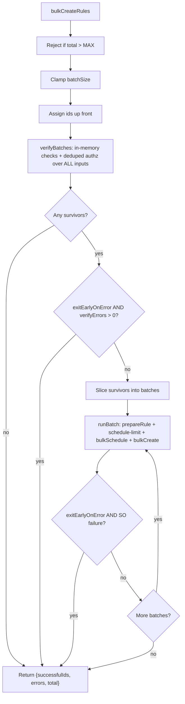

# bulk_create_rules: verifyBatches() extraction

## Goals

1. Pull cheap, fail-fast per-rule validation **out of per-batch `runBatch`** and **up into a whole-call `verifyBatches()`** that runs once before any batch loop iteration.
2. Treat verifyBatches failures as **removals** (push to `errors[]`, exclude from `runBatch`), not demotions. Demotion paths inside `runBatch` (`api_key_creation_failed`, `schedule_limit_exceeded`, `task_schedule_failed`, `task_validation_failed`) stay where they are.
3. Honor `exitEarlyOnError`: if any rule fails verifyBatches and the flag is set, return immediately with the collected errors — **zero ES writes**.
4. Drop alerting-side `runAt`/`scheduledAt`/`BULK_TM_SCHEDULE_DELAY` so TM's `addJitter` (commit `6669b2a`) applies on `bulkSchedule`.

This is a deliberate scope-down. No prefetching, no schedule-limit move, no shared-helper signature changes.

## Files to change

- [bulk_create_rules.ts](x-pack/platform/plugins/shared/alerting/server/application/rule/methods/bulk_create/bulk_create_rules.ts)
- [utils.ts](x-pack/platform/plugins/shared/alerting/server/application/rule/methods/bulk_create/utils.ts)
- [types.ts](x-pack/platform/plugins/shared/alerting/server/application/rule/methods/bulk_create/types.ts)
- [constants.ts](x-pack/platform/plugins/shared/alerting/server/rules_client/common/constants.ts)
- [bulk_create_rules.test.ts](x-pack/platform/plugins/shared/alerting/server/application/rule/methods/bulk_create/bulk_create_rules.test.ts)

## What `verifyBatches()` does

Signature (lives in `utils.ts`):

```ts
verifyBatches<Params extends RuleParams>({
  context,
  inputsWithIds,
}: {
  context: RulesClientContext;
  inputsWithIds: Array<{ id: string; rule: BulkCreateRulesItem<Params> }>;
}): Promise<{
  survivors: Array<{ id: string; rule: BulkCreateRulesItem<Params> }>;
  errors: BulkCreateOperationError[];
}>;
```

The map is **populated and discarded in-function** — caller receives only the two lean arrays so memory stays tight (C4).

### Phase 1: per-rule, cheapest first

Sequential `for` loop over every input. Each iteration is wrapped in its own `try/catch` — one bad rule does not affect the others. On the **first throw**, capture an error for that rule keyed by `id`, then `continue` to the next rule.

Per rule, in this exact order (cheapest first; stop at first failure):

1. `addGeneratedActionValues(rule.data.actions, rule.data.systemActions, context)` — KQL parse can throw `Boom.badRequest`.
2. `createRuleDataSchema.validate(data)` — schema. Catch and wrap as `Boom.badRequest('Error validating create data - ...')` to match single-rule [create_rule.ts](x-pack/platform/plugins/shared/alerting/server/application/rule/methods/create/create_rule.ts).
3. `ruleTypeRegistry.get(data.alertTypeId)` — throws 400 if unregistered.
4. `ruleTypeRegistry.ensureRuleTypeEnabled(data.alertTypeId)` — throws if disabled.
5. `validateRuleTypeParams(data.params, ruleType.validate.params)` — params shape.

`parseDuration` + the minimum-interval check **stay in `prepareRule` / `runBatch`** intentionally — keeping that check inside the per-batch path leaves the door open to demote interval-violators in a future iteration via the existing `demotePreparedRules` machinery, rather than removing them up front. Today's behavior is preserved unchanged: `enforce=true` + interval < min → per-rule error (rule removed); `enforce=false` + interval < min → `logger.warn` and proceed.

The locally-built `data` (with generated UUIDs / dsl) is **discarded** at end of iteration. The entry retained from Phase 1 is just `{ id, rule, consumerKey: 'alertTypeId::consumer' }` for survivors. `addGeneratedActionValues` is intentionally rerun later in `prepareRule` (its output is what lands in the SO); duplicate CPU at the 10k cap is ~250ms — accepted to keep memory lean.

If **zero rules** survive Phase 1, return immediately. Phase 2 (the only ES read in `verifyBatches`) is skipped entirely — no authz call if every input failed fast. **This is the strict "in-memory first, ES later" guarantee.**

### Phase 2: deduped per-pair `ensureAuthorized`

Group survivors by `${alertTypeId}::${consumer}` (typical bulk has 1–10 unique pairs). For each unique pair, call `context.authorization.ensureAuthorized({ ruleTypeId, consumer, operation: WriteOperations.Create, entity: AlertingAuthorizationEntity.Rule })` inside its own `try/catch`. On rejection:

- For **each rule id** in the rejected pair: emit a `RuleAuditAction.CREATE` failure audit with `savedObject: { type: RULE_SAVED_OBJECT_TYPE, id, name }` (mirrors today's per-rule audit behavior in `prepareRule`), then push that rule's `BulkCreateOperationError` to `errors[]` and exclude it from `survivors`.
- Continue checking other pairs (one rejected pair must not skip the others).

Phase 2 **never throws**. All authz failures are per-rule errors regardless of `exitEarlyOnError`.

## Caller wiring in `bulkCreateRules`

```ts
const inputsWithIds = rules.map((rule) => ({
  id: rule.options?.id ?? SavedObjectsUtils.generateId(),
  rule,
}));

const { survivors, errors: verifyErrors } = await verifyBatches({ context, inputsWithIds });
errors.push(...verifyErrors);

if (verifyErrors.length > 0 && exitEarlyOnError) {
  return { successfulIds, errors, total };
}
if (survivors.length === 0) {
  return { successfulIds, errors, total };
}

// Slice survivors into batches and run runBatch per slice as today.
```

ID generation moves from `runBatch` up to `bulkCreateRules` so `verifyBatches` works against final ids.

## `runBatch` changes

- Receives `Array<{ id, rule }>` for **this batch's surviving slice** (no longer assigns ids).
- Removes the per-batch `authzCache` (centralised in `verifyBatches` Phase 2).
- `prepareRule` no longer runs the steps that moved into Phase 1, nor the authz call:
  - **Keep** the second `addGeneratedActionValues` call (its output is consumed by the SO).
  - **Keep** `validateActions`, `validateAndAuthorizeSystemActions`, `extractReferences`, `transformRuleDomainToRuleAttributes`, API key mint, schedule-limit, task scheduling, SO bulkCreate exactly as today.
  - **Keep** `parseDuration(data.schedule.interval)` and the **full** minimum-interval block (both the `enforce=true` reject branch and the `enforce=false` warn branch) exactly as today — these stay in `prepareRule` to preserve the option of future per-batch demotion.
  - **Drop** `createRuleDataSchema.validate`, `ruleTypeRegistry.get/ensureRuleTypeEnabled`, `validateRuleTypeParams`, and `authzCache`.
  - `prepareRule` still needs `ruleType` for downstream calls — call `ruleTypeRegistry.get(data.alertTypeId)` once at the top (in-memory, cheap, can't fail at this point because verifyBatches already proved it's registered).

## `buildTaskInstance` / `BULK_TM_SCHEDULE_DELAY`

In [utils.ts](x-pack/platform/plugins/shared/alerting/server/application/rule/methods/bulk_create/utils.ts):

- Delete `runAt: new Date()` and `scheduledAt: new Date()` from `buildTaskInstance`. TM applies jitter on enabled recurring tasks via `addJitter` (commit `6669b2a`).
- Delete the commented `// import { BULK_TM_SCHEDULE_DELAY } from ...` line.

In [constants.ts](x-pack/platform/plugins/shared/alerting/server/rules_client/common/constants.ts):

- Remove `BULK_TM_SCHEDULE_DELAY` (only used by tests now; no production references after this change).

## Types

In [types.ts](x-pack/platform/plugins/shared/alerting/server/application/rule/methods/bulk_create/types.ts):

- Remove `authzCache: Map<string, Promise<void>>` from `PrepareRuleArgs`.
- No new exported types needed — `verifyBatches` return is inline; the small entry shape is private to `utils.ts`.

## Control flow



## Test changes

Verify the new pre-flight semantics:

- Schema-invalid rule among valid rules → invalid reported in `errors[]`, valid rules still proceed; `runBatch` is called with the valid subset only.
- All rules fail verifyBatches → **zero** `validateScheduleLimit`, `taskManager.bulkSchedule`, `bulkCreate`, `createAPIKey`, **and `authorization.ensureAuthorized`** calls.
- `exitEarlyOnError=true` + at least one verifyBatches error → returns immediately, zero ES writes.
- Unregistered `alertTypeId` → per-rule error from `verifyBatches`, not from `prepareRule`.
- Disabled `alertTypeId` → per-rule error from `verifyBatches`.
- Invalid params → per-rule error from `verifyBatches`.
- Minimum-interval enforce=true, interval below min → per-rule error from `prepareRule` (unchanged from today). Warn branch (enforce=false) still logs a warning from `prepareRule` (unchanged from today).
- Two rules with the same `${alertTypeId}::${consumer}` pair, unauthorized → `ensureAuthorized` called **once**, both rules get per-rule audit events + per-rule errors.
- Partial authz: pair A authorized, pair B rejected → only pair A's rules survive; pair B rules get audit + error.
- `addGeneratedActionValues` runs twice per successful rule (once in verifyBatches, once in prepareRule) — assert only that final SO actions carry UUIDs (not new behavior; just confirm it didn't regress).

Task-instance test updates (drop `BULK_TM_SCHEDULE_DELAY`):

- "all-enabled happy path" and "per-batch runAt is at least the buffer beyond now" tests: assert `bulkSchedule` is called with task instances **without** `runAt`/`scheduledAt`. Delete the `BULK_TM_SCHEDULE_DELAY` import and the now-irrelevant `minRunAt` assertions.

## Out of scope (deliberately)

- Per-batch connector prefetch / shared-helper `preFetchedActions` signature changes.
- Moving `validateScheduleLimit` out of `runBatch`.
- Any security-solution-side changes ([bulk_import_rules.ts](x-pack/solutions/security/plugins/security_solution/server/lib/detection_engine/rule_management/logic/detection_rules_client/methods/bulk_import_rules.ts), [bulk_create_prebuilt_rules.ts](x-pack/solutions/security/plugins/security_solution/server/lib/detection_engine/rule_management/logic/detection_rules_client/methods/bulk_create_prebuilt_rules.ts)) — they already domain-pre-flight and benefit automatically.

## Verification

- `node scripts/type_check --project x-pack/platform/plugins/shared/alerting/tsconfig.json`
- `node scripts/jest x-pack/platform/plugins/shared/alerting/server/application/rule/methods/bulk_create/`
- `node scripts/eslint --fix $(git diff --name-only)`
