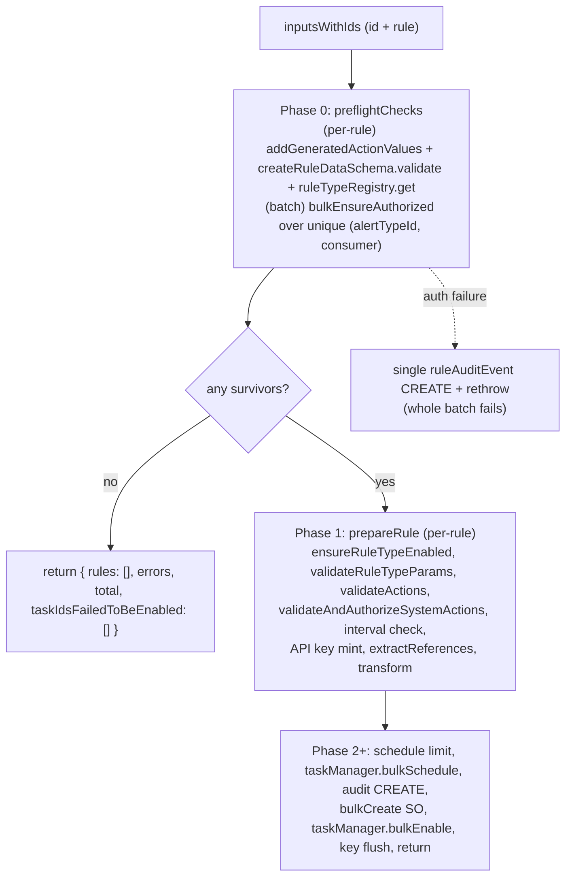

## Goal

In [bulk_create_rules.ts](x-pack/platform/plugins/shared/alerting/server/application/rule/methods/bulk_create/bulk_create_rules.ts):

1. Add a single `preflightChecks()` utility that runs per-rule validation (schema + registry) and a single bulk authorization check.
2. Per-rule schema/registry failures push to `errors[]` and exclude the rule from the batch.
3. Auth is all-or-nothing: a single `bulkEnsureAuthorized` call over the surviving pairs; on failure emit one audit log and throw on the whole batch.
4. Strip authorization + schema/registry checks from `prepareRule` so it only handles enabled-rule plumbing.

## New pipeline



## Changes

### 1) `bulk_create/utils.ts` — new `preflightChecks()`

Single entry point used by `bulk_create_rules.ts`. Signature:

```ts
export const preflightChecks = async <Params extends RuleParams>(
  context: RulesClientContext,
  inputsWithIds: Array<{ id: string; rule: BulkCreateRulesItem<Params> }>
): Promise<{
  validatedInputs: Array<ValidatedRuleInput<Params>>;
  errors: BulkCreateOperationError[];
}>;
```

Behaviour:

- Per-rule loop (sequential or `pMap`; uses uiSettings + ES query config so `addGeneratedActionValues` is the only async op):
  - Call `addGeneratedActionValues(rule.data.actions, rule.data.systemActions, context)` → `data` with uuids/KQL parsed.
  - `createRuleDataSchema.validate(data)`.
  - `context.ruleTypeRegistry.get(data.alertTypeId)` (throws 400 if not registered).
  - On success: push `{ id, data, allowMissingConnectorSecrets }` to `validatedInputs`.
  - On failure: push `{ message, status: err.output?.statusCode, rule: { id, name: rule.data?.name ?? 'n/a' } }` to `errors` and skip the rule.
- If `validatedInputs.length === 0`: return early (no auth call, no audit log).
- Otherwise run a single bulk authorization check over the survivors:
  - Build unique `(alertTypeId, consumer)` pairs from `validatedInputs`.
  - `withSpan({ name: 'authorization.bulkEnsureAuthorized', type: 'rules' })` →
    `context.authorization.bulkEnsureAuthorized({ ruleTypeIdConsumersPairs, operation: WriteOperations.Create, entity: AlertingAuthorizationEntity.Rule })`.
  - On catch: log a single `ruleAuditEvent({ action: RuleAuditAction.CREATE, error })` (no `savedObject`, mirroring [check_authorization_and_get_total.ts](x-pack/platform/plugins/shared/alerting/server/rules_client/lib/check_authorization_and_get_total.ts)) then rethrow so the whole batch fails.
- Return `{ validatedInputs, errors }`.

### 2) `bulk_create/utils.ts` — slim `prepareRule`

- Remove: leading `addGeneratedActionValues`, `createRuleDataSchema.validate`, the first `ruleTypeRegistry.get`, the entire `authzCache` / `ensureAuthorized` block, and the per-rule `ruleAuditEvent({ action: RuleAuditAction.CREATE, error: authzError })`.
- Input is now an already-validated `ValidatedRuleInput<Params>` (uuids + KQL parsed, schema valid, ruleType registered).
- Keep: `ruleTypeRegistry.ensureRuleTypeEnabled`, `ruleTypeRegistry.get` for `ruleType`, `validateRuleTypeParams`, `validateActions`, `validateAndAuthorizeSystemActions`, interval check, API key mint (soft-fail), `extractReferences`, transforms.
- Any throw inside `prepareRule` still becomes a per-rule `BulkOperationError` via the existing outer `try/catch`.

### 3) `bulk_create/types.ts`

- Add `ValidatedRuleInput<Params>` (`id`, `data` with generated actions/systemActions, `allowMissingConnectorSecrets`).
- Drop `authzCache` from `PrepareRuleArgs`.
- Replace `rule: BulkCreateRulesItem<Params>` on `PrepareRuleArgs` with `input: ValidatedRuleInput<Params>` (or inline `{ id, data, allowMissingConnectorSecrets }`).

### 4) `bulk_create_rules.ts`

- Remove `authzCache` and the now-unused `apiKeysMap` / `errors` plumbing from the prepare call signature where it duplicates `preflightChecks` outputs. Replace the current Phase 1 with:

```ts
const { validatedInputs, errors: preflightErrors } = await preflightChecks(context, inputsWithIds);
errors.push(...preflightErrors);
if (validatedInputs.length === 0) {
  return { rules: [], errors, total, taskIdsFailedToBeEnabled: [] };
}

await pMap(
  validatedInputs,
  async (input) => {
    const { prepared, error } = await prepareRule({
      context,
      actionsClient,
      username,
      input,
      errors,
      apiKeysMap,
    });
    if (prepared) preparedRules.set(input.id, prepared);
    else if (error) errors.push(error);
  },
  { concurrency: API_KEY_GENERATE_CONCURRENCY }
);
```

- Auth failures in `preflightChecks` propagate out of `bulkCreateRules` (per the requirement). No key/task cleanup is needed at that point because nothing has been minted yet.

### 5) Tests

- Update [bulk_create_rules.test.ts](x-pack/platform/plugins/shared/alerting/server/application/rule/methods/bulk_create/bulk_create_rules.test.ts):
  - Switch existing auth mocks from `authorization.ensureAuthorized` to `authorization.bulkEnsureAuthorized`.
  - Schema-invalid and unregistered-ruleTypeId inputs end up in `errors[]`, are excluded from the batch, and do not affect surviving rules; `bulkEnsureAuthorized` is called with only the surviving pairs (deduped).
  - When `bulkEnsureAuthorized` rejects: `bulkCreateRules` throws, exactly one `RuleAuditAction.CREATE` audit log is emitted with `error`, and no SOs/tasks are created.
  - Verify `bulkEnsureAuthorized` is invoked once per call (not per pair).
- Add focused unit test for `preflightChecks` covering: all-valid, mix of valid + schema/registry failures, all-invalid (no auth call), auth failure (single audit + throw).

## Notes / non-goals

- `MAX_RULES_NUMBER_FOR_BULK_OPERATION` is not introduced here; `checkAuthorizationAndGetTotal`'s find-based count is intentionally not reused (it queries existing rules, irrelevant for create).
- Security solution callers ([import_rules.ts](x-pack/solutions/security/plugins/security_solution/server/lib/detection_engine/rule_management/logic/import/import_rules.ts)) keep their existing chunk-level try/catch — bulk-auth throws will surface as a hard chunk failure exactly like other thrown errors today.
