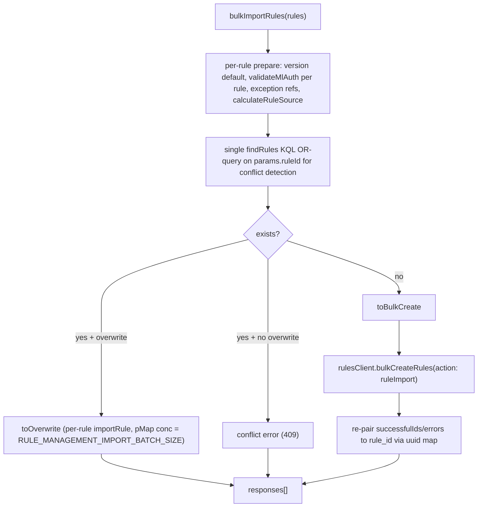

# Optimize rule `_import` (create path) via `bulkCreateRules`

Wire `POST .../rules/_import` to push *new* rules through `rulesClient.bulkCreateRules()` in a single bulk call, instead of the current per-rule loop. Gated by a new experimental flag. Existing rules (when `overwrite: true`) keep using the per-rule `importRule` path — the bulk update path is a separate follow-up (#275204).

Reference: [.knowledge/patches/wiring-for-bulk-create-and-changes-history.patch](.knowledge/patches/wiring-for-bulk-create-and-changes-history.patch). We take only the import portions (not the `bulkCreatePrebuiltRules` install wiring), plus the import-route concurrency limiter.

## Scope decisions (confirmed)
- Import-only: do NOT add `bulkCreatePrebuiltRules` / touch `perform_rule_installation_handler.ts`.
- Include the import-route concurrency limiter (`RULE_MANAGEMENT_IMPORT_CONCURRENCY = 1`) and the `timeouts.ts` -> `constants.ts` rename.

## How the new bulk path classifies rules

## Changes

### 1. Feature flag
[x-pack/solutions/security/plugins/security_solution/common/experimental_features.ts](x-pack/solutions/security/plugins/security_solution/common/experimental_features.ts) — add `bulkCreateRulesEnabled: false` to `allowedExperimentalValues` (per patch lines 5-18, but drop the prebuilt-install wording).

### 2. New bulk import method
Create `logic/detection_rules_client/methods/bulk_import_rules.ts`, exporting `bulkImportRules`, `BulkImportRulesResult`, `BulkImportRuleSuccess`. Key behaviour:
- Per-rule prepare loop with isolated error capture (version default for custom rules, `validateMlAuth` per rule, `checkRuleExceptionReferences`, `calculateRuleSource`).
- One `findRules` call with a parenthesized `alert.attributes.params.ruleId: ("a" OR "b" ...)` KQL filter to detect conflicts in bulk. `rule_id` is interpolated raw, matching the existing convention in `getRuleByRuleId` (no bespoke escaping — see risks report).
- Classify into `conflict` (409) / `toOverwrite` / `toBulkCreate`.
- Overwrite branch reuses the existing single `importRule` ([methods/import_rule.ts](x-pack/solutions/security/plugins/security_solution/server/lib/detection_engine/rule_management/logic/detection_rules_client/methods/import_rule.ts)) via `pMap` concurrency `RULE_MANAGEMENT_IMPORT_BATCH_SIZE` (50, mirrors the old per-chunk bound), collapsing the full `RuleResponse` to `{ rule_id }`.
- Bulk-create branch builds `{ data, options: { id }, allowMissingConnectorSecrets }` items (`data` shape matches `BulkCreateRulesItem` in [alerting bulk_create/types.ts](x-pack/platform/plugins/shared/alerting/server/application/rule/methods/bulk_create/types.ts)), preserving the user `enabled` flag, with `changeTracking: { action: ruleImport, metadata: { bulkCount: rules.length } }`. Pre-assigns uuids and re-pairs `successfulIds`/`errors` back to `rule_id`.

### 3. Detection rules client wiring
- [detection_rules_client_interface.ts](x-pack/solutions/security/plugins/security_solution/server/lib/detection_engine/rule_management/logic/detection_rules_client/detection_rules_client_interface.ts) — add `bulkImportRules: (args: BulkImportRulesArgs) => Promise<BulkImportRulesResult>` and `export type BulkImportRulesArgs = ImportRulesArgs;` (patch lines 814-859, omitting the `BulkCreatePrebuiltRules*` additions).
- [detection_rules_client.ts](x-pack/solutions/security/plugins/security_solution/server/lib/detection_engine/rule_management/logic/detection_rules_client/detection_rules_client.ts) — add the `bulkImportRules` method delegating to the new file inside `withSecuritySpan` (patch lines 799-809; skip the `bulkCreatePrebuiltRules` block).
- [__mocks__/detection_rules_client.ts](x-pack/solutions/security/plugins/security_solution/server/lib/detection_engine/rule_management/logic/detection_rules_client/__mocks__/detection_rules_client.ts) — add `bulkImportRules: jest.fn().mockResolvedValue({ responses: [] })` (drop the `bulkCreatePrebuiltRules` mock line).

### 4. Import orchestrator branch
[logic/import/import_rules.ts](x-pack/solutions/security/plugins/security_solution/server/lib/detection_engine/rule_management/logic/import/import_rules.ts) (patch lines 1413-1527) — add optional `experimentalFeatures` param. When `bulkCreateRulesEnabled` is off, keep the existing per-chunk loop; when on, flatten `ruleChunks.flat()` into a single `detectionRulesClient.bulkImportRules()` call. Extract the response mapping into a shared `toImportRuleResponse` helper.

### 5. Route wiring + constants
- Rename [api/timeouts.ts](x-pack/solutions/security/plugins/security_solution/server/lib/detection_engine/rule_management/api/constants.ts) -> `api/constants.ts`, add `export const RULE_MANAGEMENT_IMPORT_CONCURRENCY = 1;` and `export const RULE_MANAGEMENT_IMPORT_BATCH_SIZE = 50;` (the latter moved out of the import route's local `CHUNK_PARSED_OBJECT_SIZE` so the chunk size and the overwrite-branch `pMap` bound share one source of truth).
- Update the two other importers of the old path: `api/rules/bulk_actions/route.ts` and `api/rules/export_rules/route.ts`.
- [api/rules/import_rules/route.ts](x-pack/solutions/security/plugins/security_solution/server/lib/detection_engine/rule_management/api/rules/import_rules/route.ts) — import `RULE_MANAGEMENT_IMPORT_BATCH_SIZE`, `RULE_MANAGEMENT_IMPORT_CONCURRENCY`, and the socket-timeout const from `../../constants`; chunk with `RULE_MANAGEMENT_IMPORT_BATCH_SIZE`; add `tags: [routeLimitedConcurrencyTag(RULE_MANAGEMENT_IMPORT_CONCURRENCY)]` to route options; read `ctx.securitySolution.getConfig().experimentalFeatures` and pass `experimentalFeatures` into `importRules()`.

## Tests
- Unit: new `detection_rules_client.bulk_import_rules.test.ts` covering all-new/disabled, all-new/enabled, large input single-call, mixed conflict, mixed overwrite fallback, per-row error re-pairing, changeTracking action/bulkCount, and empty input.
- Unit: extend [import_rules.test.ts](x-pack/solutions/security/plugins/security_solution/server/lib/detection_engine/rule_management/logic/import/import_rules.test.ts) with a `bulk path` describe — chunk flattening, single call, 4xx/409 error mapping.
- Not in this commit: `change_tracking.test.ts` additions (action + bulkCount are already covered in `bulk_import_rules.test.ts`) and the API-integration suite (deferred, see the `api-tests` todo).

## Validation
- `node scripts/jest x-pack/solutions/security/plugins/security_solution/server/lib/detection_engine/rule_management/logic/detection_rules_client/detection_rules_client.bulk_import_rules.test.ts`
- `node scripts/jest .../logic/import/import_rules.test.ts`
- `node scripts/type_check --project x-pack/solutions/security/plugins/security_solution/tsconfig.json`
- `node scripts/eslint --fix $(git diff --name-only)`
- Manual: enable `xpack.securitySolution.enableExperimental: ['bulkCreateRulesEnabled']`, import the sample NDJSON from the ticket via Security > Detection Rules > Import.