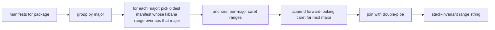

# Stack-invariant `related_integrations.version` via multi-major OR range

## Why

Today [`find_least_compatible_version()`](detection_rules/integrations.py) returns a single `^X.Y.Z` anchor that depends on `current_stack_version`. The same rule TOML therefore packages as `^8.2.0` when the 8.19 backport is built and `^9.0.0` when the 9.x package is built, while the prebuilt rule `version` integer is identical across packages. Kibana sees "same version, different content" and never offers an upgrade — see [issue #5601](https://github.com/elastic/detection-rules/issues/5601).

The detection-rules version hash already excludes `related_integrations` (PR #4621), so we don't have to touch the lock logic — we only need the *packaged* string to stop drifting between backports.

## Approach

Emit a range string that is **derived only from the integration's manifests**, not from `current_stack_version`:

- One `^X.Y.Z` anchor per major that has a compatible manifest, where `X.Y.Z` is the oldest manifest in that major whose `conditions.kibana.version` admits some stack version inside that major.
- Plus one forward-looking `^(M+1).0.0` anchor above the highest manifest major, **always** included regardless of whether a manifest exists for it (semantically: "be permissive about future majors of this integration").
- Anchors joined by ` || `, ascending by major.

Worked example for `endpoint` today: manifests cover 7.x → 8.x → 9.x, so the emitted range becomes:

```
^7.17.0 || ^8.2.0 || ^9.0.0 || ^10.0.0
```

…identical on every backport package build.



## Code changes

### 1. Rename + reshape in [detection_rules/integrations.py](detection_rules/integrations.py)

Rename `find_least_compatible_version` to `find_compatible_version_range`. The only in-repo call sites are the definition itself, the single caller in `_convert_add_related_integrations` (updated in step 2), and the tests (rewritten in step 4), so a straight rename is safe. The function is a module-level public symbol in `detection_rules.integrations`, so out-of-tree scripts that import it would break — if that turns out to matter we can add a one-line deprecation shim later; the default here is a clean rename with no shim.

New signature/return:

```python
@dataclass(frozen=True)
class CompatibleVersionRange:
    range: str                 # e.g. "^8.2.0 || ^9.0.0 || ^10.0.0"
    anchors: list[str]         # ["8.2.0", "9.0.0"] -- manifest-backed anchors only
    forward_anchor: str        # "10.0.0" -- the forward-looking next-major floor

def find_compatible_version_range(
    package: str,
    packages_manifest: dict[str, Any],
) -> CompatibleVersionRange:
    """Return a stack-invariant OR'd caret range covering every major with a
    compatible manifest, plus one forward-looking next-major anchor."""
```

Algorithm:

1. Group `packages_manifest[package]` versions by `Version.parse(v).major`.
2. For each major `M`, walk that major's versions oldest → newest and pick the first `vM` whose `conditions.kibana.version` overlaps the half-open interval `[M.0.0, (M+1).0.0)`. Implement that overlap with a small helper `_major_has_compatible_stack(major, req)` that reuses `_parse_kibana_range`.
3. Append `^(top_major + 1).0.0` as the forward-looking anchor (unconditional).
4. Join `^{vM}` strings + the forward-looking anchor with ` || `.
5. Raise `ValueError` only if no major produced an anchor (matches today's failure mode).

After this rename, the old name `find_least_compatible_version` no longer exists in the codebase. Remove its import in `detection_rules/rule.py` and its references in `tests/test_integrations.py`.

### 2. Update [`_convert_add_related_integrations`](detection_rules/rule.py) (around line 1423)

Switch the export step to use the new function and the new anchor list. Today's code does:

```1447:1463:detection_rules/rule.py
                    for package in package_integrations:
                        package["version"] = find_least_compatible_version(
                            package=package["package"],
                            integration=package["integration"],
                            current_stack_version=current_stack_version,
                            packages_manifest=packages_manifest,
                        )

                        # if integration is not a policy template remove
                        if package["version"]:
                            version_data = packages_manifest.get(package["package"], {}).get(
                                package["version"].strip("^"), {}
                            )
                            policy_templates = version_data.get("policy_templates", [])

                            if package["integration"] not in policy_templates:
                                del package["integration"]
```

Becomes (sketch):

```python
                    for package in package_integrations:
                        result = find_compatible_version_range(
                            package=package["package"],
                            packages_manifest=packages_manifest,
                        )
                        package["version"] = result.range

                        # Union policy_templates across all manifest-backed anchors;
                        # forward_anchor has no manifest yet so it can't contribute.
                        policy_templates: set[str] = set()
                        for anchor in result.anchors:
                            version_data = packages_manifest.get(package["package"], {}).get(anchor, {})
                            policy_templates.update(version_data.get("policy_templates", []))

                        if package["integration"] not in policy_templates:
                            del package["integration"]
```

That is the only in-repo caller; no other call sites need to change. Also update the `from .integrations import ...` line at the top of `rule.py` to import `find_compatible_version_range` instead of `find_least_compatible_version`.

The `current_stack_version` lookup a few lines above (`load_current_package_version()`) stays for the schema-data path; it's no longer used by the integrations block.

### 3. Schema

No schema change needed:

- `RelatedIntegrations.version` is declared `NonEmptyStr` ([rule.py line 374](detection_rules/rule.py)), no regex.
- `ConditionSemVer` / `CONDITION_VERSION_PATTERN` in [detection_rules/schemas/definitions.py](detection_rules/schemas/definitions.py) only constrains EPR package `conditions`, not `related_integrations`.

So the new range string passes existing detection-rules validation untouched. We should still confirm Kibana's security-solution rule schema accepts `||` (node-semver supports it, and Kibana already parses EPR `conditions.kibana.version` strings that use `||`), but that's a separate verification, not a code change here.

### 4. Tests in [tests/test_integrations.py](tests/test_integrations.py)

Rename `TestFindLeastCompatibleVersion` to `TestFindCompatibleVersionRange` and rewrite its cases (the old behaviour is gone — there's nothing left to test for `find_least_compatible_version`). Also update the import at the top of the file:

```python
from detection_rules.integrations import (
    _parse_clause,
    _parse_kibana_range,
    _satisfies_kibana_range,
    find_latest_compatible_version,
    find_compatible_version_range,  # renamed from find_least_compatible_version
)
```

New cases:

- `test_emits_or_range_across_majors`: manifests `{1.0.0: ^8.12.0, 1.5.0: ^8.12.0, 2.0.0: ^9.0.0, 2.5.0: ^9.1.0}` → `"^1.0.0 || ^2.0.0 || ^3.0.0"`. Asserts both the per-major oldest-pick and the forward-looking anchor.
- `test_stack_invariance_property`: same manifests as above, range result is identical (we just call once now — `current_stack_version` is no longer an input).
- `test_single_major_still_appends_forward_anchor`: manifests only `{1.0.0: ^9.0.0}` → `"^1.0.0 || ^2.0.0"`.
- `test_three_majors_endpoint_shape`: synthetic mirror of the real `endpoint` shape — manifests spanning 7.x, 8.x, 9.x with realistic kibana ranges → `"^7.17.0 || ^8.2.0 || ^9.0.0 || ^10.0.0"`. Mirrors the #5601 reproducer.
- `test_skips_majors_with_no_overlap`: manifests `{1.0.0: ^7.10.0, 2.0.0: =9.4.0}` where the 2.0.0 manifest is pinned to a single point inside 9.x — still produces a 9.x anchor for 2.0.0 and a forward `^10.0.0`.
- `test_raises_when_no_major_has_compatible_manifest`: degenerate manifest set where no major has any in-range manifest → `ValueError`.
- `test_returns_anchor_list_for_policy_template_lookup`: asserts `result.anchors` and `result.forward_anchor` are populated so `_convert_add_related_integrations` can iterate them.

The old class `TestFindLeastCompatibleVersion` is gone with the function it covered.

## Out of scope (deliberately)

- No change to the version-lock hash (PR #4621 stays intact).
- No re-lock pass for already-divergent shipped rules. The fix lands only for *future* package builds; in-place reconciliation is a follow-up.
- No Kibana-side schema change. Validation that Kibana's `related_integrations.version` schema accepts `||` is a 10-minute follow-up check outside this codebase.
- No deprecation shim for the old `find_least_compatible_version` name — clean rename. Add one later if out-of-tree breakage shows up.

## Risks

- **Kibana consumer**: if security-solution's rule schema applies a stricter regex than node-semver (e.g. only `^X.Y.Z`), the `||` form will be rejected. Worth a quick read of the kibana side before merging.
- **Forward anchor permissiveness**: `^(M+1).0.0` admits any future X.0.0+ package. If the integration ships a 10.x package whose `conditions.kibana.version` excludes the current stack, the rule's `related_integrations` will still claim compatibility. This matches the user's chosen semantics ("always include the forward anchor"), but it is a one-line change to gate later if it surprises users.
- **Tests downstream of rule export**: any test asserting an exact `^X.Y.Z` string for `related_integrations.version` will need to be updated. Should be limited; a quick grep for `related_integrations` assertions in `tests/` will surface them before implementation.