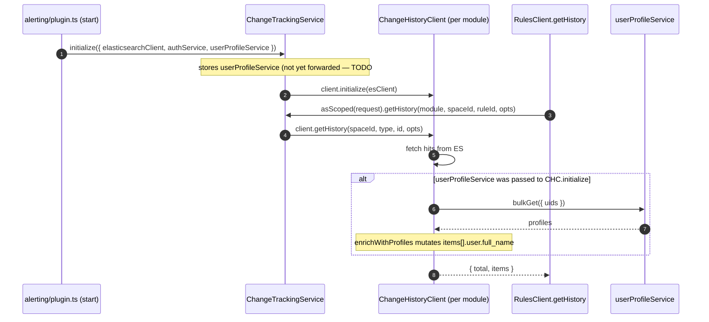

## Result

Draft PR: [#278439 — [Change History] Shared user-profile name resolution in getHistory](https://github.com/elastic/kibana/pull/278439).

**What actually shipped in this PR:**

- `@kbn/change-history` now supports read-time `user.full_name` enrichment. The heavy lifting lives in a standalone `enrichWithProfiles` helper in `utils.ts`, not as a private method on the client (final call: reusable + easier to unit-test in isolation).
- Alerting's `ChangeTrackingService` accepts and stores `userProfileService` on `initialize`, but **does not** pass it through to `ChangeHistoryClient.initialize` yet. That call is annotated `TODO` with a link back to #278422; it gets flipped on in the two follow-up PRs that remove the temporary Security (#278353) and Workflows (#278426) resolvers, so we never do two `bulkGet` round-trips for the same request.

**Deferred / follow-up work (out of this PR):**

- Follow-up PR (Security): remove local resolver in `security_solution/detection_rules_client/methods/get_history_for_rule.ts`; flip `ChangeTrackingService.initializeAll` to pass `{ userProfileService: this.userProfileService }` into `client.initialize`; drop the matching `TODO` in the service test.
- Follow-up PR (Workflows): remove Workflows' equivalent resolver from #278426; same `TODO` flip if not already done by the Security follow-up.

## Preflight — before touching code

Pull a fresh copy of the tracking issue and re-read it before executing. Also refresh both temporary fix PRs:

```bash
gh issue view 278422 --repo elastic/kibana --comments
gh pr view 278353 --repo elastic/kibana --comments   # Security temp fix
gh pr view 278426 --repo elastic/kibana --comments   # Workflows temp fix
```

If anything material has changed since this plan was written, pause and surface it before executing.

## Scope

- **In (this PR):** `@kbn/change-history` (types, client, utils), alerting `ChangeTrackingService` (init params, stored field, plugin wiring).
- **Out (follow-up PRs):** flipping the `TODO` inside `ChangeTrackingService.initializeAll`; removing the per-solution temp resolvers in `DetectionRulesClient` (#278353) and Workflows (#278426).

## Layer 1: `@kbn/change-history`

### [x-pack/platform/packages/shared/kbn-change-history/src/types.ts](x-pack/platform/packages/shared/kbn-change-history/src/types.ts)

Added optional `full_name` to `ChangeHistoryDocument.user`. Read-time enrichment only; not persisted.

```ts
user: {
  id?: string;
  name: string;
  /** Resolved at read time from the user profile; not persisted. */
  full_name?: string;
};
```

### [x-pack/platform/packages/shared/kbn-change-history/src/client.ts](x-pack/platform/packages/shared/kbn-change-history/src/client.ts)

- New exported interface `ChangeHistoryClientInitializeOptions` with a single optional field `userProfileService?: UserProfileServiceStart`.
- `initialize(elasticsearchClient, opts?)` stores the service on a private field.
- `getHistory(...)` calls `enrichWithProfiles(items, this.userProfileService, this.logger)` when a service was provided at init time; otherwise the search results are returned unchanged.

### [x-pack/platform/packages/shared/kbn-change-history/src/utils.ts](x-pack/platform/packages/shared/kbn-change-history/src/utils.ts)

New helper `enrichWithProfiles(items, service, logger)`:

1. Collects unique `user.id`s into a `Set<string>`.
2. Early return when the set is empty.
3. Calls `service.bulkGet({ uids })`, builds a `Map<uid, UserProfile>`.
4. Mutates each doc's `user.full_name` in place when a matching profile with a non-empty `full_name` is found.
5. `try/catch`: on failure, `logger.warn(...)` and return items unresolved. Never throws.

Kept as a standalone `const` arrow function so it's reusable outside the alerting-owned client (e.g. by Workflows) and unit-testable without spinning up a full `ChangeHistoryClient`.

### [x-pack/platform/packages/shared/kbn-change-history/tsconfig.json](x-pack/platform/packages/shared/kbn-change-history/tsconfig.json)

Added `@kbn/core-user-profile-server` to `kbn_references`. `moon.yml` was regenerated by `scripts/check.js` — same dep added to `dependsOn`.

## Layer 2: alerting framework

### [x-pack/platform/plugins/shared/alerting/server/rules_client/lib/change_tracking/types.ts](x-pack/platform/plugins/shared/alerting/server/rules_client/lib/change_tracking/types.ts)

Added `userProfileService: UserProfileServiceStart` to `ChangeTrackingServiceInitializeParams` (required — always available from `coreStart.userProfile`).

### [x-pack/platform/plugins/shared/alerting/server/rules_client/lib/change_tracking/service.ts](x-pack/platform/plugins/shared/alerting/server/rules_client/lib/change_tracking/service.ts)

- Added `private userProfileService?: UserProfileServiceStart;` field.
- `initialize({ elasticsearchClient, authService, userProfileService })` stores it.
- `initializeAll` currently calls `await client.initialize(elasticsearchClient)` **without** the profile service, guarded by a `TODO` referencing #278422 — see "Deferred / follow-up work" above. Flipping this to `await client.initialize(elasticsearchClient, { userProfileService: this.userProfileService })` is the follow-up step once the temp resolvers are removed.

### [x-pack/platform/plugins/shared/alerting/server/plugin.ts](x-pack/platform/plugins/shared/alerting/server/plugin.ts)

`changeTrackingService.initialize({...})` at ~line 679 now passes `userProfileService: core.userProfile`.

### [x-pack/platform/plugins/shared/alerting/tsconfig.json](x-pack/platform/plugins/shared/alerting/tsconfig.json)

Added `@kbn/core-user-profile-server` to `kbn_references`. `moon.yml` regenerated by `check.js`.

## Data flow



## Tests

- **`@kbn/change-history`** — `src/utils.test.ts` covers `enrichWithProfiles`: happy path (`full_name` populated), empty-set short-circuit (no `bulkGet` call), profile missing (no `full_name`), profile has no `full_name` (no `full_name` set), `bulkGet` throws (returns docs unresolved + `logger.warn` asserted).
- **`@kbn/change-history`** — `src/client.test.ts` covers `getHistory` wiring: **negative** case (no service at init → `bulkGet` never called; `full_name` stays undefined) and **positive** case (service provided → `bulkGet` called with unique uids; `full_name` populated on items).
- **alerting** — `server/rules_client/lib/change_tracking/service.test.ts` still asserts `ChangeHistoryClient.initialize` is called with the ES client only; a matching `TODO` marks where the `{ userProfileService }` assertion will land once the pass-through is enabled in the follow-up.

## Code style (applied throughout)

Follows [.cursor/rules/code-style-guidelines.mdc](.cursor/rules/code-style-guidelines.mdc) and [AGENTS.md](AGENTS.md):

- **Comments minimal.** One-line JSDoc on the new `full_name` field, the `initialize` `opts` param, and the `enrichWithProfiles` helper (params + failure semantics). No narrative comments elsewhere.
- **Short names.** `profiles`, `uids`, `map`, `err`, `service`, `logger`, `item`. Helper is `enrichWithProfiles` — not `enrichHistoryItemsWithUserProfiles`.
- **No renames** of `initialize`, `getHistory`, `userProfileService`, etc.
- **TypeScript.** No `any` / `unknown` in production code (test-only `as never` on a couple of mock returns). `import type` for `UserProfileServiceStart`. Explicit `Promise<void>` return on `enrichWithProfiles`. No `!` non-null assertions, no `@ts-ignore` / `@ts-expect-error`.
- **`const` arrow function** for `enrichWithProfiles`.
- **No new source files** (helper landed in existing `utils.ts`). Test additions are appended to existing `utils.test.ts` and `client.test.ts`.
- **Early returns.** Empty-`uids` short-circuit: `if (uids.size === 0) return;`.
- **Formatting.** Single quotes, no reformatting of unrelated lines.

## Verification (result)

`node scripts/check.js --scope=branch`:

```
check  branch  origin/main..HEAD  1 commit
  tsproj ✓ 2 projects
  moon   ✓ projects regenerated
  lint   ✓ 9 files
  jest   ✓ 2 configs ran, 4576 tests
  tsc    ✓ 2 projects
```

Also individually:

- `node scripts/type_check --project x-pack/platform/packages/shared/kbn-change-history/tsconfig.json`
- `node scripts/type_check --project x-pack/platform/plugins/shared/alerting/tsconfig.json`
- `node scripts/jest x-pack/platform/packages/shared/kbn-change-history` — 31 tests pass
- `node scripts/jest x-pack/platform/plugins/shared/alerting/server/rules_client/lib/change_tracking` — 18 tests pass

## PR

Opened as **draft** against `main`: [#278439](https://github.com/elastic/kibana/pull/278439).

Body references:

- `Addresses #278422` (tracking issue).
- [#278353](https://github.com/elastic/kibana/pull/278353) — the Security temporary fix this shared solution will unblock.
- [#278426](https://github.com/elastic/kibana/pull/278426) — the Workflows temporary fix (mirror of #278353) that this shared solution will also unblock.

Labels applied: `release_note:skip`, `Team: SecuritySolution`, `Team:One Workflow`, `Team:Detection Engineering`.

## Non-changes worth noting

- Write path (`log`, `logBulk`) untouched. `full_name` is never persisted.
- `ChangeHistoryClient` constructor unchanged.
- `IChangeTrackingService.asScoped` shape unchanged — callers upstream don't see any new parameter.
- `DetectionRulesClient` untouched. Its local resolver is removed in the follow-up PR that also flips the deferred pass-through.
