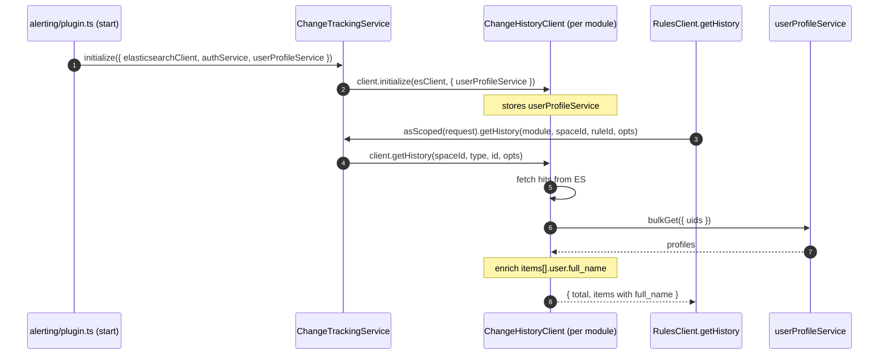

## Preflight — before touching code

Pull a fresh copy of the tracking issue and re-read it. The plan below was drafted off an earlier snapshot; if the issue has moved on (scope tweaks, extra acceptance criteria, new comments from ResponseOps / Workflows / Security), reconcile before proceeding.

```bash
gh issue view 278422 --repo elastic/kibana --comments
```

Also refresh context on the two temporary fixes this plan supersedes:

```bash
gh pr view 278353 --repo elastic/kibana --comments  # Security temp fix
gh pr view 278426 --repo elastic/kibana --comments  # Workflows temp fix
```

If anything material changed since the plan was written, pause and surface it before executing.

## Scope

- **In:** `@kbn/change-history`, alerting `ChangeTrackingService`.
- **Out (follow-up PR):** any changes to `DetectionRulesClient` / `security_solution` local resolver.

## Layer 1: `@kbn/change-history`

### [x-pack/platform/packages/shared/kbn-change-history/src/types.ts](x-pack/platform/packages/shared/kbn-change-history/src/types.ts)

Add optional `full_name` to `ChangeHistoryDocument.user`. Read-time enrichment only; not persisted.

```ts
user: {
  id?: string;
  name: string;
  /** Display name resolved at read time from the user profile; absent when unresolved. */
  full_name?: string;
};
```

### [x-pack/platform/packages/shared/kbn-change-history/src/client.ts](x-pack/platform/packages/shared/kbn-change-history/src/client.ts)

- Extend the class to hold an optional `userProfileService?: UserProfileServiceStart` (private field, set during `initialize`).
- Change `initialize(elasticsearchClient)` to accept an optional second arg:
  ```ts
  async initialize(
    elasticsearchClient: ElasticsearchClient,
    opts?: { userProfileService?: UserProfileServiceStart }
  ) { ... this.userProfileService = opts?.userProfileService; ... }
  ```
- In `getHistory(...)`, after collecting hits into `items`, if `this.userProfileService` is set, call a new private `enrichWithProfiles(items)` helper that:
  1. Collects unique `user.id`s into a `Set<string>`.
  2. Short-circuits when the set is empty.
  3. Calls `userProfileService.bulkGet({ uids })`, builds a `Map<uid, UserProfile>`.
  4. Mutates each doc's `user.full_name` when a profile is found (only sets when `profile.user.full_name` is non-empty).
  5. Wrapped in `try/catch`: on failure, `logger.warn` the error and return items unresolved.

### [x-pack/platform/packages/shared/kbn-change-history/tsconfig.json](x-pack/platform/packages/shared/kbn-change-history/tsconfig.json)

Add `@kbn/core-user-profile-server` to `kbn_references`.

## Layer 2: alerting framework

### [x-pack/platform/plugins/shared/alerting/server/rules_client/lib/change_tracking/types.ts](x-pack/platform/plugins/shared/alerting/server/rules_client/lib/change_tracking/types.ts)

Add `userProfileService: UserProfileServiceStart` to `ChangeTrackingServiceInitializeParams` (required — always available from `coreStart.userProfile`).

### [x-pack/platform/plugins/shared/alerting/server/rules_client/lib/change_tracking/service.ts](x-pack/platform/plugins/shared/alerting/server/rules_client/lib/change_tracking/service.ts)

- Add `private userProfileService?: UserProfileServiceStart;` field.
- In `initialize({ elasticsearchClient, authService, userProfileService })`, store it.
- In `initializeAll`, pass it to each client:
  ```ts
  await client.initialize(elasticsearchClient, { userProfileService: this.userProfileService });
  ```

### [x-pack/platform/plugins/shared/alerting/server/plugin.ts](x-pack/platform/plugins/shared/alerting/server/plugin.ts)

Extend the `changeTrackingService.initialize({...})` call at line 679 to pass `userProfileService: core.userProfile`.

## Data flow



## Tests

- **`@kbn/change-history`** — extend `src/client.test.ts` (or add if absent): happy path (`full_name` populated when profile found), empty-set short-circuit (no `bulkGet` call), profile missing (no `full_name`), profile has no `full_name` (no `full_name` set), `bulkGet` throws (returns docs unresolved + logger.warn asserted).
- **alerting** — extend `server/rules_client/lib/change_tracking/service.test.ts`: assert `userProfileService` is passed through to `ChangeHistoryClient.initialize`.

## Code style

Follow [.cursor/rules/code-style-guidelines.mdc](.cursor/rules/code-style-guidelines.mdc) and [AGENTS.md](AGENTS.md):

- **Comments minimal.** One-liners only, and only where they explain non-obvious intent the code can't convey. No narrative comments. Reserve the JSDoc I add on the new `full_name` field and on `initialize`'s new `opts` param — those describe non-obvious integration behaviour (read-time only, absent when unresolved).
- **Short names.** Prefer one-or-two-word locals: `profiles`, `uids`, `map`, `err`. Avoid three-plus-word names unless intent would be unclear otherwise. Don't echo the enclosing method/file name (no `enrichHistoryItemsWithUserProfiles` — just `enrichWithProfiles`, or inline if short).
- **Don't rename existing symbols.** `initialize`, `getHistory`, `userProfileService`, etc. stay as they are on both sides.
- **TypeScript.** No `any` / `unknown`. `import type` for the new `UserProfileServiceStart` / `UserProfile` imports. Explicit return type on the new private helper. No `!` non-null assertions. No `@ts-ignore` / `@ts-expect-error`.
- **Prefer `const` arrow functions** for the new private helper; destructure params.
- **Filenames.** No new source files planned. If tests need a new fixture, `snake_case.ts`.
- **Early returns.** The empty-`uids` short-circuit uses `if (uids.size === 0) return;` — no nested else.
- **Formatting.** Match the file's existing style — single quotes in both packages, no reformatting of unrelated code.

## Verification

- `node scripts/type_check --project x-pack/platform/packages/shared/kbn-change-history/tsconfig.json`
- `node scripts/type_check --project x-pack/platform/plugins/shared/alerting/tsconfig.json`
- `node scripts/jest x-pack/platform/packages/shared/kbn-change-history`
- `node scripts/jest x-pack/platform/plugins/shared/alerting/server/rules_client/lib/change_tracking`

## PR

Open as **draft** against `main`. The PR body must explicitly reference:

- **`Addresses #278422`** (or `Closes #278422` if it fully resolves the tracking issue — decide based on the fresh issue read in Preflight).
- [#278353](https://github.com/elastic/kibana/pull/278353) as the temporary Security fix that this shared solution will unblock.
- [#278426](https://github.com/elastic/kibana/pull/278426) — the Workflows temporary fix ("[One Workflow] fix: resolve human-readable usernames in workflow changes history") that mirrors #278353 and which this shared solution will also unblock.

Labels: `Team: SecuritySolution`, `Team:One Workflow`, and whatever ResponseOps ownership label applies to `@kbn/change-history` (owned by `@elastic/security-detection-engineering` per its `kibana.jsonc`, so probably also `Team:Detection Engineering`).

## Non-changes worth noting

- Write path (`log`, `logBulk`) untouched. `full_name` is never persisted.
- `ChangeHistoryClient` constructor unchanged.
- `IChangeTrackingService.asScoped` shape unchanged — callers upstream don't see any new parameter.
- `DetectionRulesClient` untouched.
