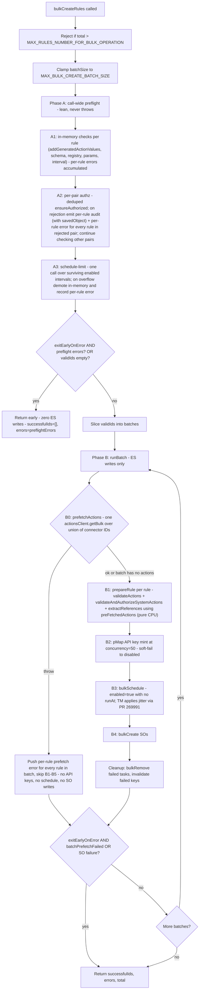

# bulkCreateRules — Custodian-Feedback Review

Reviewing the prior plan ([bulk-create-rules-preflight](.cursor/plans/bulk-create-rules-preflight_b58ffaf1.plan.md)) against the framework custodians' written feedback, with reference to three established framework patterns:

- [bulk_enable_rules.ts](x-pack/platform/plugins/shared/alerting/server/application/rule/methods/bulk_enable/bulk_enable_rules.ts)
- [create_rule.ts](x-pack/platform/plugins/shared/alerting/server/application/rule/methods/create/create_rule.ts)
- [bulk_edit_rules_occ.ts](x-pack/platform/plugins/shared/alerting/server/rules_client/common/bulk_edit/bulk_edit_rules_occ.ts)

## 1. Custodian constraints (verbatim)

| # | Constraint | Status after revisions |
|---|---|---|
| C1 | Do the batching inside the bulkCreate method | satisfied (current code) |
| C2 | Support exit-early on error | satisfied via `exitEarlyOnError`; **extended** to also short-circuit at the Phase A→B boundary when any preflight errors are present (operational halt — same "stop digging" semantics the flag already provides between batches). Authz failures stay per-rule in both modes; the flag's purpose is operational halt, not failure-shape change. |
| C3 | Create tasks as enabled, then rules as enabled | **satisfied by TM** — [PR #269991](https://github.com/elastic/kibana/pull/269991) (merged) added jittered `runAt` (up to 5m or interval, whichever is smaller) inside `TaskScheduling.bulkSchedule` for enabled recurring tasks. Our side just needs `enabled: true` with no `runAt` and TM does the spread. The commented-out `BULK_TM_SCHEDULE_DELAY` and the prior plan's manual stagger are no longer needed (constant removed from `constants.ts`). |
| C4 | Keeping track of results is a memory footgun — keep minimum info in memory | **satisfied** — only `{ id, error? }` retained call-wide; transforms rebuilt per batch and discarded; `addGeneratedActionValues` re-runs in Phase B without storing its Phase A output |
| C5 | Be cautious about operations before ES writes; don't validate between ES calls (even API key creation) | **satisfied without exception** — Phase A is in-memory + one read (authz) + one read (schedule-limit); Phase B per batch is one read (prefetch) → pure-CPU validation → N consecutive writes (API key mint → bulkSchedule → bulkCreate SOs). No fallback path that re-introduces validation-between-ES-calls (prefetch throw = batch-wide error, no per-rule retry). |
| C6 | Best-effort cleanup is acceptable | satisfied |
| C7 | Max limit + configurable batch size, both with upper bounds | satisfied (`MAX_RULES_NUMBER_FOR_BULK_OPERATION=10000`, `MAX_BULK_CREATE_BATCH_SIZE=500`) |
| Q&A | "Before any ES API calls, do fail-fast checks like schema validation. When all checks pass, start ES calls. Fewer reverts." | satisfied — Phase A does all in-memory fail-fast checks for every rule across the call before any ES write |

## 2. What the three example files actually establish

### [create_rule.ts](x-pack/platform/plugins/shared/alerting/server/application/rule/methods/create/create_rule.ts) (single rule)

Order of operations:

1. `addGeneratedActionValues` (in-memory UUID minting)
2. `createRuleDataSchema.validate` (in-memory)
3. `ruleTypeRegistry.get` (in-memory)
4. `validateScheduleLimit` (ES read) — **only if `data.enabled`**
5. `authorization.ensureAuthorized` (ES read)
6. `ruleTypeRegistry.ensureRuleTypeEnabled` + `validateRuleTypeParams` (in-memory)
7. `resolveRuleAPIKey` (ES **write**)
8. `validateActions` (ES read)
9. `validateAndAuthorizeSystemActions` (ES read)
10. Minimum-interval check (in-memory)
11. `extractReferences` (in-memory)
12. `transformRuleDomainToRuleAttributes` (in-memory)
13. `createRuleSavedObject` (ES write)

The single-rule path **does interleave validation with the first ES write** (steps 8–10 follow step 7). For a single rule, the cost of revert is bounded to one API key, so this is acceptable. **The custodians' "don't validate between ES calls" guidance is an explicit call-out for bulk**, where the cost of revert scales.

### [bulk_enable_rules.ts](x-pack/platform/plugins/shared/alerting/server/application/rule/methods/bulk_enable/bulk_enable_rules.ts)

Structure:

1. Pull rules via PIT finder (no IDs to generate).
2. `validateScheduleLimit` **once** before per-rule pMap; if it fails, every rule in the pMap throws "scheduleValidationError" (single validation decision, not per-rule re-check).
3. `pMap(rules, concurrency: 50)` per-rule: authz, API key mint, build update payload, accumulate audit events and task instances.
4. Single `taskManager.bulkSchedule` (tasks created with `enabled: false`).
5. Single `bulkCreateRulesSo` (SO write).
6. Separate `taskManager.bulkEnable` step (randomises `runAt` — that's the activation-jitter we want for bulkCreate).
7. Per-row failure handling pulled from `result.saved_objects`.

Key takeaway: validation outcomes are made **once over the whole call** when possible, not re-derived per batch. API key minting is part of the per-rule loop, but it follows the call-wide schedule-limit decision.

### [bulk_edit_rules_occ.ts](x-pack/platform/plugins/shared/alerting/server/rules_client/common/bulk_edit/bulk_edit_rules_occ.ts)

Structure:

1. `pMap` per-rule: build update payload, mint API keys (ES write) inside the loop.
2. `validateScheduleLimit` **after** the pMap finishes.
3. **If it fails**: invalidate every newly-minted API key (best-effort cleanup), return errors for the whole batch.
4. Else: `bulkCreateRulesSo` (overwrite=true).
5. On SO throw: invalidate newly-minted API keys.

This is the closest pattern to bulkCreate. Note it explicitly does *not* satisfy "no validation between ES calls" — schedule-limit validation runs after API key minting, and the cleanup path exists precisely to revert keys when that validation fails. The custodian feedback is asking us to do **better** in bulkCreate than what bulkEdit does.

## 3. Where my prior plan goes wrong

### Violation A — memory footgun (C4)

My prior plan stored a `PreflightValidatedRule` per input across all batches:

```
PreflightValidatedRule {
  id, data, ruleType, validatedRuleTypeParams,
  references, params, actionsWithRefs, artifactsWithRefs
}
```

At the 10k hard cap with realistic params + references arrays, this is on the order of 100s of MB held in memory until each batch consumes its slice. The custodian's exact wording — "Keeping track of the results is a memory footgun. keep the minimum info in memory" — rules this out.

The lean version of call-wide pre-flight is acceptable: store only `{ id, error? }` (a few hundred KB at the cap). The transformed payloads should be **rebuilt per batch and discarded**.

### Violation B — semantics of "always abort on pre-flight"

I argued for this in the last back-and-forth. Re-reading the Q&A:

> "Before doing any API calls to ES, let's do first the operations that can fail fast like schema validation. Then, when all checks have passed, we can go and start doing the ES calls."

This is about **temporal ordering**, not about aborting the whole call on partial failures. The framework's standing contract is per-rule isolation (errors collected, valid rules proceed). I should not silently change that.

**Resolution:** pre-flight failures (including authz) are always reported per-rule and excluded from the ES phase. `exitEarlyOnError` is extended **only** to short-circuit at the Phase A→B boundary when any pre-flight errors are present — using the flag for its established "operational halt" purpose, not for failure-shape change. With the flag off (default), valid rules still proceed and unauthorized rules emit per-rule errors — preserving today's `bulkCreate` contract verbatim. With the flag on, the same per-rule errors are produced but the call short-circuits before Phase B (zero ES writes) when any preflight error exists. Authz failure **never** throws — Phase A never throws mid-step.

This deliberately diverges from the sibling-bulk-method audit-and-throw pattern (`bulkDelete`/etc.) because those methods don't batch and don't have `exitEarlyOnError`; bundling throw-semantics onto `exitEarlyOnError` would conflate operational halt with failure-shape change on a single flag.

### Violation C — call-wide pre-flight at the wrong granularity

The custodian Q&A reads as "validation before ES" but **does not specify call-wide vs per-batch**. There's a real trade-off:

- **Per-batch validation**: simple, lean memory, but if batch 7 of 10 has invalid rules, batches 1–6 are already written. With `exitEarlyOnError=true`, the remaining batches don't run, but the already-written batches are not reverted.
- **Call-wide pre-flight (lean)**: all validation happens up front; no ES writes happen for invalid rules. Stronger guarantee, slightly more code.

Given the custodian's stated goal is "as few reverts as possible," **lean call-wide pre-flight is the right answer.** Memory cost (only IDs + errors stored) is negligible. The transforms (`extractReferences`, `transformRuleDomainToRuleAttributes`) are re-run per batch.

### Violation D — C3 (thundering herd / activation spread) — resolved upstream

[PR #269991](https://github.com/elastic/kibana/pull/269991) (merged last week) made `TaskScheduling.bulkSchedule` apply randomised `runAt` itself for enabled recurring tasks: the first task runs immediately, the rest are spread over `min(interval, 5m)`. See [task_scheduling.ts L142–179](x-pack/platform/plugins/shared/task_manager/server/task_scheduling.ts).

Implication for this plan:

- We **do not** need a manual stagger, future-`runAt` buffer, or `BULK_TM_SCHEDULE_DELAY` constant.
- [utils.ts L85–86](x-pack/platform/plugins/shared/alerting/server/application/rule/methods/bulk_create/utils.ts):
  ```ts
  runAt: new Date(),
  scheduledAt: new Date(),
  ```
  Both fields should be **deleted** from `buildTaskInstance` so TM's `bulkSchedule` jitter logic kicks in (`if (i > 0) addJitter(...)`). Leaving an explicit `runAt: new Date()` would currently be ignored by TM (it overwrites), but it's misleading — drop it.
- **Explicitly remove**:
  - `BULK_TM_SCHEDULE_DELAY = 30_000` export in [constants.ts L30](x-pack/platform/plugins/shared/alerting/server/rules_client/common/constants.ts).
  - The commented import `// import { BULK_TM_SCHEDULE_DELAY ...` at [utils.ts L34](x-pack/platform/plugins/shared/alerting/server/application/rule/methods/bulk_create/utils.ts).
  - Grep for other importers of `BULK_TM_SCHEDULE_DELAY` across the alerting plugin before removal — there should be none.

About the SO-landing race: now that TM spreads activations across up to 5 minutes, the worst-case earliest claim is `runAt = now() + 0ms` (the i=0 task). The SO `bulkCreate` for the same batch typically lands within a few hundred ms of the `bulkSchedule`. If the i=0 task fires before its SO lands, the rule runner already handles "rule SO not found" by failing the run gracefully and retrying — same behaviour as today's single-rule create path. We accept the soft guarantee and skip the manual buffer; document the trade-off in the PR.

## 4. Revised design (custodian-aligned)



### Phase A — lean call-wide pre-flight (`preflightChecks`)

Per-rule iteration over **all inputs** (sequential `for` loop). Each rule, in order:

- `addGeneratedActionValues` (in-memory; pure; verified non-mutating)
- `createRuleDataSchema.validate`
- `ruleTypeRegistry.get` + `ensureRuleTypeEnabled`
- `validateRuleTypeParams`
- Minimum-interval check via `parseDuration`

State held: `Map<inputIndex, { id, error?, consumerKey?, enabled?, interval? }>`. **No generated arrays or transforms stored.**

> `addGeneratedActionValues` runs in both Phase A and Phase B step 1. Phase A's generated UUIDs are discarded (never exposed in outcomes/errors/audits); Phase B's UUIDs are what land in the SO. ~250 ms duplicate CPU at 10k cap is accepted to keep memory lean and helper signatures unchanged.

Then **two** ES-touching passes over the in-memory-validated set:

- **Authz (per-pair, never throws)**: build `Map<authzKey, { alertTypeId, consumer, ruleIndices: number[] }>` where `authzKey = \`${alertTypeId}::${consumer}\``. For each unique pair, call `context.authorization.ensureAuthorized({ ruleTypeId, consumer, operation: Create, entity: Rule })` inside its own `try/catch` (deduped sequential loop; typical bulk has 1-10 unique pairs). On pair rejection, emit a per-rule `RuleAuditAction.CREATE` failure audit **with** `savedObject` for every rule in the rejected pair, and mark each as errored in the preflight outcome. Other pairs continue to be checked. **Audit shape and return-vs-throw semantics are mode-invariant** — neither `exitEarlyOnError` value changes them. Today's per-pair dedup in `utils.ts` L119-130 (`authzCache`) moves wholesale into Phase A2; the only thing that changes is that failure-handling is lifted out of `prepareRule` so it no longer interleaves with API-key minting. **This deliberately diverges from the sibling-bulk-method pattern** (`checkAuthorizationAndGetTotal` re-throws); see §3 and §7 for the rationale.
- **Schedule-limit**: collect intervals for surviving enabled rules; one `validateScheduleLimit` call; on overflow, demote those rules **in the result set** (record them as "would be created disabled") rather than failing — preserves today's demotion semantics but applied call-wide (stricter than today's per-batch check; see §7).

> Connector/action validation does **not** happen in Phase A. It moves into Phase B step 0 as a per-batch pre-fetch (see below), following [commit d0483a2](https://github.com/elastic/kibana/commit/d0483a20df2fa7e96cb7ecff036656185b69147f).

After Phase A: `validIds: Set<string>`, `preflightErrors: BulkCreateOperationError[]`.

- If `exitEarlyOnError && preflightErrors.length > 0` → return early with `{ successfulIds: [], errors: preflightErrors, total }`. **Zero ES writes.**
- If `validIds.length === 0` (no survivors, regardless of flag) → return early. **Zero ES writes.** No point entering Phase B with empty input.
- Else → continue to Phase B with the survivors.

### Phase B — ES-writes-only per-batch

For each batch of validated inputs:

0. **Prefetch actions** via new `prefetchActions(...)` helper (pattern from [commit d0483a2 "Add performance improvements"](https://github.com/elastic/kibana/commit/d0483a20df2fa7e96cb7ecff036656185b69147f)):
   - Skip entirely if the batch has no actions or systemActions across any rule (avoid an empty `getBulk` call).
   - Otherwise, union every action ID + systemAction ID across this batch's rules.
   - One `actionsClient.getBulk({ ids: [...union], throwIfSystemAction: false })` call.
   - Returns `Map<id, ActionResult | InMemoryConnector>` on success.
   - **On throw (batch-wide error, no fallback):** `actionsClient.getBulk` throws synchronously on the first missing connector ID. Catch the throw and treat as a **batch-wide error**: push a per-rule error for every rule in the batch with the prefetch error message, set `batchPrefetchFailed = true`, and skip steps 1-6 for this batch. No API keys minted, no `bulkSchedule`, no `bulkCreate`. The next batch proceeds with its own independent prefetch (unless `exitEarlyOnError` is set, in which case the outer loop breaks). **Earlier iterations had a per-rule `getBulk` fallback inside `validateActions`; that was removed because it would sit between the failed prefetch and the first ES write, violating C5.**
1. **`prepareRule`** (per rule, all in-memory once step 0 succeeds):
   - `addGeneratedActionValues(rule.data.actions, rule.data.systemActions, context)` — rerun (Phase A's UUIDs are discarded). See §"Risks / open items" in the plan for rationale.
   - `validateActions(..., sliceActionsById(preFetchedActions, data.actions ++ data.systemActions))` — uses the slice; no ES call.
   - `validateAndAuthorizeSystemActions({ ..., preFetchedActions: slice })` — same.
   - `extractReferences(..., slice)` — same; threads through to `denormalizeActions`.
   - `transformRuleDomainToRuleAttributes(...)` builds `rawRule`. Discard after the batch.
2. **Mint API keys for the enabled subset** — per-rule via `createNewAPIKeySet`, run through `pMap` at concurrency `API_KEY_GENERATE_CONCURRENCY` (= 50). Soft-fail per rule (flip `effectiveEnabled` to `false`, push `disabledReason: 'api_key_creation_failed'` to `errors[]`). N concurrent ES writes per batch (capped at 50), all completing before step 3. No bulk API-key mint endpoint exists today.
3. `taskManager.bulkSchedule(tasks)` — `enabled: true`, **no `runAt` / `scheduledAt`** (deleted from `buildTaskInstance`). TM's [PR #269991](https://github.com/elastic/kibana/pull/269991) `addJitter` handles activation spread for us.
4. `bulkCreateRulesSo(...)` — enabled per rule.
5. Per-row outcomes:
   - Success → push to `successfulIds`, emit `ENABLE` audit if enabled.
   - Error → push to `errors`, queue task ID for cleanup, queue API key for invalidation.
6. `bulkRemove` failed tasks (best-effort).
7. `bulkMarkApiKeysForInvalidation` for queued keys (best-effort).

If `exitEarlyOnError` and `batchPrefetchFailed || perRowFailureOccurred` → break the outer loop.

**ES touches per batch**: prefetchActions (read) → API key mint (N writes, soft-fail per rule) → bulkSchedule (write) → bulkCreate SOs (write). All validation lives in step 1, which is pure CPU once step 0 finishes. **No validation between any ES calls** — the only ES read (step 0) is followed by pure-CPU validation; from step 2 onward it's writes only.

### Memory characteristics

- Phase A state: `Map<idx, {id, error?}>` plus error array — ~50 bytes/rule × 10k = ~500KB. Lean.
- Phase B state: only the current batch's `preparedRules: Map<id, PreparedRule>` plus payloads. Released at end of each batch.
- Cross-batch accumulators: `successfulIds: string[]` and `errors: BulkCreateOperationError[]`. Lean — strings and small objects.

No call-wide accumulation of transformed rule attributes. **C4 satisfied.**

## 5. Specific deltas from current code (post-merge)

### [bulk_create_rules.ts](x-pack/platform/plugins/shared/alerting/server/application/rule/methods/bulk_create/bulk_create_rules.ts)

- Add a `preflightChecks` invocation before the batch loop. Phase A never throws mid-step.
- Add Phase A2 per-pair authz (inline or a small private helper): build `Map<authzKey, { alertTypeId, consumer, ruleIndices }>`, run deduped `ensureAuthorized` per pair. On rejection (any mode): per-rule audit (with `savedObject`) + per-rule error for rules in rejected pairs; continue checking other pairs.
- Add Phase A3 deduped `validateScheduleLimit` call; on overflow demote enabled subset in-place in the preflight outcome map.
- After Phase A: short-circuit return if `exitEarlyOnError && preflightErrors.length > 0` OR `validIds.length === 0`. This is the single point that turns "any preflight error" into "zero ES writes" — it works the same way for authz, schema, schedule-limit demotions, etc.
- `runBatch` consumes only the valid subset; **remove the existing per-batch `authzCache` entirely** (authz is centralised in Phase A2).
- `runBatch` calls `prefetchActions` once at the start. On throw, push per-rule error for every rule in the batch, set `batchPrefetchFailed = true`, and skip the rest of the batch. Otherwise call `prepareRule` per rule with the resulting map.

### [utils.ts](x-pack/platform/plugins/shared/alerting/server/application/rule/methods/bulk_create/utils.ts)

- Split today's `prepareRule` into:
  - `preflightChecks` — in-memory only (schema, registry, params, interval, `addGeneratedActionValues`). Returns `{ ok: true; consumerKey; enabled; interval } | { ok: false; error }`. No transforms, no action lookups.
  - `prepareRule` — runs in Phase B per batch. Accepts `preFetchedActions?: Map<id, ActionResult | InMemoryConnector>` (Map shape — per-batch caller's view). Does `validateActions` / `validateAndAuthorizeSystemActions` / `extractReferences` (pure CPU when the map is present) + API key minting via `pMap` (concurrency `API_KEY_GENERATE_CONCURRENCY`, soft-fail per rule) + `transformRuleDomainToRuleAttributes`. Same output shape as today's `PreparedRule`.
- Add `prefetchActions(actionsClient, batch, logger)` helper: unions connector IDs across the batch (skipping when zero), calls `actionsClient.getBulk({ ids, throwIfSystemAction: false })`, returns `Map<id, ActionResult | InMemoryConnector>` on success. **Re-throws on failure** (no fallback) — the caller (`runBatch`) treats the throw as a batch-wide error.
- Add `sliceActionsById(map, actions)` helper: returns ordered `Array<ActionResult | InMemoryConnector>` subset of pre-fetched actions for a given rule's `data.actions` / `data.systemActions`. **This is the Map → Array bridge** — per-batch caller holds a `Map`, shared helpers consume an `Array`. (Canonical shape from [commit d0483a2](https://github.com/elastic/kibana/commit/d0483a20df2fa7e96cb7ecff036656185b69147f).)
- `buildTaskInstance`: **delete** `runAt: new Date()` and `scheduledAt: new Date()` from the returned task instance. Delete the commented `BULK_TM_SCHEDULE_DELAY` import at L34. TM's `bulkSchedule` fills these via [PR #269991](https://github.com/elastic/kibana/pull/269991).

### Shared `rules_client/lib` helpers (additive, backward-compatible)

Mirrors [commit d0483a2 "Add performance improvements"](https://github.com/elastic/kibana/commit/d0483a20df2fa7e96cb7ecff036656185b69147f). Each adds an optional `preFetchedActions?: Array<ActionResult | InMemoryConnector>` parameter (Array shape — the helpers don't see the Map directly; `sliceActionsById` converts at the call site). When present, the helper uses it instead of calling `actionsClient.getBulk`. Single-rule callers (`createRule`, `updateRule`, etc.) keep working unchanged.

- [validate_actions.ts](x-pack/platform/plugins/shared/alerting/server/rules_client/lib/validate_actions.ts)
- [validate_authorize_system_actions.ts](x-pack/platform/plugins/shared/alerting/server/lib/validate_authorize_system_actions.ts)
- [extract_references.ts](x-pack/platform/plugins/shared/alerting/server/rules_client/lib/extract_references.ts) (threads through to `denormalizeActions`)
- [denormalize_actions.ts](x-pack/platform/plugins/shared/alerting/server/rules_client/lib/denormalize_actions.ts)

### [types.ts](x-pack/platform/plugins/shared/alerting/server/application/rule/methods/bulk_create/types.ts)

- Add `PreflightOutcome = { ok: true; id: string; consumerKey: string; enabled: boolean; interval: string } | { ok: false; id: string; error: BulkCreateOperationError }`.
- Update `PrepareRuleArgs` to the per-batch ES-only shape: remove `authzCache`, add optional `preFetchedActions: Map<id, ActionResult | InMemoryConnector>`.

### [constants.ts](x-pack/platform/plugins/shared/alerting/server/rules_client/common/constants.ts)

- **Delete** `BULK_TM_SCHEDULE_DELAY = 30_000` (L30). Its only reference is the commented-out import in `utils.ts` L34, also removed. TM's [PR #269991](https://github.com/elastic/kibana/pull/269991) `addJitter` makes any alerting-side stagger constant unnecessary, and leaving it in is misleading.

### Tests

`bulk_create_rules.test.ts`:

- Keep existing batching / hard-cap (`MAX_RULES_NUMBER_FOR_BULK_OPERATION`) / SO-step `exitEarlyOnError` / per-batch error tests passing unchanged.
- Add: schema-invalid rule in batch 5 of 10 → preflight reports per-rule error, valid rules still created. Asserts per-rule isolation.
- Add: schedule-below-minimum surfaced in pre-flight; others succeed.

**Per-pair authz tests (consistent across modes):**
- Add: **partial-authz user, `exitEarlyOnError=false` (default)** — pair `(siem.signals, siem)` authorized, pair `(logs.alert.foo, logs)` rejected. Assert authorized rules land in `successfulIds`; unauthorized rules emit per-rule `RuleAuditAction.CREATE` audit (with `savedObject`) and appear in `errors[]`; `ensureAuthorized` is called once per unique pair, not per rule; `apiKey.create` / `bulkSchedule` / `bulkCreate` are called only for the authorized subset. **This is today's contract — assert it is preserved verbatim.**
- Add: **partial-authz user, `exitEarlyOnError=true`** — same input. Assert per-rule audit (with `savedObject`) emitted for unauthorized rules (same shape as default — mode-invariant); `errors[]` contains per-rule entries; call **returns normally** (does NOT throw); **zero ES writes** (`apiKey.create`, `taskManager.bulkSchedule`, `unsecuredSavedObjectsClient.bulkCreate` spies all unhit) — the A→B boundary short-circuits before any ES write, including for the authorized subset.
- Add: all pairs authorized → no Phase-A2 audit events emitted; behavior identical to today's all-authorized path.
- Add: **multiple rejected pairs** — assert Phase A2 checks the second pair after the first is rejected (does NOT short-circuit on first rejection); both pairs' rules appear in `errors[]`.

**Preflight short-circuit tests:**
- Add: `exitEarlyOnError=true` with any pre-flight error → returns immediately, **zero ES writes**.
- Add: `validIds.length === 0` short-circuit (all rules invalid, flag off) → returns without entering Phase B.

**Prefetch tests (no fallback):**
- Add: prefetch happy path — exactly **one** `actionsClient.getBulk` call per batch with the union of connector IDs; downstream helpers (`validateActions`, etc.) make **zero** additional `getBulk` calls.
- Add: batch with zero actions — `actionsClient.getBulk` is **not called** at all for that batch.
- Add: **prefetch throw → batch-wide error** — `actionsClient.getBulk` throws on missing connector ID; every rule in the batch appears in `errors[]` with the prefetch error message; **zero** `apiKey.create`, `bulkSchedule`, and `bulkCreate` calls for that batch; subsequent batches proceed (assert `getBulk` is invoked again for the next batch).
- Add: **prefetch throw + `exitEarlyOnError=true`** — outer loop breaks; remaining batches are not invoked.
- Add: mixed-batch — some rules with actions, some without — single `getBulk` call with the union of IDs from actioned rules; no `getBulk` for the no-actions rules.

**API key + task tests:**
- Add: per-rule `createNewAPIKeySet` throw — that rule becomes disabled with `disabledReason: 'api_key_creation_failed'`; others succeed.
- Add: `bulkSchedule` called with `enabled: true` and **no** `runAt` / `scheduledAt` on task instances (TM-side jitter is TM's responsibility; we only assert delegation).

`utils.test.ts`:

- Cover `preflightChecks` and `prepareRule` separately.
- Assert `prepareRule` with `preFetchedActions` Map provided makes **no** `actionsClient.getBulk` calls.
- Assert `sliceActionsById` returns the correct ordered subset for a rule.

Shared `rules_client/lib` tests:

- Add cases asserting `preFetchedActions` Array short-circuit in [validate_actions.ts](x-pack/platform/plugins/shared/alerting/server/rules_client/lib/validate_actions.ts), [validate_authorize_system_actions.ts](x-pack/platform/plugins/shared/alerting/server/lib/validate_authorize_system_actions.ts), [extract_references.ts](x-pack/platform/plugins/shared/alerting/server/rules_client/lib/extract_references.ts), [denormalize_actions.ts](x-pack/platform/plugins/shared/alerting/server/rules_client/lib/denormalize_actions.ts). Single-rule callers (no `preFetchedActions`) continue to work.

## 6. Failure boundaries: what throws, what's captured

Enumerates every error path in the refactored `bulkCreateRules` and how it's handled. Useful for PR review and route-layer expectations.

| Path / failure | Phase | Behaviour | Throws whole call? |
|---|---|---|---|
| `rules.length > MAX_RULES_NUMBER_FOR_BULK_OPERATION` | up-front | `Boom.badRequest` | **Yes** — intended gate |
| `rules.length === 0` | up-front | Early return `{ successfulIds: [], errors: [], total: 0 }` | No |
| `context.getUserName` / `context.getActionsClient` throws | pre-Phase A | Propagates (consistent with today) | **Yes** — unexpected infra failure |
| Per-rule schema validation failure (`createRuleDataSchema.validate`) | A | Captured per-rule, `errors[i]` | No |
| Per-rule rule-type lookup (`ruleTypeRegistry.get` / `ensureRuleTypeEnabled`) | A | Captured per-rule | No |
| Per-rule `validateRuleTypeParams` failure | A | Captured per-rule | No |
| Per-rule minimum-interval violation (`enforce=true`) | A | Captured per-rule | No |
| Per-rule `addGeneratedActionValues` invalid KQL | A | Captured per-rule | No |
| Phase A2 per-pair `ensureAuthorized` rejection (any mode) | A2 | Per-rule `RuleAuditAction.CREATE` audit (with `savedObject`) for each rule in the rejected pair; per-rule error in `errors[]`; other pairs continue to be checked. Preserves today's `bulkCreate` contract exactly. Under `exitEarlyOnError=true`, the A→B boundary then short-circuits Phase B (zero ES writes); the call still returns normally. | No |
| `validateScheduleLimit` overflow | A | Demote enabled rules → created disabled; recorded in `errors[i]` per affected rule | No |
| `validateScheduleLimit` unexpected ES failure | A | Propagates (today's behaviour) | **Yes** — unexpected infra failure |
| `validIds.length === 0` after Phase A | A→B boundary | Early return; no ES writes | No |
| `exitEarlyOnError === true && preflightErrors.length > 0` | A→B boundary | Early return; no ES writes | No |
| `actionsClient.getBulk` (prefetch) throws | B step 0 | **Batch-wide error**: per-rule error pushed for every rule in the batch; skip steps 1-6 for this batch; set `batchPrefetchFailed = true`. No fallback to per-rule `getBulk`. Continue to next batch unless `exitEarlyOnError`. | No (batch-only) |
| Per-rule `validateActions` / `validateAndAuthorizeSystemActions` failure | B step 1 | Captured per-rule | No |
| Per-rule `createNewAPIKeySet` failure | B step 2 | Soft-fail → rule created disabled with `disabledReason: 'api_key_creation_failed'` in `errors[]` | No |
| `taskManager.bulkSchedule` whole-call throw | B step 3 | Demote enabled subset → disabled with `disabledReason: 'task_schedule_failed'`; **continue to SO write** | No |
| `taskManager.bulkSchedule` per-task silent drop | B step 3 | Demote dropped rules → disabled with `disabledReason: 'task_validation_failed'`; **continue to SO write** | No |
| `bulkCreateRulesSo` whole-call throw | B step 4 | Best-effort cleanup; batch-wide error in `errors[]`; `soFailureOccurred = true` | No |
| `bulkCreateRulesSo` per-row failure | B step 4 | Captured per-row in `errors[]`; queue task cleanup + API key invalidation | No |
| Best-effort `taskManager.bulkRemove` / `bulkMarkApiKeysForInvalidation` throws | B step 5 | Logged at `error`, swallowed | No |
| `exitEarlyOnError === true && (batchPrefetchFailed || soFailureOccurred)` | B→loop | Break outer batch loop; return accumulated results | No |

Summary: **throw paths are limited to those inherited from today** — the hard-cap gate and unexpected infra failures (`getUserName` / `getActionsClient` / `validateScheduleLimit` ES errors). **No new throw paths are introduced.** Authz failures are always per-rule, in both modes; the call returns normally with `errors[]` populated. `exitEarlyOnError=true` is purely an *operational halt* (skip remaining work, return early) — not a *failure-shape* change.

> **Terminology**: "Phase A never throws" elsewhere in this document is shorthand for "Phase A never throws on *preflight outcomes*" — i.e. schema, registry, params, interval, authz, schedule-limit. Phase A *does* propagate truly unexpected infra failures (an ES error from `validateScheduleLimit`, a context-init failure from `getUserName` / `getActionsClient`), which is consistent with today's behaviour. The distinction matters: a user-input-driven failure is always converted into a per-rule entry; a platform-level failure surfaces as an exception so the route layer can return 5xx and operators can alert on it.

The authz-handling decision was the most-debated point in this review. Earlier iterations bundled "throw on authz failure" onto `exitEarlyOnError=true` to align with the sibling-bulk-method audit-and-throw pattern (`checkAuthorizationAndGetTotal`, used by `bulkDelete`/`bulkEnable`/etc.). That bundling was rejected because:

1. **`exitEarlyOnError` is an operational halt, not a failure-shape change.** The flag's documented purpose is "stop further batches on SO-level failure" — purely about *progression*, not about how failures are reported. Adding throw-semantics to it conflates two distinct concepts on one flag.
2. **Sibling-bulk methods don't batch and don't have `exitEarlyOnError`.** Their throw-pattern is the only "circuit breaker" they have. `bulkCreate` already has the A→B boundary short-circuit, which delivers the same "zero ES writes" guarantee without changing the return/audit shape.
3. **Mode-invariant audit shape simplifies downstream consumers.** Audit dashboards and SIEM consumers see one shape for "bulkCreate authz failed for this rule" regardless of which mode the call used.
4. **Security-solution callers don't need the throw.** [bulk_import_rules.ts](x-pack/solutions/security/plugins/security_solution/server/lib/detection_engine/rule_management/logic/detection_rules_client/methods/bulk_import_rules.ts) and [bulk_create_prebuilt_rules.ts](x-pack/solutions/security/plugins/security_solution/server/lib/detection_engine/rule_management/logic/detection_rules_client/methods/bulk_create_prebuilt_rules.ts) iterate `errors[]` today; they don't have try/catch around `rulesClient.bulkCreateRules`. Introducing a new throw path would force a defensive change in both callers for no caller-side benefit.

The PR description should explicitly note the divergence from `checkAuthorizationAndGetTotal`'s pattern and link to this section for the rationale.

## 7. Open trade-offs worth flagging in the PR

- **Schedule-limit moved to Phase A.** Today it's per-batch; we centralise it for consistency. Behavioural change: if batch 1 schedules 800 rules and batch 2 would breach the limit, both batches get the same up-front decision. Cleaner semantics; worth noting in the PR.
- **Authz contract preserved verbatim (deliberate divergence from sibling-bulk methods).** Authz failures always produce per-rule audit (with `savedObject`) + per-rule errors, in both `exitEarlyOnError` modes. The call never throws on authz failure; the route layer returns 200 with `errors[]` populated. `exitEarlyOnError=true` adds the *operational* behavior of skipping Phase B when any preflight error exists (zero ES writes), but the return/audit shape is identical to the default mode. This intentionally **does not** adopt the [`checkAuthorizationAndGetTotal`](x-pack/platform/plugins/shared/alerting/server/rules_client/lib/check_authorization_and_get_total.ts) audit-and-throw pattern used by sibling-bulk methods — see §6 for the four-point rationale (operational-halt vs. failure-shape distinction, sibling methods don't batch, mode-invariant audit shape, security-solution callers unchanged). Per-rule audit events for the SO write phase (`CREATE` outcome `unknown` before write, `ENABLE` outcome `unknown` on success) are also unchanged.
- **No prefetch fallback (C5 strict).** Earlier iterations had a "fall back to per-rule `getBulk`" path on prefetch failure. That was removed to honor C5 without exception — per-rule `getBulk` would sit between the failed prefetch and the first ES write, which is exactly the validation-between-ES-calls pattern C5 prohibits. Cost: one missing connector ID in one rule of the batch causes the whole batch to error. Acceptable because (a) batches are bounded at 500 rules, (b) the next batch is independent, and (c) the alternative violates a custodian constraint.
- **`addGeneratedActionValues` reruns in both phases (by design).** Source-read of [add_generated_action_values.ts](x-pack/platform/plugins/shared/alerting/server/rules_client/lib/add_generated_action_values.ts) confirms no ES/registry calls; only async dep is a `uiSettings` lookup which is request-scoped cache. Safe to run twice; UUIDs from Phase A are discarded (never reach errors/audits/return values). Cost: ~250 ms duplicate CPU at the 10k cap. The alternative — carrying Phase A's generated arrays call-wide (~1.8 MB at the cap) — was considered and dismissed in favor of the simpler rerun-and-discard design.
- **API-key mint is N concurrent ES writes per batch.** `pMap` at concurrency 50. No bulk-mint endpoint exists. All N writes are bracketed inside Phase B step 2 with no validation between them and step 3, so C5 is preserved.
- **Activation spread is fully delegated to TM.** [PR #269991](https://github.com/elastic/kibana/pull/269991) added `addJitter` to `bulkSchedule`. We pass `enabled: true` without `runAt`. No alerting-side staggering. The first task (i=0) still fires immediately, which is consistent with the single-rule `create` path. `BULK_TM_SCHEDULE_DELAY = 30_000` is removed from `constants.ts` along with the commented-out import in `utils.ts`.

## 8. TL;DR

The prior plan got pre-flight conceptually right (validate everything before any ES writes) but **carried too much state** (held transformed rule attributes for all rules across batches) and **changed user-visible failure semantics** (aborting on any pre-flight error). The corrected design:

- **Lean call-wide pre-flight**: store only IDs + errors, no transforms. Phase A's `addGeneratedActionValues` outputs are discarded and rerun in Phase B. **Phase A never throws.**
- **Per-rule error isolation, always**: today's `bulkCreate` contract is preserved verbatim in both `exitEarlyOnError` modes. All preflight failures — schema, registry, params, interval, authz, schedule-limit demotion — surface as per-rule entries in `errors[]` with per-rule audit events. The call never throws on a preflight failure.
- **`exitEarlyOnError` is an operational halt**, not a failure-shape change. With the flag on, the A→B boundary short-circuits Phase B when any preflight error exists (zero ES writes). With it off, valid rules proceed. The flag's purpose mirrors its today-meaning between batches in Phase B — just lifted to the Phase A→B boundary as well.
- **No prefetch fallback**: prefetch throw = batch-wide error. No per-rule `getBulk` retry that would re-introduce "validation between ES calls."
- **Per-batch ES phase**: rebuild transforms (pure CPU using prefetched actions), mint API keys per-rule via `pMap` (soft-fail to disabled), schedule tasks (TM applies jitter), write SOs, best-effort cleanup. No validation between any ES calls.
- **Activation spread is TM's responsibility** ([PR #269991](https://github.com/elastic/kibana/pull/269991)). Drop the alerting-side `runAt`/stagger/buffer. `BULK_TM_SCHEDULE_DELAY` constant removed.

## 9. Implementation notes and follow-ups

Captured from the design discussion for the implementing PR. These are non-blocking but worth landing alongside or following the refactor.

### 9.1 Update `exitEarlyOnError` JSDoc

Today's docstring at [types.ts L54](x-pack/platform/plugins/shared/alerting/server/application/rule/methods/bulk_create/types.ts) only describes the Phase B (SO-failure) behaviour:

```ts
/** If true, stop further batches on SO-level failure (whole-call throw or any per-row SO error). Phase 1/2/3 demotions never halt the loop. Defaults to false. */
exitEarlyOnError?: boolean;
```

After this refactor the flag also gates the Phase A→B short-circuit. The implementing PR should rewrite the doc-string to make the full contract explicit, e.g.:

```ts
/**
 * Operational circuit-breaker. When true:
 *   (a) Phase A short-circuits to early-return if any preflight error
 *       (schema / registry / params / interval / authz / schedule-limit
 *       demotion) is recorded — zero ES writes, returns
 *       `{ successfulIds: [], errors: preflightErrors, total }`.
 *   (b) The outer batch loop breaks on inter-batch SO failure (whole-call
 *       throw or any per-row SO error) — same as today.
 * In both cases the call returns normally with `errors[]` populated;
 * the flag never changes return-vs-throw semantics or audit-event shape.
 * Defaults to false.
 */
```

This is the contract surface real callers see — if it stays stale, future authors will be confused about whether the flag changes failure shape (it doesn't) or just halts progression (it does).

### 9.2 Guidance for callers: when to set `exitEarlyOnError=true`

Worth including in the JSDoc or a comment near the public method:

> Set `exitEarlyOnError: true` when you want to **minimize cleanup on partial failure**. Typical use cases:
>
> 1. Installation of a coherent bundle of rules where half-installed is operationally worse than not-installed (e.g. a prebuilt-rule package install).
> 2. Automated migrations where partial state requires manual recovery.
>
> Do **not** set it just to detect failures — the return value already reports them per-rule with full granularity. Setting the flag has a real cost: rules that *could* have been created don't get created when an earlier rule fails. Only worth it when partial success is genuinely worse than no success.

### 9.3 Suggested follow-up: opt `bulk_create_prebuilt_rules` into `exitEarlyOnError=true`

[bulk_create_prebuilt_rules.ts L101-103](x-pack/solutions/security/plugins/security_solution/server/lib/detection_engine/rule_management/logic/detection_rules_client/methods/bulk_create_prebuilt_rules.ts) is the canonical example of "coherent bundle, partial-install is worse than no-install":

```ts
const { successfulIds, errors: bulkErrors } = await rulesClient.bulkCreateRules<RuleParams>({
  rules: bulkInputs,
});
```

Setting `exitEarlyOnError: true` on that call would give the prebuilt-rule installer a cleaner failure mode (no partial bundle to recover from manually) without changing audit/return shape. Worth raising as a separate question with the security-solution team after this refactor lands — explicitly **out of scope** for the platform-side PR. By contrast, [bulk_import_rules.ts](x-pack/solutions/security/plugins/security_solution/server/lib/detection_engine/rule_management/logic/detection_rules_client/methods/bulk_import_rules.ts) is a user-driven import where per-rule failure reporting is the desired UX — it should stay on the default flag.

### 9.4 Audit-event volume — explicit note for the PR

Under Option B, a partial-authz user importing 10k rules where 9k are in unauthorized pairs produces **9k per-rule audit events** with `savedObject`. This is identical to today's `bulkCreate` shape (no regression), but worth explicitly stating in the PR description so reviewers don't flag it as accidental.

Two reasons it's the right shape:

1. **Same volume as today.** Today's `prepareRule` emits per-rule authz audits for the same scenario. The refactor doesn't add cardinality; it just moves the audit emission earlier (Phase A2 instead of inside `prepareRule`).
2. **Per-rule audit is the signal operators want.** 9k authz failures on a single import is signal — it's a privilege-escalation attempt or a misconfiguration. Collapsing it to one call-wide audit would mask the per-rule cardinality that lets security operators triage.

Cardinality is bounded by `MAX_RULES_NUMBER_FOR_BULK_OPERATION = 10000`. Above that, the call is rejected with `Boom.badRequest` before any audit is emitted.

### 9.5 Distinguishing "preflight short-circuit" from "all batches ran with errors" — explicit no-op

Under Option B, a caller seeing `{ successfulIds: [], errors: [...], total: N }` cannot tell from the return shape alone whether:

- **(a)** `exitEarlyOnError=true` short-circuited Phase B because preflight had errors, or
- **(b)** every batch ran and every rule failed inside Phase B.

This was considered as a potential return-shape addition (`preflightShortCircuited?: boolean`) and **deliberately not added** because:

- No caller has asked for the distinction.
- Both cases are observable by inspecting `errors[]` (preflight errors have specific shapes — schema errors, authz errors, schedule-limit demotion messages; Phase B errors have different shapes — SO 409s, API key mint failures, prefetch errors).
- Adding a flag preemptively expands the public return contract.

If a caller in the future genuinely needs this distinction without inspecting `errors[]`, it can be added as a non-breaking extension. Today, the simpler return shape wins.

### 9.6 Test-naming suggestions

The plan's test enumeration uses verbose names (e.g. "partial-authz user + `exitEarlyOnError=true` short-circuits at A→B boundary with zero ES writes"). When implementing, prefer semantic names that focus on the user-visible behaviour:

- `partial-authz user, default flag → per-rule errors, authorized subset created`
- `partial-authz user, exitEarlyOnError=true → per-rule errors, zero ES writes, returns normally`
- `multiple rejected authz pairs → every pair is checked, all rejected rules in errors[]`
- `schema-invalid rule in batch N → invalid rule reported per-rule, valid rules still created`
- `prefetch throw on batch N → every rule in batch N errored, batch N+1 proceeds`

Smaller suite, easier to scan during PR review and CI failure triage.

### 9.7 Phase A2 — sequential vs. parallel pair checks

The plan specifies "deduped sequential `for` loop" for Phase A2. Rationale:

- Typical bulk has 1–10 unique `alertTypeId::consumer` pairs.
- `ensureAuthorized` is a cheap in-process check against an already-loaded role/feature map — not a remote ES call. Sequential vs. parallel makes ~1ms difference on the upper bound.
- `pMap` adds noise (concurrency tuning, promise overhead) for negligible gain.
- Sequential preserves the natural order of audit-event emission (rejected pairs surface in the order they appeared in the input), which is mildly easier to reason about during incident review.

If profiling later shows a partial-authz user with hundreds of unique pairs experiences slow `bulkCreate` calls, switching to `pMap` is a one-line change. Today, optimise for clarity.

### 9.8 Single source of truth for the authz audit shape

After the refactor, the audit-event emission for authz failures lives in **exactly one place** (Phase A2 in `bulk_create_rules.ts` / `utils.ts`). Today it's also in one place (inside `prepareRule`) — but `prepareRule` is also doing API key minting, action validation, and SO transformation, so the audit emission is buried.

Worth a code comment at the Phase A2 audit site explaining the contract:

> "Phase A2 authz audit emission — mode-invariant. Emits one `RuleAuditAction.CREATE` failure audit per rule in a rejected `(alertTypeId, consumer)` pair, with `savedObject` populated. Matches today's `prepareRule` audit shape. Do not collapse into a call-wide audit event without revisiting [bulk_create_rules_custodian_review.md §6 rationale]."

The reference in the comment lets the next person who's tempted to "match the sibling-bulk pattern" find this report.

### 9.9 Things deliberately left unchanged

To bound the refactor's blast radius, the following are explicitly *not* touched even though they share territory with the changes:

- **Per-rule API key minting concurrency** stays at `API_KEY_GENERATE_CONCURRENCY = 50`. No bulk-mint endpoint exists today; a future API-side change would be a separate PR.
- **`pMap` for per-rule API key minting** is preserved verbatim from today's `prepareRule`. Moving to a different concurrency primitive (e.g. a queue) is out of scope.
- **Task-instance shape** stays the same except for the deletion of `runAt` / `scheduledAt` fields. No other field migration.
- **`bulkCreateRulesSo` return shape** stays the same. Per-row error handling stays at the call-site in `runBatch`.
- **`demotePreparedRules` semantics** stay the same — its in-memory rewrite of `rawRule` to the disabled form is preserved verbatim, and the same `disabledReason` enum values are used.
- **`flushKeysToInvalidate` / `collectNewKeysToInvalidate`** stay the same — their behavior is unchanged; only the call-sites in `runBatch` are re-arranged.

Listed so the PR reviewer doesn't accidentally request changes to these and so the next maintainer knows they were intentional preservations rather than oversights.
