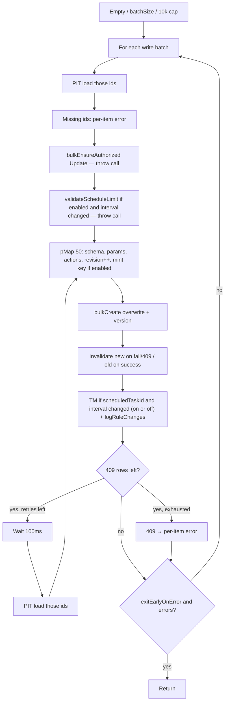

# Adding a `bulkUpdateRules` method to `RulesClient` (POC)

- [PR #284946](https://github.com/elastic/kibana/pull/284946)

## What we are doing

Kibana already has two ways to change many alerting rules at once:

- **Create-many** (`bulkCreateRules`) — a list of brand-new rules. Check them, then save a hundred at a time.
- **Edit-many** (`bulkEditRules` / `bulkEditRulesOcc`) — the *same* patch on every matching rule (for example “add this tag”). One load, one write.

`bulkUpdateRules` aims for a third scenario used by detection rule [`rules/_import` (update path)](https://github.com/elastic/kibana/issues/275204) and [prebuilt rule `upgrade/_perform`](https://github.com/elastic/kibana/issues/264908) and is tracked in [this ticket](https://github.com/elastic/kibana/issues/264894):

What it does: “here are 200 **existing** rules, each with its **own** new definition.” This is different to `bulkEditRule` "here are some fields that changed on the rule, do not update anything else".

Per-rule behaviour follows `updateRule` (overwrite the whole saved object, mint a key if the rule is on, reschedule Task Manager if the interval changed). The *shape* of the call follows create-many: `batchSize`, `exitEarlyOnError`, `{ successfulIds, errors, total }`.

## Tradeoffs

These are discussed in more details on the following document:

- [bulk-update-rules-tradeoffs.md](./bulk-update-rules-tradeoffs.md).

## Approach

Clone **create’s control flow**. Use **edit’s tools**. Do not call `bulkEditRulesOcc` / `saveBulkUpdatedRules` — those assume one shared patch, then one save of the whole pile. Our API is a list of different bodies. Sharing the helpers (PIT finder, `createNewAPIKeySet`, `invalidateKeys` / `bulkMarkApiKeysForInvalidation`, `bulkCreateRulesSo` overwrite, `logRuleChanges`, `taskManager.bulkUpdateSchedules`) is enough; running through edit’s OCC/save helper is not.

AAD (`RuleAttributesIncludedInAAD`) binds the encrypted key to name/tags/params/actions/schedule/enabled/consumer/etc. Almost every update of an **enabled** rule must mint a **new** key. Same count as edit; concurrency still `API_KEY_GENERATE_CONCURRENCY` (50). Batching does not make key gen faster; it caps how many new keys a failed write can wipe.

## Locked decisions

- **Load:** PIT finder per **write batch** (`createPointInTimeFinderDecryptedAsInternalUser` + `convertRuleIdsToKueryNode`). Missing ids → per-item error. No per-id `getDecryptedRuleSo` fallback.
- **OCC:** stamp loaded `version` on overwrite. **Reload-and-PUT** on 409 only — same reason as `updateRule` / [#77838](https://github.com/elastic/kibana/pull/77838): most 409s come from background rule execution updating `executionStatus` and `lastRun` while the caller saves. Without retry, import/upgrade of running rules would fail randomly. This is **not** `retryIfBulkEditConflicts` (that reapplies a PATCH). On 409: invalidate the **new** key (rule still has the old one), wait 100ms, re-PIT those ids, `prepareUpdate` again (fresh `version` + runtime fields, same `item.data`, new key), overwrite. 2 retries (3 attempts), matching `RetryForConflictsAttempts`. Do not replay the same bulk objects (old version 409s forever). Skip authz / circuit breaker / migrate / audit on retry. Non-409 row errors and a full `bulkCreateRulesSo` throw are not retried. 409s in flight are not `exitEarlyOnError` errors until retries are exhausted. A competing PUT in that window is last-writer-wins, same as `updateRule`.
- **Batch size:** new constants `DEFAULT_BULK_UPDATE_BATCH_SIZE = 100`, `MAX_BULK_UPDATE_BATCH_SIZE = 500`. Min 10 (same floor as create). Key mint reuses `API_KEY_GENERATE_CONCURRENCY`.
- **Authz:** `bulkEnsureAuthorized({ operation: WriteOperations.Update })` on existing type/consumer pairs. Any miss **throws that `bulkUpdateRules` call**.
- **Circuit breaker:** `validateScheduleLimit` only for rules that are already enabled **and** whose interval changed. Overflow **throws that call**.
- **Throw vs per-item:** throw on authz, schedule limit, bad `batchSize`, over `MAX_RULES_NUMBER_FOR_BULK_OPERATION` (10000). Per-item: missing id, schema/params/actions, key mint fail, 409 after retries exhausted, SO row error. `exitEarlyOnError` default false (already on the type).
- **Keys:** `createNewAPIKeySet` with `shouldUpdateApiKey: original.enabled`. Disabled: no new key (same as `updateRule`). Success → invalidate **old** keys. Fail / full SO throw → invalidate **new** keys for that batch (264892 policy, copied; do not patch `saveBulkUpdatedRules`).
- **SO write:** `bulkCreateRulesSo` + `overwrite: true` + `version`. Never partial `bulkUpdate` (AAD).
- **TM:** `bulkUpdateSchedules` grouped by **new** interval when `scheduledTaskId` exists and the interval changed, including disabled rules (same as `updateRule`). Fail → **log and swallow**. Rule stays in `successfulIds`. Do not create/delete tasks. Do not enable/disable.
- **Revision:** always increment via existing `incrementRevision` (no `shouldIncrementRevision` param).
- **Out of scope:** type-change delete+recreate, enable/disable after update, outer caller batching, tests, `#275695` create-import.

Authz / schedule-limit run **after that batch’s PIT**, before that batch’s writes. Callers should chunk so one `bulkUpdateRules` call is ~one batch. If a call spans multiple inner batches and batch 2 throws, batch 1 is already committed.

## Phases (per `bulkUpdateRules` call)

## Files

- Implement: `x-pack/platform/plugins/shared/alerting/server/application/rule/methods/bulk_update/bulk_update_rules.ts` (plus local utils if needed)
- Constants: `x-pack/platform/plugins/shared/alerting/server/rules_client/common/constants.ts`
- Reuse: `bulk_create` `invalidateKeys`, `update_rule` prepare semantics, `convertRuleIdsToKueryNode`
- Do not edit Security callers, `import_rule.ts` create path, `upgrade_prebuilt_rules.ts` (legacy loop)

## After this POC

Unit tests. Caller-side batching (upgrade: only load the ids in the chunk). Enable/disable-after-update follow-up. Optional issue comments to Christos / Banderror.
