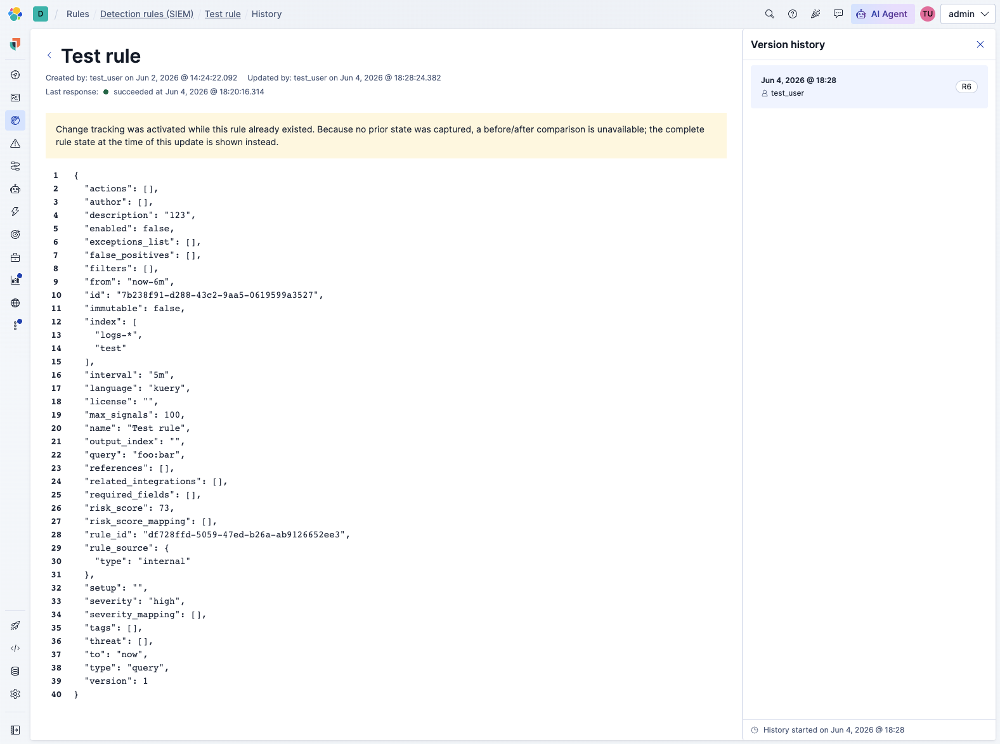

# Rule Changes History: Missing Initial Snapshots — Investigation & Solutions

**Date**: 2026-06-24  
**Raised by**: Steven de Salas, Maxim Palenov, Kseniia Ignatovych, Yngrid Coello  
**Slack thread**: https://elastic.slack.com/archives/C09QUB06E4Q/p1780590276886099  
**Related PR**: https://github.com/elastic/kibana/pull/269617 (UI MVP for rule changes history)  
**GitHub issue**: https://github.com/elastic/kibana/issues/274925

---

## The Problem

When the rule changes history feature is enabled (`xpack.alerting.ruleChangeTracking.enabled: true` + experimental flag `ruleChangesHistoryEnabled: true`), **all rules that existed before tracking was enabled have no baseline snapshot**.

The feature works by capturing a full rule snapshot on every CRUD operation (create, update, patch, import, upgrade, revert, bulk delete). The diff between consecutive snapshots is computed at read time using RFC 7396 JSON Merge Patch. When only a single snapshot exists there is no "previous" to diff against.

**Who is affected**:
- Any user who enables change tracking on a Kibana instance where rules already exist
- Any user who performs a `rule_update`, `rule_import` (overwrite), or `rule_revert` as the *first* tracked change on a rule — these are the only actions where a diff is *expected* but unavailable

**Actions with this problem** (from `changes_diff.tsx:24-28`):
```typescript
const EDIT_ACTIONS_REQUIRING_PRIOR_STATE = [
  RuleChangeTrackingAction.ruleUpdate,
  SecurityRuleChangeTrackingAction.ruleImport,
  SecurityRuleChangeTrackingAction.ruleRevert,
];
```

**What the user sees today without a fix**: the entire rule renders as a pure green addition — as if it were newly created — because `old_values` is `null` (no predecessor snapshot) and the UI falls back to showing the full rule as an insertion.

### Maxim's screenshot of the fallback UI (PR #269617)

Slack message: https://elastic.slack.com/archives/C09QUB06E4Q/p1780648563062979?thread_ts=1780590276.886099&cid=C09QUB06E4Q  
Local copy: `rule-changes-history-no-diff-fallback-ui.png`



What the screenshot shows:
- The "Test rule" history page — the rule was created on Jun 2 but **history only started on Jun 4 @ 18:28** (shown in the bottom-right footer and the single "R6" timeline entry)
- The yellow warning callout: *"Change tracking was activated while this rule already existed. Because no prior state was captured, a before/after comparison is unavailable; the complete rule state at the time of this update is shown instead."*
- The full rule JSON is rendered (40 fields, e.g. `"description": "123"`, `"severity": "high"`) **without green insertion highlighting** — the `noInsertionHighlightCss` strips the diff colouring so it doesn't look like a fresh create
- Right panel shows a single history entry — there is no previous snapshot to diff against, which is precisely the gap the pre-population solutions aim to fill

---

## Short-Term Fix (Already Merged — PR #269617)

Maxim pushed a UI-layer fix that degrades gracefully instead of misleading the user.

**Location**: `x-pack/solutions/security/plugins/security_solution/public/detection_engine/rule_details_ui/components/changes_diff/changes_diff.tsx`

**Behaviour**:
- When `item.action` is one of the edit actions requiring prior state AND `item.old_values === null`, the component sets `noDiffAvailable = true`
- A warning callout is shown: *"Change tracking was activated while this rule already existed. Because no prior state was captured, a before/after comparison is unavailable. The complete rule state at the time of this update is shown instead."*
- The rule body is displayed without the green insertion highlighting (via `noInsertionHighlightCss` CSS)

This is a good fallback but **not a full solution** — the user still cannot see what they changed.

---

## Architecture: How Snapshots Are Created

Understanding the snapshot pipeline is key to evaluating both solutions.

### Data flow

```
Rule CRUD operation
  → security_solution detection_rules_client (e.g. updateRule, importRule, …)
    → alerting rulesClient.update/create/patch/…
      → log_rule_changes.ts::logRuleChanges()
        → ChangeTrackingService.logBulk()
          → ChangeHistoryClient.logBulk()  (kbn-change-history package)
            → ES bulk index to .kibana_change_history-{module}-{space} data stream
```

### Key files

| File | Role |
|------|------|
| `x-pack/solutions/security/plugins/security_solution/server/lib/detection_engine/rule_management/logic/detection_rules_client/detection_rules_client.ts` | Orchestrates all rule CRUD, passes `changeTracking` metadata |
| `x-pack/solutions/security/plugins/security_solution/server/lib/detection_engine/rule_management/logic/detection_rules_client/methods/create_rule.ts` | Passes `changeTracking` to `rulesClient.create()` |
| `x-pack/solutions/security/plugins/security_solution/server/lib/detection_engine/rule_management/logic/detection_rules_client/methods/get_history_for_rule.ts` | Reads history via two parallel queries; returns `tracking_started_at` from oldest snapshot |
| `x-pack/solutions/security/plugins/security_solution/server/lib/detection_engine/rule_management/logic/detection_rules_client/methods/utils/map_rule_history_item.ts` | Maps `RuleChangeHistoryDocument` → `RuleHistoryItem`, computes `old_values` |
| `x-pack/solutions/security/plugins/security_solution/server/lib/detection_engine/rule_management/logic/detection_rules_client/methods/utils/compute_old_values.ts` | Computes RFC 7396 merge patch between consecutive snapshots |
| `x-pack/platform/plugins/shared/alerting/server/application/rule/methods/common_utils/log_rule_changes.ts` | Core snapshot write — called after every CRUD, gated by `ruleType.trackChanges` |
| `x-pack/platform/plugins/shared/alerting/server/rules_client/lib/change_tracking/service.ts` | `ChangeTrackingService` — holds `ChangeHistoryClient` per module, routes `logBulk` calls |
| `x-pack/platform/packages/shared/kbn-change-history/src/client.ts` | Writes to the ES data stream |
| `x-pack/solutions/security/plugins/security_solution/public/detection_engine/rule_details_ui/components/changes_diff/changes_diff.tsx` | UI diff renderer — handles the `noDiffAvailable` fallback path |

### Feature flags (both required)

```yaml
# kibana.yml (alerting layer — controls snapshot writes)
xpack.alerting.ruleChangeTracking.enabled: true

# kibana.yml (security solution layer — controls the API endpoint)
xpack.securitySolution.enableExperimental: ['ruleChangesHistoryEnabled']
```

`ruleChangesHistoryEnabled` is defined in:  
`x-pack/solutions/security/plugins/security_solution/common/experimental_features.ts:276`

---

## Solution A: New Initialization Flow (UI Bootstrap)

**Idea**: The Security Solution already has a pluggable initialization flow system (`server/lib/initialization/flow_registry.ts`) triggered by `POST /api/security_solution/initialization` — the same mechanism used to bootstrap prebuilt rules on startup. Add a new flow (e.g. `INITIALIZATION_FLOW_INIT_RULE_BASELINE_SNAPSHOTS`) to the same registry.

### How it would work

1. A new `InitializationFlowDefinition` is registered in `flow_registry.ts` alongside `INITIALIZATION_FLOW_INIT_PREBUILT_RULES` and the other existing flows
2. When the Security app initialises, the client includes the new flow ID in the `POST /api/security_solution/initialization` request body
3. The flow handler pages through all existing rules in the current space, checks which have no history entries, and calls a new alerting `RulesClient` method (e.g. `rulesClient.snapshotRules(ruleIds[])`) with action `rule_baseline_snapshot`

### Relevant files

- `server/lib/initialization/flow_registry.ts` — registers all flows; `runFirst: true` flows run sequentially before others; has built-in `inflightFlows` deduplication map
- `server/lib/initialization/flows/init_prebuilt_rules/index.ts` — the closest existing example to follow
- `server/lib/initialization/routes/initialize_route.ts` — the `POST /api/security_solution/initialization` route that dispatches flows

### Pros
- Fits naturally into the existing init flow architecture — no new endpoint needed
- Space-scoped automatically via the request context
- Concurrency-safe by default (the registry's `inflightFlows` map deduplicates concurrent calls with the same flow ID + space)
- No Kibana version coupling — runs any time the user opens the Security app

### Cons
- **Detections-as-Code (DaC) users are not covered** — operators who manage rules entirely via the REST API or CI pipelines never trigger the UI bootstrap
- Could be slow for tenants with thousands of rules; needs pagination/batching inside the flow
- Requires a new `snapshotRules()` API on the Alerting `RulesClient` (see shared constraint below)

---

## Solution B: Backend Pre-population After Kibana Upgrade

**Idea**: Register a one-time Task Manager task that runs on the server side — either post-upgrade or when change tracking is first enabled — to create baseline snapshots for all existing rules.

### How it would work

1. Register a new task definition in `plugin.ts::setup()` near the other entity analytics tasks (around line 361)
2. In `plugin.ts::start()`, use `taskManager.ensureScheduled()` with an initial run interval to schedule the task (analogous to `scheduleEntityAnalyticsMigration()`)
3. The task:
   - Checks whether `changeTrackingService` is initialised (i.e. the feature flag is on)
   - Pages through all security detection rules via an internal `rulesClient`
   - For each rule, checks if any history exists (query `.kibana_change_history` by `ruleId`)
   - If none, calls a new `rulesClient.snapshotRules()` method with action `rule_baseline_snapshot`
   - Stores a completed flag in task state to avoid re-running on every restart
4. Alternatively, this could be implemented as a Saved Object model version `data_backfill` if the snapshot write can be done without the alerting `RulesClient` context — but that's impractical since the data stream is owned by `@kbn/change-history`

### Pattern reference

`x-pack/solutions/security/plugins/security_solution/server/plugin.ts:373` — `scheduleEntityAnalyticsMigration()` is the closest existing pattern: a one-time task scheduled at startup that runs a migration and marks itself done in state.

### Pros
- **Works for DaC users** — runs on the server regardless of whether anyone opens the UI
- Fires automatically after an upgrade without any user action
- Follows established Task Manager patterns already in this plugin
- Can be retried if it fails mid-way (task state tracks progress)

### Cons
- Requires a new `snapshotRules()` API on the Alerting `RulesClient` (cross-plugin contract change)
- Task runs with elevated internal privileges — needs careful auth scoping per space
- Must handle multi-space tenants: needs to iterate over all spaces or be registered per space
- Task state versioning needs care to handle re-enable scenarios (e.g. user disables and re-enables the feature flag)
- If the tenant has 10k+ rules the task needs to be chunked with resumable progress state
- In large or shared deployments — including Elastic's serverless offering — iterating across all rules for all spaces at startup could be a significant performance concern

---

## Shared Constraint: New Alerting API Required

**Both solutions need the same alerting-side change.**

Currently `logRuleChanges()` is a private utility called from within the alerting plugin's CRUD methods. To backfill snapshots for rules that were never written-to since tracking was enabled, a new public `RulesClient` method is needed:

```typescript
// Proposed addition to rulesClient API
rulesClient.snapshotRules(ruleIds: string[], action: string): Promise<void>
```

This method would:
1. Bulk-fetch the saved objects for the given rule IDs
2. Call `logRuleChanges()` with a `rule_baseline_snapshot` action and the current timestamp
3. Skip rules where `ruleType.trackChanges` is false

Without this, the only workaround is a no-op `rulesClient.update()` on each rule — which is wasteful and leaves misleading audit log entries.

---

## Recommendation

Implement **both** — they are complementary, not alternatives:

1. **Solution B first** (backend task): This is the correct place to handle "what happens on upgrade" and covers DaC users. It should be the primary mechanism.
2. **Solution A as a fast-path** (UI bootstrap, optional): Add a lightweight check in the Security app initialisation that nudges baseline snapshot creation only if the task hasn't completed yet. This is useful for dev environments or cloud instances where the upgrade task might have run before the feature flag was fully on.

The fallback UI callout from PR #269617 remains a good safety net for edge cases where pre-population hasn't run yet.

---

## Open Questions

1. **Who owns the new `snapshotRules()` API?** The Alerting plugin. Needs coordination with that team.
2. **What action string for baseline snapshots?** Proposed: `rule_baseline_snapshot` — needs to be added to `SecurityRuleChangeTrackingAction` enum in `rule_change_tracking.ts` and handled in the UI diff component.
3. **How does the UI render a baseline snapshot?** It has no `old_values` (null — it's the first entry). The diff component already handles this for `rule_create` / `rule_install` actions by showing the full rule as a pure insertion (green). A baseline snapshot should probably show the same, but without the green highlight (same as the current `noDiffAvailable` path) — or show a neutral "baseline captured" state.
4. **Multi-space**: Does the Task Manager task run once across all spaces, or per space? The existing `scheduleEntityAnalyticsMigration` pattern uses a single task with space-aware logic inside.
5. **Idempotency**: Both solutions need to handle the case where a rule already has history — the check is a `getHistory({ size: 1 })` query per rule, which can be batched.
