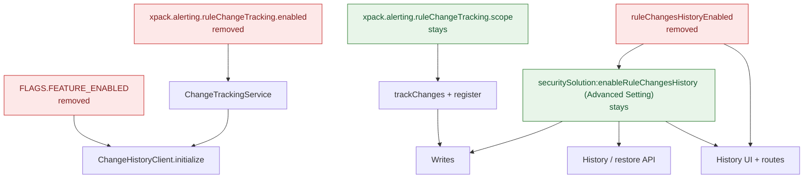

# PR Review: #278197 — [Security Solution] Remove rule changes history feature flags

**PR:** [elastic/kibana#278197](https://github.com/elastic/kibana/pull/278197) by @maximpn
**Created Date: 23 Sep 2026**
**Related:** [security-team#12367](https://github.com/elastic/security-team/issues/12367) (epic) | [Official docs: View rule changes history](https://www.elastic.co/docs/solutions/security/detect-and-alert/view-rule-changes-history)

---

**Scale:** Substantive (32 files, −138 / +74, cross-team)

---

### Ownership

CODEOWNERS last-match-wins:

- **`@elastic/response-ops` (8):** Alerting config/plugin, `log_rule_changes`, `get_rule_history`, `create_rule_route.test`, `test_utils`
- **`@elastic/kibana-core` (5):** `@kbn/change-history` index, client, client tests (unit + integration), constants
- **`@elastic/kibana-operations` (1):** `common/plugins/alerts/moon.yml`
- **`@elastic/response-ops` (6, FTR):** alerting_api_integration config, fixture plugin, tsconfig, group6 change-tracking tests
- **`@elastic/security-solution` (6):** `experimental_features.ts`, `ui_settings.ts` + test, serverless plugin, ESS/serverless base configs
- **`@elastic/security-detection-engineering` (5):** `rule_details/index.tsx`, `rule_actions_overflow`, `routes.tsx`, `register_routes.ts`, `change_tracking.ts` API integration test
- **`@elastic/security-data-analytics` (1):** `get_changes_history_usage.ts`

---

### Context / Motivation

The Detection Rule Changes History feature shipped in 9.5.0 behind two flags that both defaulted to `true`:
1. Alerting config `xpack.alerting.ruleChangeTracking.enabled`
2. Security experimental flag `ruleChangesHistoryEnabled`

Plus a package-level `FLAGS.FEATURE_ENABLED` in `@kbn/change-history`.

All three were scaffolding for GA — the real user-facing on/off is the `securitySolution:enableRuleChangesHistory` advanced setting (per-space) and the alerting `ruleChangeTracking.scope` (cluster-wide, which solutions get tracking). This PR removes the temporary flags, leaving only those two.

From the PR:

> Removes the feature flags gating the Detection Rule Changes History feature, now that it's shipping unconditionally. Both flags defaulted to `true`, so there's no behavior change for the majority of deployments — this only removes the opt-out.

The PR originally lacked a config deprecation for the removed `enabled` key, which meant any 9.5.x deployment with `xpack.alerting.ruleChangeTracking.enabled` in `kibana.yml` would crash on upgrade. **That's now fixed** — the current diff adds `unused('ruleChangeTracking.enabled', { level: 'warning' })` in `config_deprecations.ts` with a test.

---

### Validating the issue — does this PR address it?

**Yes. The temporary flags are removed, and the upgrade path is handled.**

- **Where the problem was:** Three separate on/off switches (`enabled` config, experimental flag, `FLAGS`) stacked on top of the real controls (`scope` + advanced setting), blocking GA cleanup.
- **How the PR fixes it:** Deletes all three. Always constructs `ChangeTrackingService`. UI/API/serverless rely solely on the advanced setting. Alerting `scope` still controls which solutions produce history records.
- **Upgrade path:** `unused('ruleChangeTracking.enabled')` in `config_deprecations.ts` strips the key with a warning instead of crashing on unknown config. Test confirms the key is removed and `scope` is preserved.
- **Leftover experimental flag:** `ruleChangesHistoryEnabled` in `enableExperimental` only logs a warning via `parseExperimentalConfigValue` — does not crash. Confirmed in `security_solution/server/config.ts`.

---

### Summary

Removes the three temporary feature-flag off-switches for rule changes history.

1. `xpack.alerting.ruleChangeTracking.enabled`
2. `ruleChangesHistoryEnabled`
3. `FLAGS.FEATURE_ENABLED` (`@kbn/change-history`)


Default product behavior is unchanged — the feature was already on everywhere. 

What remains is alerting `ruleChangeTracking.scope` (which solutions get `trackChanges`) and the Security advanced setting `securitySolution:enableRuleChangesHistory` (per-space off switch for writes/reads/UI). 

Other changes: history/restore routes always register (still 403 when setting off); serverless always shows the project setting; serverless change-history API tests are enabled; `@kbn/change-history` no longer has a FLAGS bail-out.

#### Dependency diagram



---

### Files touched

**`@kbn/change-history` (kibana-core):** Remove `FLAGS` object and its export. Remove `FLAGS.FEATURE_ENABLED` guard in `ChangeHistoryClient.initialize()`. Clean up tests that toggled FLAGS.

**Alerting plugin (response-ops):**
- `config.ts` — drop `enabled` from `ruleChangeTracking` schema
- `config_deprecations.ts` — add `unused('ruleChangeTracking.enabled')` so stale keys don't crash startup
- `config_deprecations.test.ts` — test for the above
- `plugin.ts` — always construct `ChangeTrackingService` (no conditional)
- `log_rule_changes.ts` — updated comments: `scope` is the only alerting-side gate now
- `get_rule_history.ts` — updated doc comment for `RuleChangeTrackingDisabledError`
- `create_rule_route.test.ts`, `test_utils/index.ts` — drop `enabled` from test config fixtures

**Alerting FTR (response-ops + ops):**
- `common/config.ts` — rename `ruleChangeTrackingEnabled` option to `ruleChangeTrackingScope` (now passes scope directly instead of the old enabled+hardcoded-scope combo)
- `common/plugins/alerts/server/plugin.ts` — stop setting `CHANGE_HISTORY_FLAGS`; drop `stop()` method
- `moon.yml`, `tsconfig.json` — remove `@kbn/change-history` dependency
- `group6/enabled.ts` — test description updated
- `group6/config_with_change_tracking_enabled.ts` — uses `ruleChangeTrackingScope: ['stack']`

**Security Solution UI (detection-engineering):**
- `rule_details/index.tsx`, `rule_actions_overflow/index.tsx`, `routes.tsx` — drop `useIsExperimentalFeatureEnabled('ruleChangesHistoryEnabled')`, use only `useUiSetting$` for the advanced setting

**Security Solution server (security-solution):**
- `experimental_features.ts` — remove `ruleChangesHistoryEnabled` definition
- `ui_settings.ts` — always register `ENABLE_RULE_CHANGES_HISTORY_SETTING` (no longer conditional on experimental flag)
- `ui_settings.test.ts` — drop flag from test fixture
- `register_routes.ts` — always register `ruleHistoryRoute` and `restoreRuleFromHistoryRoute`

**Serverless (security-solution):** `plugin.ts` — always push `securitySolution:enableRuleChangesHistory` to project settings.

**Tests / telemetry:**
- ESS `config.base.ts` — drop experimental flag, `enabled` config, and uiSettings override
- Serverless `config.base.ts` — drop experimental flag and `enabled` config
- `change_tracking.ts` — `@ess @skipInServerless` → `@ess @serverless`; use `utils.getUsername()` instead of hardcoded `'elastic'`
- `get_changes_history_usage.ts` — comment cleanup (remove stale reference to `enabled` config)

---

### Flow trace

1. Kibana starts → Alerting `constructor` always runs `new ChangeTrackingService(logger, kibanaVersion)` (`plugin.ts`).
2. If stale `ruleChangeTracking.enabled` exists in `kibana.yml` → `unused()` deprecation strips it with a warning; startup proceeds.
3. Rule types register → if `config.ruleChangeTracking.scope` includes the solution (default `['security']`), `ruleType.trackChanges = true` + `changeTrackingService.register(solution)`.
4. Alerting `start()` → `changeTrackingService.initialize()` → `ChangeHistoryClient.initialize()` creates the data stream (no FLAGS bail-out).
5. Security rule create/update → `logRuleChanges` skips unless `trackChanges` is true AND `securitySolution:enableRuleChangesHistory` advanced setting is true.
6. UI → History tab / actions overflow / routes check only `useUiSetting$(ENABLE_RULE_CHANGES_HISTORY_SETTING)`.
7. API → `ruleHistoryRoute` / `restoreRuleFromHistoryRoute` always registered; handler returns 403 if advanced setting is false.
8. Serverless → `setupProjectSettings` always includes the setting ID so admins see the toggle.

---

### Assumptions

- Default `ruleChangeTracking.scope: ['security']` stays — Obs/Stack rules don't write history unless someone widens scope.
- The advanced setting is the supported Security off switch for writes (`log_rule_changes`) and reads (route handlers + UI).
- Always building `ChangeTrackingService` is cheap when nothing is registered. With default scope, Security registers and the data stream gets created at startup.
- Leftover `enableExperimental: ['ruleChangesHistoryEnabled']` in `kibana.yml` or helm only logs a warning — does not fail startup.

---

### Risks

1. **(Low — pre-existing, not introduced by this PR)** **Scope ↔ UI mismatch.** Security UI/API only check the advanced setting — they never read alerting `scope`. If someone sets `scope: []`, the UI still shows History (advanced setting defaults to true), the API calls `getHistory()`, `ChangeTrackingService` finds no client for `'security'` (never registered), and throws → **500** with `Unable to get history. Change history client not initialized for [security, alerting-rules]`. User sees a generic error toast. Write path is fine (silently skips). Requires deliberate admin misconfiguration of a key that defaults to `['security']`. See **Follow-up #1** for the full trace. **(Error-handling note — activity #4)** The old cluster-wide off (`enabled: false`) threw the exported `RuleChangeTrackingDisabledError` ("Rule change tracking is disabled."). The remaining off (`scope` excludes the module) throws an untyped `Error` with no `statusCode`, so `transformError` is guaranteed 500. Same status, worse message, no `instanceof` hook. See **Risk #5**.

2. **(Low)** **Serverless tests newly enabled.** Suite moves `@skipInServerless` → `@serverless`. The `getUsername()` change is correct for SAML auth. Worth watching for flakes from timing or data-stream initialization in serverless environments.

3. **(Low)** **Routes always registered.** Setting off → 403, not "route missing." This is fine — client also drops the React route in `routes.tsx`, and server handlers + `change_tracking_disabled` tests align. No behavioral change for users.

4. ~~**(Nit)** **`ruleChangeTracking.scope` is undocumented.** Now the only alerting-side control, but has no inline comment in `config.ts`, no README mention, and no entry in the `unused()` deprecation message for the removed `enabled` key. Operator reading `kibana.yml` has no guidance on what `scope` does or what `[]` means.~~ **Dropped — pre-existing gap, not introduced by this PR.** `scope` was already undocumented before this PR; asking the author to fix it here is a drive-by. The [official docs](https://www.elastic.co/docs/solutions/security/detect-and-alert/view-rule-changes-history) only mention the advanced setting as the off switch, which is correct for users. See activity #3.

5. **(Low)** **`RuleChangeTrackingDisabledError` is a dead production contract.** Exported from `@kbn/alerting-plugin/server`, thrown only when `context.changeTrackingService` is null (`get_rule_history.ts:73–74`). This PR always constructs the service, so that path no longer fires in production — only in tests that omit the service. JSDoc now says "unavailable" but the default message still says "disabled." No Security (or other) caller `instanceof`-checks it; the route just `transformError`s. The real remaining off-switch (`scope` excludes the module) throws a generic `Error` from `ChangeTrackingService.getHistory` (`service.ts:184–188`) instead. See **activity #4**, **Open questions #1–2**.

6. **(Low)** **Setting-off API suite still ESS-only.** Happy-path `change_tracking.ts` is now `@ess @serverless`. `change_tracking_disabled.ts` stays `@ess @skipInServerless` (separate ESS config with `uiSettings.overrides`). The remaining user-facing off switch is untested in serverless. Skip reason was the old flags — those are gone. See **activity #6**, **Open question #5**.

7. **(Nit)** **Always-true `changeTrackingService` guards.** Constructor always assigns the service, but `plugin.ts` still types it optional and keeps `if (this.changeTrackingService)` / `changeTrackingService?.initialize`. The false path is dead. **Prototyped locally — see activity #8. Not on the PR.**

---

### Open questions

1. Is `ruleChangeTracking.scope: []` the intended cluster-wide off switch now that `enabled` is gone? If so, should Security UI/API check it too (or at least return a clear error instead of an uninitialized-client crash)? *(Suggested reading — activity #4: `scope: []` / omitting `'security'` is the only remaining cluster-wide off, and it does **not** throw `RuleChangeTrackingDisabledError`. Security can't cheaply read alerting config; a clearer error would mean `ChangeTrackingService.getHistory` throwing a typed / `statusCode` 4xx when the module was never registered, so `transformError` doesn't default to 500.)*
2. Should `RuleChangeTrackingDisabledError` get renamed? Production alerting always builds the service now; the error fires only when `changeTrackingService` is null on the `RulesClientContext`, which shouldn't happen with this PR. *(Suggested reading — activity #4: renaming alone doesn't fix it. Options: throw it — or a 4xx sibling — when the module isn't registered, or delete it if "service missing on context" is only a test / programming error. JSDoc already says "unavailable" while the default message still says "disabled.")*
3. Do any Cloud/ECE/helm templates outside this repo still set `ruleChangeTracking.enabled`? The `unused()` deprecation handles it gracefully, but those templates should get cleaned up too.
4. Should the `unused()` message for `ruleChangeTracking.enabled` tell the operator what replaced it (`scope` + advanced setting)? *(Suggested reading — activity #10: local prototype on `config_deprecations.ts:15` + snapshot. Still the author's call.)*
5. Should `change_tracking_disabled` run in serverless now that the flags that kept it skipped are gone? *(Suggested reading — activity #6: the happy path is already `@serverless`; the setting-off 403 / no-write cases are the remaining gate and only run on ESS.)*

---

### Notes for your codebase map

- Rule changes history had four switches: alerting `enabled`, alerting `scope`, Security experimental flag, Security advanced setting. **This PR leaves scope + advanced setting.**
- Write checks for Security live in Alerting (`log_rule_changes.ts`); read/UI checks live in Security Solution.
- `@kbn/change-history` is owned by `@elastic/kibana-core`; Alerting wraps it in `ChangeTrackingService` (Response Ops). The package-level FLAGS was a temporary GA gate — now gone.
- Unknown experimental flags only warn; unknown alerting config keys crash startup unless you add `unused()` / `deprecate()`.
- Serverless project settings control which advanced settings show up; listing a setting doesn't turn it on.
- The FTR config pattern changed: `ruleChangeTrackingEnabled: boolean` → `ruleChangeTrackingScope: string[]`, which is cleaner.

---

### Follow-up Review Activities

1. **Deep dive: Risk #1 — scope ↔ UI mismatch when `ruleChangeTracking.scope` excludes `'security'`.**

   Traced the full write and read paths. Two distinct failure modes:

   **Write path (silent, correct):**
   - `plugin.ts:590` — `scope.includes('security')` is false → `trackChanges` stays false, `changeTrackingService.register('security')` never called
   - `log_rule_changes.ts:111` — `!ruleType.trackChanges` → skips → no writes. Silent and correct.

   **Read path (500 error):**
   - `route.ts:56` — checks only the advanced setting (`ENABLE_RULE_CHANGES_HISTORY_SETTING`) → true (default) → proceeds
   - `get_history_for_rule.ts:44` — calls `rulesClient.getHistory({ module: 'security', ... })`
   - `get_rule_history.ts:73` — `context.changeTrackingService` exists (always constructed now) → passes null check
   - `service.ts:182` — `this.clients['security']` is **undefined** because `register('security')` was never called
   - `service.ts:184–188` — **throws** `Error: Unable to get history. Change history client not initialized for [security, alerting-rules]`
   - `route.ts:76` — `transformError(err)` → returns **500** to the client

   **UI experience:** History tab renders (advanced setting is true), fires fetch, gets 500, shows an error toast via `useInfiniteChangeHistory` → `addError(error, { title: i18n.HISTORY_FETCH_ERROR })`.

   **Verdict:** Pre-existing issue (already in 9.5 GA), not introduced by this PR. The mismatch existed before because `scope` and the advanced setting were always independent. With `enabled` gone the only way to trigger this is manually setting `scope: []` or removing `'security'` — a deliberate admin action on a config key that defaults to `['security']`. Unlikely in practice but the error is unhelpful (generic 500 vs a clear "scope doesn't include security" message). Filing as a low-priority follow-up suggestion, not a merge blocker. Downgraded from Medium to **Low**. Left a [pending review comment](https://github.com/elastic/kibana/pull/278197#pullrequestreview-5316528916) on `log_rule_changes.ts` suggesting either a better error from `ChangeTrackingService.getHistory` or a Security-side check before calling `getHistory`.

2. **Risk #2 — serverless flaky test runner.** Left a [pending review comment](https://github.com/elastic/kibana/pull/278197#pullrequestreview-5316528916) on `change_tracking.ts` line 40 (`@ess @serverless` tag change) requesting a flaky test run. Kicked off the flaky test suite runner against the serverless config — [build #14580](https://buildkite.com/elastic/kibana-flaky-test-suite-runner/builds/14580). Awaiting results.

3. **Focused review: documentation.** Checked all documentation surfaces for the now-official gating model (`scope` + advanced setting). Findings:
   - **[should-fix] `config.ts:99–100`** — `ruleChangeTracking.scope` has no inline comment. Every sibling key (`totalFieldsLimit`, `coordinateInstallation`) has one. This is now the only alerting-side control and an operator reading `kibana.yml` has zero guidance on what it does or what `[]` means. Raised as Risk #4.
   - **[should-fix] `config_deprecations.ts:15`** — `unused('ruleChangeTracking.enabled')` uses the auto-generated message. Should tell the operator what replaced it — `scope` + advanced setting. Raised as Open question #4.
   - **[nit] `ui_settings.ts:427`** — Advanced setting description doesn't mention its dependency on `scope`. If `scope` excludes `'security'`, the setting is a lie (enabled but API 500s). Relates to Risk #1.
   - **[nit] `plugin.ts:585–593`** — Comment explains `scope` for the write path but not the read path (`getHistory` throws for unregistered modules). Only place in the codebase documenting how `scope` works.
   - **Clean:** `log_rule_changes.ts:108–110` comment accurate; `get_rule_history.ts:25` JSDoc updated; `get_changes_history_usage.ts:46–48` stale reference removed; `constants.ts:294` adequate.

4. **Focused review: error handling.** Throw vs return across the flag-removal surfaces.
   - **[should-fix] `service.ts:184` + `route.ts:76`** — `scope` excluding `'security'` throws an untyped `Error` (no `statusCode`); `transformError` → 500; UI toasts it. Old cluster-wide off (`enabled: false`) threw `RuleChangeTrackingDisabledError` — same 500, clearer message, `instanceof`-able. Sharpens Risk #1.
   - **[should-fix] `get_rule_history.ts:73–74`** — `RuleChangeTrackingDisabledError` is dead in production (service always constructed). Exported, nobody `instanceof`-checks it. Raised as Risk #5.
   - **[nit] `get_rule_history.ts:28`** — JSDoc says "unavailable", default message still says "disabled."
   - Suggested readings on Open questions #1 and #2 (not closed — author/reviewer call).
   - **Clean:** `unused()` deprecation (startup no longer crashes); route 403 for the advanced setting; write-path swallows (`log_rule_changes`); init failures logged not fatal; telemetry degrades to zero; FLAGS-throw-as-control-flow removed.

5. **Error-handling follow-up: dead `RuleChangeTrackingDisabledError` (Risk #5).**
   - **Problem:** After this PR the service is always constructed, so the throw at `get_rule_history.ts:74` is dead. Disabling via `ruleChangeTracking.scope: []` never hits that class — `ChangeTrackingService.getHistory` throws a plain `Error` ("client not initialized"), Security `transformError` has no `statusCode`, History API returns 500, UI toasts.
   - **Solution:** Move `RuleChangeTrackingDisabledError` next to `ChangeTrackingService` and throw it from `getHistory` when the module was never registered. Give it `statusCode: 403` so `transformError` returns 4xx. The "service missing on context" path can import the same class.
   - **Comment:** Posted on `get_rule_history.ts` line 32 (the class) with the problem, the move, and a `getHistory()` diff. Relates to Risk #1 and Risk #5. Open questions #1–2 still open.

6. **Focused review: test coverage.** Is the flag-removal test update enough?
   - **[should-fix] `change_tracking_disabled.ts:25`** — still `@ess @skipInServerless` while the happy path is now `@serverless`. Setting-off 403 / no-write is untested in serverless. Skip reason was the old flags. Raised as Risk #6, Open question #5.
   - **[nit] `rule_actions_overflow/index.test.tsx:24`** — still mocks `use_experimental_features`; component now gates only on the advanced setting. No assertion on the History menu item (`rules-details-history`). Same for `routes.tsx` / rule details tab — UI gating change has no unit test.
   - **[nit] `ui_settings.test.ts`** — dropped the experimental flag from the fixture, but never asserts `ENABLE_RULE_CHANGES_HISTORY_SETTING` is always registered.
   - **[nit] No test for `scope: []`** — remaining alerting-side off is untested (pre-existing; relates to Risk #1). Not a merge ask.
   - **Clean:** FLAGS tests fully removed (no leftovers); `unused()` deprecation test asserts key gone + `scope` kept; config snapshot updated; all four `item.user` asserts use `getUsername()`; route unit tests still cover setting-off 403; FTR config rename `ruleChangeTrackingEnabled` → `ruleChangeTrackingScope` is consistent.

7. **Focused review: dead code.** Leftovers after the three flags came out.
   - **[nit] `plugin.ts:588`** — `if (this.changeTrackingService)` is always true now. Raised as Risk #7.
   - **[nit] `plugin.ts:261` + `plugin.ts:679`** — field still `changeTrackingService?`; `changeTrackingService?.initialize` never skips.
   - **[nit] `rule_actions_overflow/index.test.tsx:24`** — `jest.mock` of `use_experimental_features` is leftover (component no longer uses it). Same note as activity #6.
   - **[nit] `config_with_change_tracking_enabled.ts`** — filename still says `enabled` after the key became `ruleChangeTrackingScope`.
   - Already tracked: `RuleChangeTrackingDisabledError` throw at `get_rule_history.ts:74` is dead in production — Risk #5 / activity #5.
   - **Clean:** `ruleChangesHistoryEnabled` has zero remaining references; `FLAGS` / `CHANGE_HISTORY_FLAGS` fully gone from package + FTR fixture; UI files dropped the experimental import; `unused('ruleChangeTracking.enabled')` is the upgrade path, not dead; `log_rule_changes.ts:86` `!changeTrackingService` still used by tests that omit the service.

8. **Local prototype: drop dead `changeTrackingService` guards (Risk #7).**
   - **Problem:** After this PR the service is always constructed, so `if (this.changeTrackingService)` / `?.initialize` / `changeTrackingService?` are leftovers.
   - **Local change (not on the PR):** field is `private readonly changeTrackingService: ChangeTrackingService`; register-path `if` gone; `changeTrackingService.initialize(...)` is a plain call.
   - Factory / `RulesClientContext` stay optional — tests still omit the service. `log_rule_changes.ts:86` and `get_rule_history.ts:73` still need that hole.

9. **Local prototype: `ui_settings.test.ts` always-registers assert (activity #6 nit).**
   - **Problem:** PR dropped `ruleChangesHistoryEnabled` from the fixture and never asserted the setting still registers.
   - **Local change (not on the PR):** `always registers ENABLE_RULE_CHANGES_HISTORY_SETTING` — `toHaveProperty` plus name / value `true` / type. Fixture already has experimental flags off, so this also proves it's not gated.

10. **Local prototype: custom `unused()` message (Open question #4).**
    - **Problem:** Auto message is "You no longer need to configure ruleChangeTracking.enabled." Operator isn't told what replaced it.
    - **Local change (not on the PR):** `unused(..., { message })` on `config_deprecations.ts:15` points at `scope` + `securitySolution:enableRuleChangesHistory`. Snapshot updated.
    - Open question #4 still open — author's call.

11. **Manual test plan.** Six walk-throughs for the remaining gates + upgrade leftovers. See **Manual test plan** below.

---

### Manual test plan

Test the **PR as shipped**, not the local prototypes. Defaults: `scope: ['security']`, advanced setting `securitySolution:enableRuleChangesHistory` = **on**. Setting requires a page reload.

**Prep:** Security trial license, a custom query rule you can edit. Open **Security → Rules**.

#### 1. Happy path — flags gone, history still works

What this checks: GA default. No `enabled` / experimental / `FLAGS` needed.

1. Open a custom detection rule → kebab (**…**) → **Changes history** (`rules-details-history`).
2. Confirm `/app/security/rules/id/<id>/changes-history` loads (create event at least).
3. Edit the rule (name or query) → save → reload History. New `updated` row, your username.
4. Rule details subtitle still shows **Revision**.

Pass: History page + new row after edit. Fail: missing menu item, empty after edit, or a toast.

#### 2. Advanced setting off — UI hide + API 403

What this checks: remaining user-facing off switch.

1. **Stack Management → Advanced Settings** → search `Enable detection rule changes history` → **off** → save.
2. Reload Kibana (setting is `requiresPageReload`).
3. Same rule → kebab: **Changes history** gone. Revision gone from subtitle.
4. Hit `/app/security/rules/id/<id>/changes-history` directly → Not Found (route unregistered).
5. Optional curl (kbn-xsrf + session): `GET /internal/detection_engine/rules/<id>/history/_list` → **403** `"Rule changes history is disabled..."`.

Pass: menu + page + API all off. Fail: menu still there, or API 200 / 500.

#### 3. Setting back on + restore

What this checks: toggle is reversible; restore still works.

1. Turn the setting **on** → reload.
2. History menu + page are back. Rows from scenario 1 still there.
3. Pick an older snapshot → restore → confirm the rule matches that snapshot.
4. Reload History: a restore event shows up.

Pass: UI back, restore works, restore row logged. Fail: empty history after re-enable, or restore no-ops.

#### 4. Stale `enabled` in `kibana.yml` — starts, does not disable

What this checks: upgrade leftover. Old `xpack.alerting.ruleChangeTracking.enabled` must not crash and must not be an off switch.

1. Add to `kibana.yml`: `xpack.alerting.ruleChangeTracking.enabled: false`
2. Restart Kibana.
3. Startup logs a warning (auto: `You no longer need to configure "ruleChangeTracking.enabled".`). Kibana is up.
4. Repeat scenario 1 — History still works (`scope` default + setting on).
5. Remove the key when done.

Pass: warning, no crash, history still writes/reads. Fail: startup crash, or `enabled: false` silently turns tracking off.

#### 5. `scope: []` — writes skip, History 500s

What this checks: remaining cluster gate + Risk #1. Deliberate misconfig.

1. Set `xpack.alerting.ruleChangeTracking.scope: []` in `kibana.yml`. Restart. Keep the advanced setting **on**.
2. Edit the rule again.
3. History menu still shows (setting is on). Open it.
4. Expect a fetch error toast (`HISTORY_FETCH_ERROR`). Network: `GET .../history/_list` → **500** `Change history client not initialized for [security, alerting-rules]`.
5. Rows from earlier scenarios may still exist in the index; new edits should **not** appear.

Pass: 500 + toast, no new write. Fail: 403/empty-200 (would mean they already fixed Risk #1), or a new row after the edit (scope ignored).

Reset: drop `scope: []` (or restore `['security']`) and restart.

#### 6. Stale experimental flag — warns, does not disable

What this checks: the other upgrade leftover. Old `ruleChangesHistoryEnabled` is unknown now; Security only warns, it is not an off switch.

1. Reset `scope` to default (`['security']` or omit). Keep the advanced setting **on**.
2. Add to `kibana.yml`:
   ```yaml
   xpack.securitySolution.enableExperimental:
     - ruleChangesHistoryEnabled
   ```
3. Restart Kibana.
4. Logs warn `Unsupported "xpack.securitySolution.enableExperimental" values detected` and list `ruleChangesHistoryEnabled`. Kibana is up.
5. Repeat scenario 1 — History still works.

Pass: warning, no crash, history still writes/reads. Fail: startup crash, or the leftover flag hides History / stops writes.

Reset: remove the `enableExperimental` entry.
